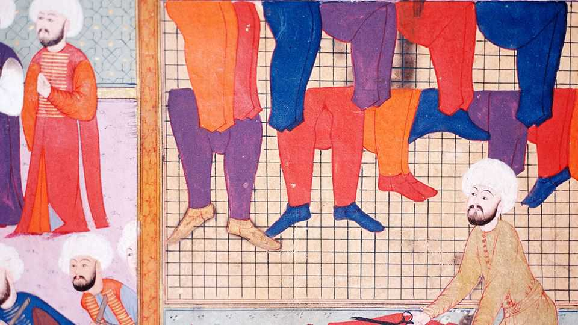

Europe | Worse for wear

Europe | Worse for wear

Turkey’s fabled textile industry is coming apart at the seams

Inflation, China and an exodus of Syrian workers are among its problems

October 23rd 2025

SULTAN BAYEZID II knew what he was doing when he ordered the construction of a large caravanserai for silk merchants and their goods in Bursa, the former Ottoman capital, in the late 15th century. The empire over which he presided was already a textile superpower, and Bursa a key stop on the Silk Road. Better was to come. Textile trade and production shaped the Ottoman economy for three centuries, before the Industrial Revolution came knocking. Bursa and the caravanserai Bayezid built, named Koza Han after the cocoon of the silkworm, became its main hub.

The han survives to this day, its courtyard home to visitors snacking on semolina halva with ice cream, its galleries thick with shops offering silk scarves. But the sector it helped define is in a deep funk. Turkey remains one of the world’s top textile suppliers. But its share of the global market has

dwindled to below 3%, the lowest in more than three decades. Garment exports from Bangladesh and Vietnam, some of Turkey’s biggest competitors, grew by double digits in the first half of 2025, compared with the same period last year. Turkey’s dipped by 6.9%.

Exports have now fallen for three consecutive years, from a peak of $22bn in 2022 to a projected $17bn this year, a drop of 23%. More than 310,000 textile and apparel workers have been laid off, according to estimates. Some 6,000 businesses have closed. Hundreds more have relocated, mostly to Egypt.

The obvious culprit is the overall state of the Turkish economy. Prohibitively high borrowing rates and an overvalued currency have brought inflation, which neared triple digits three years ago, down to a still-high 33%. The combination has also pushed up labour and production costs, severely dulling the textile sector’s competitive edge. Between the start of 2022 and today, Turkey’s minimum wage has risen from $383 to $620 in dollar terms, an increase of more than 60%. Exporters, who once feasted on low interest rates, are now feeling the squeeze.

Turkish garments were traditionally pricier than those from China or India, says Mustafa Gultepe, head of the Turkish Exporters Assembly, but could make up for this with superior quality. That formula no longer fits. “European customers chose us over the others when we were 15% or 20% more expensive,” says Mr Gultepe. “But not today, when the difference is 50%.”

Foreign orders are shifting to Asia as a result. Exports to the EU from China, already the bloc’s top textile and clothing supplier, surged by 20% in the first half of the year, also in large part due to trade diversion because of higher American tariffs.

Over the past decade, parts of the sector have come to rely on migrant and refugee labour. But here too changes are afoot. Between 250,000 and 400,000 Syrians, many of them underpaid, are thought to have found work in Turkish workshops and factories. Since the end of Syria’s murderous civil war and the collapse of the Assad regime last December, as many as 20% of

them have returned home, estimates Muzaffer Cevizli, head of Giyimkent, a hub for Turkish wholesalers.

The crisis is more than a bump in the road. Even once Turkey comes to grips with the chaos wreaked by years of inflation and economic mismanagement, the industry will struggle to return to its former state. Labour is becoming expensive, and will probably remain so. But it is also becoming increasingly scarce. Turkish textile companies are struggling to find workers, even at competitive rates, says Mr Cevizli. “Understandably, young people prefer desk jobs to factory work,” he says.

Mass production may have to become a thing of the past, replaced by a focus on branding, design, fast delivery and niche products. (As an industry insider recently put it, Turkey needs to stop trying to become the “China of Europe”.) Offshoring may be another solution. Some of Turkey’s top brands, including Eroglu and LC Waikiki, have already moved some production abroad, to Egypt. Others may need to follow suit. The sector has what it takes to thrive once again. But it may have to reinvent itself first. ■

To stay on top of the biggest European stories, sign up to Café Europa, our weekly subscriber-only newsletter.

This article was downloaded by zlibrary from https://www.economist.com//europe/2025/10/23/turkeys-fabled-textile-industry-is- coming-apart-at-the-seams