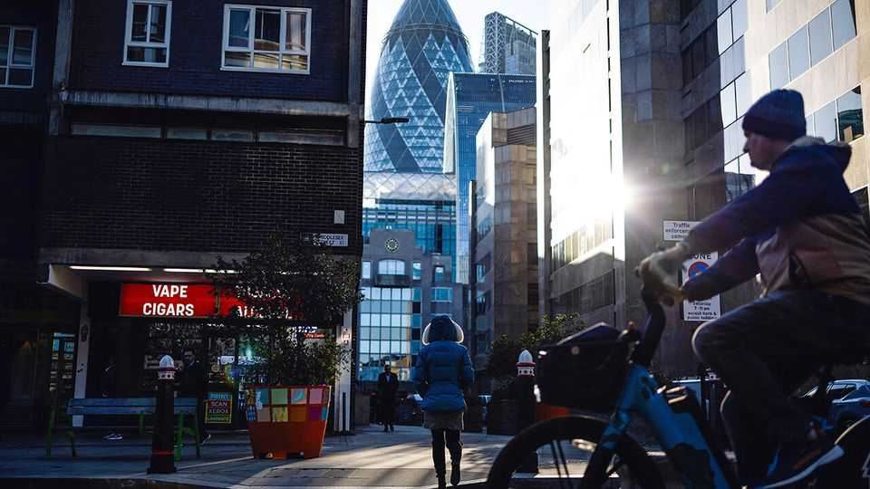
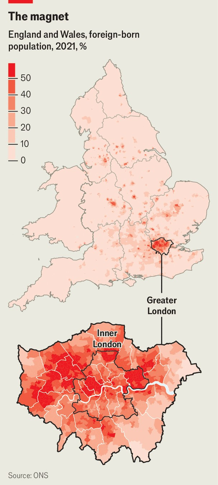
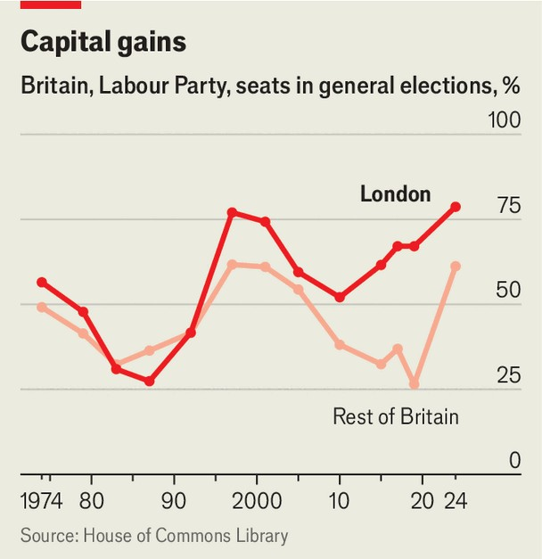

Britain | Britain’s capital
Labour is treating London shabbily
Londoners are partly to blame
October 23rd 2025

“A virtue-signalling lawyer from north London.” So Rishi Sunak, then Britain’s prime minister, described the man who would oust him in the 2024 general election. Bashing London and Londoners is an ancient political sport. But the attempt to paint Sir Keir Starmer as a creature of the capital was misguided as well as cynical. The prime minister was indeed born in London (as was the chancellor, Rachel Reeves). He represents a constituency in (north) London. He has not been a prime minister for London. The Labour government that won power in July 2024 has pursued policies that are inimical to the capital’s interests. This is more the result of thoughtlessness than malice. The government has set out to do reasonable

things such as closing tax loopholes, rationalising local-government finances and cutting immigration. In doing so, though, it is disproportionately harming the most productive part of Britain. Worse, some of the blame for its policies must fall on ordinary Londoners.

Previous regimes were truly malicious in their treatment of the capital. Boris Johnson, who had served as mayor of London, bashed the city when he became prime minister. He rowed with his Labour successor as mayor, Sir Sadiq Khan, and forced him to beg for transport funds during the worst of the covid-19 pandemic. Under the Tories, the mayor and the London Assembly left a blobby building that had been built for them in the heart of the metropolis because they struggled to pay the rent. The English National Opera company was pushed from London to Manchester on pain of losing its funding.

The noisiest assaults on the capital have ceased, not least because Sir Sadiq belongs to the same party as the prime minister. Local politicians appreciate the changed mood. “It’s nice not to have London being constantly attacked,” says Adam Hug, the leader of Westminster Council. They have plenty of gripes nonetheless.

What most exercises Mr Hug and other London politicians is a proposed change to local-government financing. Many services in London are provided by 33 local authorities. They derive much of their income from three sources: council taxes, levied on homes; a portion of rates paid by local businesses; and grants from central government. The last of these sources is about to be cut.

The government is revising the formula that is used to calculate how needy places are and how much cash they should receive. Its proposals are bad for London. Not only does the formula measure poverty without adequately accounting for housing costs, which are high in the capital. It also contains a new “remoteness adjustment” that favours rural districts. The Institute for Fiscal Studies, a think-tank, calculates that if the new formula were applied instantly, the boroughs of inner London would see a 19% cut in funding.

Many of the things that London’s local authorities do, such as caring for the old and rescuing people from homelessness, are legal obligations. So they

will probably fill their fiscal holes by raising taxes. Londoners have for years paid council taxes that are rather low, considering the hefty values of their homes. A standard “band d” home in the capital will pay an average tax of £1,982 ($2,660) this year, compared with £2,280 in England as a whole. That disparity is unlikely to last.

Businesses can expect a sharp increase in taxes, too. Business rates, levied on commercial property, are being revised to reflect changes in rental values —something that happens every three years. The government also plans to introduce a higher rate for commercial properties worth more than £500,000. The aim is to hit the huge warehouses used by e-commerce firms, which are hard to tax otherwise. An unfortunate side-effect will be higher rates for businesses occupying offices in central London. Colliers International, a commercial estate agent, estimates that rates in Farringdon, a district served by the new Elizabeth railway line, will jump from £316 per square foot to £437.

Another tax will be imposed on universities. In May Sir Keir’s government suggested that it would add a 6% levy to the tuition fees paid by international students. Few details have been released, but the plan will surely be enacted, because the government has already announced how it will spend the proceeds. The policy will hit many universities, but especially those in London. In Britain as a whole, 39% of tuition fees are paid by foreign students. In the capital 58% are.

The foreign-student levy is one of many government policies that are designed to cut immigration to Britain. Graduate visas will be made shorter, work visas will be harder to obtain, companies will have to pay more for the privilege of employing foreigners, and some migrants will have to wait ten years to be granted permanent residency, rather than the present five.

The consequences for a city of immigrants (see map) could be profound. London is a net exporter of people to the rest of Britain: in the year to June 2024, 128,000 more domestic migrants departed than arrived. Without international migration, which boosted the capital’s population by 163,000, it would have shrunk.

London’s foreign-born residents are highly accomplished. Of the ten local authorities in England and Wales where immigrants are most likely to have higher-education qualifications, nine are in the capital. In the 2022-23 tax year London also contained 58% of Britain’s “non-doms”, a wealthy group of people who were domiciled in another country for tax purposes. They were taxed lightly, but in April this year the government abolished the non- dom regime and replaced it with a less hospitable system, scaring at least some people away.

Combined with Brexit, which ended free movement between Britain and the rest of Europe, the immigration reforms and the new non-dom regulations have tarnished London. Antoine Forterre, the chief financial officer of Man Group, an investment-management firm, says it was unusual to start building a finance career in Paris when he did so two decades ago (he eventually moved to London). Today that would be unremarkable. Mr Forterre says that London is still a hugely appealing city, where it is easy to feel at home as a

non-Briton. But those who are determined to minimise their taxes are drawn to Italy or the Middle East.

Londoners do get some good things, not least a superb public-transport system, out of the taxes that they pay. But they may not get as much in future. The Treasury has changed its guidance for appraising projects, known as the Green Book, in ways that are likely to suit the rest of Britain more than the capital. “I love London, I’m from London,” said Ms Reeves at the Labour Party conference on September 30th. But, she added, the city of Leeds lacks a mass-transit system. She wants to see one built before London gets another Tube or railway line.

The old Conservative practice of using strange formulae to avoid giving money to the capital continues. In September the government launched a scheme called “pride in place”, which will sprinkle £20m each on 169 poor neighbourhoods. To identify deserving places, it uses the Community Needs Index, among other measures. That index counts things such as volunteering and the density of pubs and nightclubs. Perhaps not surprisingly, only two of Britain’s neediest places turn out to be in London. Birmingham has eight.

Labour politicians might not be doing what London voters want, but they are doing what London voters deserve. Before the late 1990s the city’s inhabitants voted much like Britons as a whole, points out Tony Travers of the London School of Economics. In 1987 the Conservative Party under Margaret Thatcher (mp for Finchley in north London) did better in the capital than elsewhere. These days London is solidly Labour (see chart). Last year the Tories won just nine seats out of 75 in the capital.

Since the Brexit referendum of 2016, people in parts of Britain have lurched from party to party. The people of Yorkshire and the Humber cast most votes for Labour in 2017, the Conservatives in 2019 and Labour again in 2024; they now favour Reform uk, a populist right-wing party. Such fickle voters draw political attention, whereas the residents of the capital are easy to overlook. Londoners seeking someone to blame for the disregard of their city might check in a mirror.■

For more expert analysis of the biggest stories in Britain, sign up to Blighty, our weekly subscriber-only newsletter.

This article was downloaded by zlibrary from [https://www.economist.com//britain/2025/10/23/labour-is-treating-london-shabbily](https://www.economist.com//britain/2025/10/23/labour-is-treating-london-shabbily)

