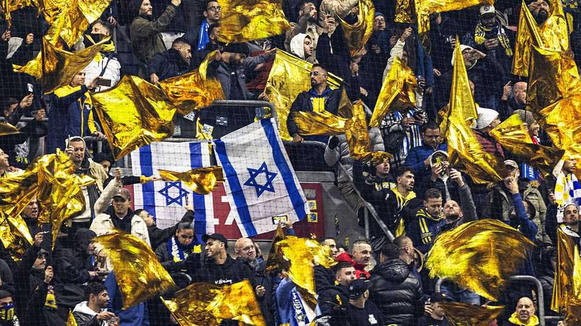

Britain | Political football
What locals think of Birmingham’s ban on Israeli football fans
Refreshingly, they are disappointed
October 23rd 2025

Health-and-safety managers are not often a source of national controversy. But on October 17th the Safety Advisory Group, under Birmingham City Council, banned fans of Maccabi Tel Aviv, an Israeli football team, from a game against Aston Villa scheduled for November 6th in the UEFA Europa League competition. The group said Birmingham does not have enough police to provide protection. The ban has reignited concerns about ethnic tensions and antisemitism in Britain. The idea that fans of an Israeli club, many of them Jewish, might not be able to safely attend a match in Britain has rightly disturbed politicians. Opponents of the ban believe that it also exaggerates the danger. Local

officials, for their part, cited clashes when Maccabi played in Amsterdam in November 2024. There were anti-Arab chants by Maccabi fans and an assault on a taxi driver before the game, and violent attacks on Maccabi supporters in the city centre after it. (A year earlier Aston Villa, on police advice, had allowed no away supporters into a game against Legia Warsaw, after “large-scale disorder” by Polish fans outside the stadium.)

Maccabi have since played in Greece and Hungary without such violence, though a game in Turkey was moved to Hungary and played behind closed doors. On October 19th a match against another Israeli team was cancelled after prematch riots stoked fears of further violence.

More than half the population of Aston, one of Birmingham’s most ethnically diverse neighbourhoods, is Muslim. Ayoub Khan, the local MP, is a pro-Palestinian independent. Given the plans for protests, two police officers told The Economist, Birmingham’s force wouldn’t be able to cope if things escalated. Jack Angelides, Maccabi’s boss, said he feared for his fans’ safety.

The government could have provided a way out. It was told about the need for extra police a week before the ban was announced. And, though Sir Keir Starmer, the prime minister, called the ban an unacceptable surrender to antisemitism on the streets, at the time his government did not offer extra resources. On October 20th Maccabi said its fans would not attend the match, even if the ban was lifted.

A couple of streets over from Aston Villa’s stadium, in a café nestled amid terraced housing on Endicott Road, residents and Aston Villa supporters are surprisingly disappointed. Most disagree with Israel’s war in Gaza. Many believe that the British government should boycott Israeli sports teams and artists. But they are also convinced that there would not have been trouble if the Israeli fans had been allowed to attend. In March Robert Jenrick, a Tory MP, visited a nearby part of town and bemoaned the absence of “another white face”. Something, he said, was wrong with Britain. “This was our chance”, says Ahmed, a postman, “to prove him wrong.” ■

For more expert analysis of the biggest stories in Britain, sign up to Blighty, our weekly subscriber-only newsletter.

This article was downloaded by zlibrary from https://www.economist.com//britain/2025/10/22/what-locals-think-of-birminghams-ban- on-israeli-football-fans