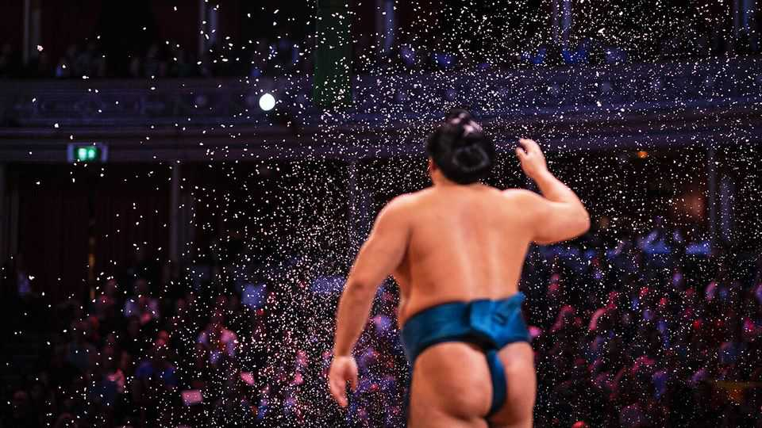
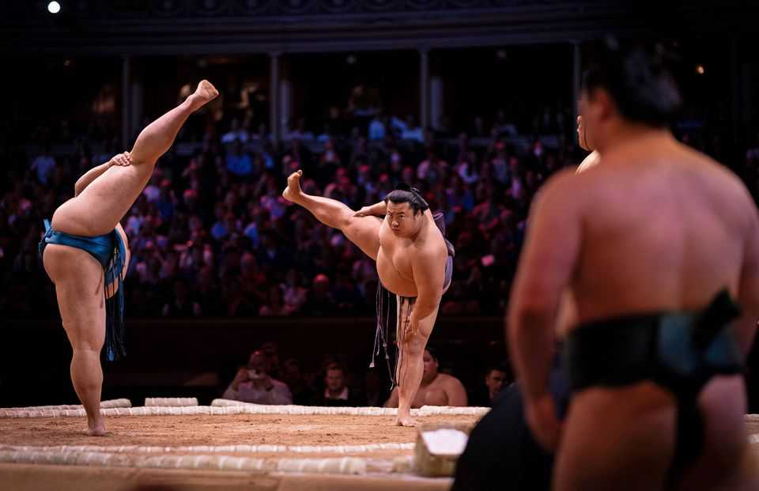

Britain | Heavyweight diplomacy
How sumo wrestling became a hit in Britain
The ancient Japanese sport finds some unlikely fans
October 23rd 2025

Usually, visitors to the Royal Albert Hall come to savour the Proms or other concerts. For five days in mid-October the grand Victorian venue in south- west London hosted a rather different kind of spectacle. In a raised clay ring large men clapped to summon Shinto deities and scattered graceful arcs of purifying salt. When they stomped to crush evil spirits they balanced their vast bellies on one leg with the poise of ballet dancers. Sumo wrestling had come to London—and that was just the warm-up. Sumo, which has been practised for over 1,500 years, rarely leaves Japan. Yet when it does, Britain holds a peculiar appeal. This was only the second five-day sumo tournament ever held abroad; the first, in 1991, also took place in London. Britain was not chosen for its thriving sumo scene. The

British Sumo Federation (BSF) knows of only a handful of clubs, and the sport is no longer broadcast on British television. Rather, its return owed much to nostalgia. Hakkaku Nobuyoshi, winner of the 1991 event, is now chairman of the Japan Sumo Association and lobbied to bring it back.

His enthusiasm was reciprocated. The event sold out within minutes. Photographs of three wrestlers cycling in kimonos through London on Lime bikes quickly went viral. The British press delighted in reporting that to keep the 40 competitors fed, the Royal Albert Hall had ordered 700kg of rice, 1,000 sachets of instant miso soup and 750 packs of noodles. For a few days the wrestlers, many on their first trip abroad, became the country’s most distinctive tourists: grinning beside Big Ben, posing at Stonehenge and next to a red double-decker bus.

Some fans knew what to expect. Neil, who first watched sumo on television in the 1990s, came with his daughter Emily, who discovered it as a student in Japan. Others were new to the sport and its rituals. In the hall a bouncy commentator explained why aides wearing pristine white gloves were dressing the yokozuna, the highest-ranking wrestlers, in a twist of white cord (symbolising the sacred ropes at Shinto shrines), and why the referee carried a dagger (symbolising that he would be willing to kill himself if he erred). After the ref made a dubious decision four robed judges jumped into the ring to overturn it rather than deferring to VAR, to the delight of the crowd.

The real spectacle was the fighting. Most bouts were over within seconds, a blur of slapping palms and brute force as one giant tried to wrench another from the ring. A Ukrainian fighter, Aonishiki Arata, was a crowd favourite. “He pulled off a worldie of a technique with an inside thigh grab,” gushed Richard Riggs, vice-president of the BSF, and a rare sumo expert among the spectators. Those sitting on cushions in the front row had the best views but the highest risk of being squashed by falling wrestlers. All the while the Asahi beer flowed.

Both sumo and the Royal Albert Hall are trying to broaden their appeal. Once fiercely insular, sumo now has an international air: the tournament was won by a Mongolian yokozuna who posed for photographs with his prizes— a giant bottle of soy sauce and a Hello Kitty plush toy (according to her back-story, Kitty is British). The Royal Albert Hall, for its part, has widened its repertoire. Recent bookings range from Westlife (once a boy band, now a nostalgia-inducing quartet belting out ballads), to an orchestral performance of the Disney film “How to Train Your Dragon”. Sumo has attracted the greatest attention.

For Japan, the week was about more than a one-off show. Suzuki Hiroshi, the country’s ambassador, had already endeared himself to Britons on social media by posing with Paddington Bear, singing the Welsh national anthem and downing pints of bitter. He says he was delighted to see Britons flock to the capital for sumo and matcha tea. During the tournament he posted enthusiastic commentary on social media; visitors to the Japanese embassy were treated to a sumo exhibition. Behind it lies shrewd diplomacy. “If British people come to love Japanese culture,” he smiles, “then Japan will be your partner for life.”■

For more expert analysis of the biggest stories in Britain, sign up to Blighty, our weekly subscriber-only newsletter.

This article was downloaded by zlibrary from https://www.economist.com//britain/2025/10/21/how-sumo-wrestling-became-a-hit-in- britain