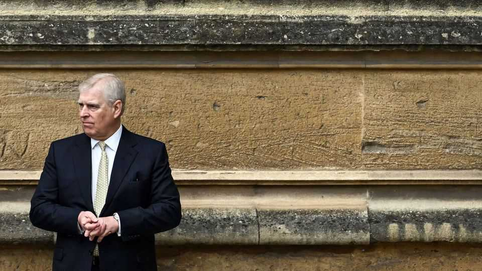

Britain | A royal mess
Britain’s Parliament goes after Prince Andrew
MPs want to question the disgraced prince. The prime minister seems unenthused
October 23rd 2025

The question was simple. Should Prince Andrew be hauled before a parliamentary select committee? The prime minister’s answer was delivered in a mumble so fast the precise words were revealed only some hours later in Hansard, the official transcript. “It is important, in relation to all Crown properties, that there is proper scrutiny,” he told the House of Commons. British history has been forged in the titanic struggles between monarch and Parliament. Yet Sir Keir Starmer is treating the matter with the haste of an insurance salesman reading out the small print. On October 17th Prince Andrew, the eldest brother of King Charles III, had agreed to no longer use his titles (among them the Duke of York and the Earl

of Inverness), prompted by the publication of a posthumous book by Virginia Giuffre, who had accused him of sexual abuse when she was 17 years old. The Mail on Sunday, a newspaper, also alleged that he had asked his police bodyguard to dig up dirt on his accuser; the Metropolitan Police is “actively looking into the claims”. Andrew has always denied any wrongdoing.

Amid all this muck, MPs want to know why the prince should continue to live in Royal Lodge, a mansion in Windsor Great Park, on which he pays a peppercorn rent. The scandal of the prince’s relationship with Jeffrey Epstein, a convicted paedophile, has dogged the monarchy for over a decade. Time, some MPs conclude, for Parliament to step in.

Sir Keir would like nothing less. Here lies the contradiction in his government. He promised to govern as an insurgent, upending failing institutions on behalf of a public itching for change. Prince Andrew looks like just another rotten public body, ripe for abolition. Yet Labour’s path to power required it to show an unusual veneration for the royals, in order to demonstrate that it could be trusted with one of Britons’ most treasured institutions after the tenure of Jeremy Corbyn, a republican socialist. But Sir Keir’s mute approach to the Andrew affair has left his colleagues fuming.

“Everyone thinks he should be castrated by elected politicians,” says one frustrated minister about the prince.

Walter Bagehot, an editor of this newspaper in the 19th century, would recognise Sir Keir’s predicament. While Britons thought of the crown as the “head of our morality”, the royals were a sleazy lot, he wrote in “The English Constitution”. George IV was a “model of family demerit” and few princes, he said, “have ever felt the anomalous impulse for real work”. But it was better if politicians kept their distance. “When there is a select committee on the Queen, the charm of royalty will be gone.”

In reality there is not much that MPs can easily do. Parliament can argue over whether Andrew should be stripped of his princeship, but that requires a “letters patent” from the king or an act of Parliament. Politicians have no power over royal rent-setting: the Crown Estate is independent. The ultimate sanction would be for Parliament to pass an act, removing Andrew from the line of succession. (He sits eighth.) But to tinker with the hereditary principle would be to fiddle with the idea of monarchy itself. ■

For more expert analysis of the biggest stories in Britain, sign up to Blighty, our weekly subscriber-only newsletter.

This article was downloaded by zlibrary from https://www.economist.com//britain/2025/10/23/britains-parliament-goes-after- prince-andrew