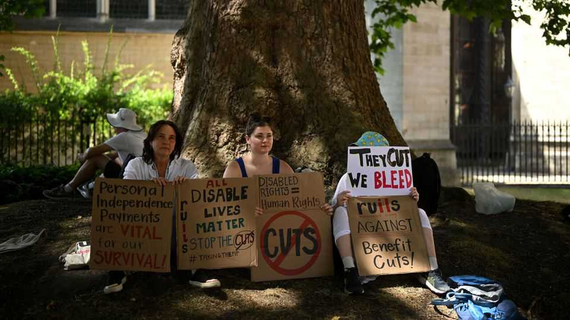

Britain | The cost of compassion
Britain’s welfare system has grown sicker
And something’s got to give
October 23rd 2025

“When I try to cook, I get anxious and confused. I’ve left things on the stove before. I need someone nearby to stay safe.” These are not the words of a frail pensioner but advice from a TikTok influencer telling viewers what to write on disability-benefit forms. The content-creator is part of a growing breed of “sickfluencers” coaching people how to squeeze money from Britain’s welfare system. Many followers have genuine conditions that make life harder. The problem is that health-related benefit claims have surged, helped by changing attitudes to mental health. One in ten working-age adults in England and Wales claims at least one disability-related benefit. That’s 4m people, up

from 2.8m in 2019. This is tricky for the Labour government, whose MPs entered politics to protect the vulnerable, not cut their support.

Some politicians argue that the overall welfare system is out of control. Kemi Badenoch, the Conservative opposition leader, says Britain risks becoming a “welfare state, with an economy attached”. These claims are overblown. Britain’s non-pensioner benefits bill this year is 4.8% of GDP (£145bn, or $195bn), according to calculations by The Economist. This is roughly in line with the 30-year average. Spending is forecast to stay at a similar level throughout the decade (see chart 1).

Beneath that calm surface lie two opposing currents. The first is a retrenchment in spending not tied to health, like unemployment and housing. Such outlays have fallen from 3.5% of GDP in 2005-06 to 2.7% in 2025-26. Successive governments pared back the system’s generosity. Benefit levels were frozen, housing allowances reduced and a two-child limit on payments for children introduced.

These cuts have been offset by a steep rise in spending on disability and incapacity benefits. Disability benefits, such as Personal Independence Payments (PIP), are cash payments to cover the extra costs of being disabled: higher heating or travel expenses, for example. They’re available

to workers and non-workers and are not means-tested. Incapacity benefits are for those too ill to work.

Claims for both have boomed since 2019 (see chart 2). Britain is an outlier; similar European countries have seen caseloads stagnate or fall since 2019. A swell of sick Britons has pushed spending on disability and incapacity to 2.1% of GDP (£64bn) this year—almost double the share two decades ago. Disability benefits account for most of the rise.

Soaring caseloads reflect broadening definitions of disability, compounded by a welfare system that distorts incentives. Around one in seven working- age Britons now reports having a long-term mental or behavioural disorder, up by 50% over the past decade. In the disability-benefits system, 44% of claims cite such illnesses as their main condition, up from 25% in 2002. The sharpest rises have been among women, under-40s and children (see chart 3).

Government assessments of benefit eligibility have struggled to keep pace. These test how a person’s conditions affect daily tasks like cooking or washing—straightforward for physical ailments but far harder to judge for mental ones. Success often hinges on presenting the right narrative. A whole ecosystem of advice on how best to do this has emerged, including from charities, TikTok and, increasingly, AI. The Mr PIP Hero Chat Bot is particularly popular: feed it your condition and it will write your application. Savvier applicants win from this system while less articulate, more vulnerable claimants lose out.

A flawed assessment is worsened by miserliness elsewhere. Britain’s unemployment benefits are among the stingiest in the rich world: a single person gets less than 13% of the average wage. Yet those on the maximum health-related benefits can quadruple their income (see chart 4). Such a feast-or-famine choice drives people towards sickness claims and disincentivises work.

In March the government unveiled reforms. It will raise the main unemployment benefit rate by £7 a week while halving the incapacity top-up for new claimants to £50. It will scrap the assessment requiring people to prove they cannot work and guarantee that trying employment won’t lead to benefit cuts. Together, these changes should sharpen work incentives.

Yet the reforms don’t touch disability benefits, where the bulk of the spending surge lies. A clumsy attempt to tighten eligibility and save £5bn a year was abandoned in July after uproar from Labour MPs. Ministers now pin their hopes on a review of the PIP assessment process led by Sir Stephen Timms, the minister for disability, which will report in autumn 2026. But few expect it to identify major savings.

Ms Badenoch has floated cutting disability benefits to avoid tax rises in November’s budget. That is wishful thinking. Capital Economics, a

consultancy, estimates the government needs to find as much as £27bn in savings or tax hikes in 2029-30 to meet its fiscal rules. Given that £5bn of disability-benefit cuts was too much to stomach in the summer, deeper ones are unlikely—and bond markets will not trust rushed proposals.

Still, something must give. Spending on non-pensioner disability benefits is forecast to grow roughly twice as quickly as health spending over the next five years. Bond markets are watching closely, treating the government’s handling of disability benefits as a fiscal-credibility test.

The government’s first step should be to make cost cutting an explicit goal of the Timms review, focusing it on saving money while protecting the most vulnerable. This entails tackling difficult questions: should Labour follow the Tory plan to cut cash payments for some mental-health claimants, providing extra treatment instead? Should disability benefits be means- tested? Exact answers can wait until after the budget. But if the government wants to signal seriousness, it can’t wait long.■

For more expert analysis of the biggest stories in Britain, sign up to Blighty, our weekly subscriber-only newsletter.

This article was downloaded by zlibrary from https://www.economist.com//britain/2025/10/23/britains-welfare-system-has-grown- sicker