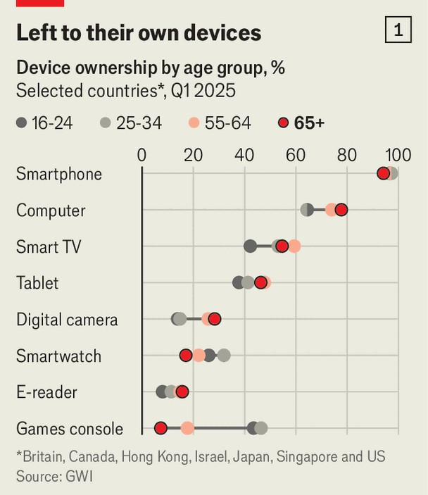
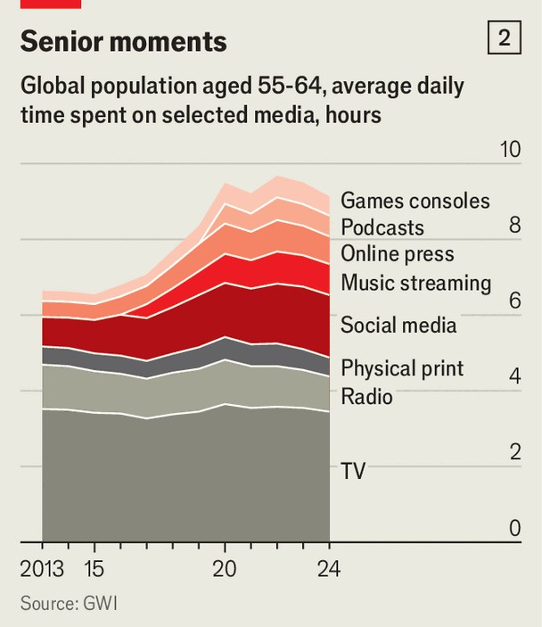

International | Age and technology
Meet the real screen addicts: the elderly
The digital habits that defined youth are transforming old age
October 23rd 2025

HUNDREDS OF TEENAGERS, sometimes strong-armed by their parents, have trooped through the doors of Britain’s National Centre for Gaming Disorders since it opened in 2019. Yet lately the publicly funded clinic has admitted a steady trickle of rather different patients. Its specialists in video- game addiction have so far treated 67 people over the age of 40. The oldest, with an obsession for games on her smartphone, was 72. Something approaching a moral panic has taken hold in many countries over the impact of digital technology on young people. Jonathan Haidt, a social psychologist and author, speaks of an “anxious generation” of youngsters whose childhood is being stolen by smartphones and social apps. Schools increasingly demand that phones are kept in lockers or at home. Parent-run

groups such as “Smartphone Free Childhood” preach abstinence. In December Australia will ban under-16s from using social media.

Yet a less-noticed explosion in screen time is happening within a different generation. As today’s 60-somethings, already familiar with digital technology, enter retirement, time spent on smart devices is shooting up among the elderly. Some older adults “are increasingly living their lives through their phones, the way teenagers or adolescents sometimes do”, says Ipsit Vahia, head of the Technology and Ageing Laboratory at McLean Hospital, part of Harvard Medical School. The digital habits that have transformed the teenage years are now coming to old age.

The elderly have long been champion television-watchers. Free time, immobility and isolation are a recipe for spending hours in front of the box: last year over-75s in Britain spent more than five-and-a-half hours a day watching broadcast TV, a good five hours more than those aged 16-24, according to the media regulator, Ofcom.

Older people have traditionally lagged behind when it comes to digital technology. A decade ago only a fifth of Americans over 65 owned a smartphone. That is changing. The newly retired, most of whom have been online since middle age, are among the most enthusiastic adopters of digital

gadgets. Over-65s are more likely than under-25s to own tablets, smart TVs, e-readers, and desktop and laptop computers, according to a seven-country survey by GWI, a research firm (see chart one).

Tech companies have identified oldies as a growing market. Apple makes earphones that double as hearing aids and watches that can carry out electrocardiograms or call an ambulance if the wearer falls. (Partly as a result of this, 17% of over-65s now own a smartwatch.)

The next generation of pensioners looks as if it will be even keener on digital gadgets: nearly a fifth of 55- to 64-year-olds own a games console. Retirement is starting to look a lot less about golf and more about “Grand Theft Auto”.

As ownership of digital devices becomes more common, older people’s screen time is growing. Rather than replacing time spent on other media, phones and tablets seem to be adding to the daily total. Over the past decade, TV and radio consumption among people in their 50s and 60s has held steady, while time spent on social media, gaming and audio streaming have all increased (see second chart). Ofcom found that last year Britons over 65 spent more than three hours a day online on smartphones, computers and tablets. That is half as much as those aged 18-24. But, combining TV and

smart devices, those of retirement age clock up more daily screen time than do young adults.

In countries where the trend is most advanced, people are starting to worry about elderly smartphone users in the same way that they worry about teens. A study in 2022 in South Korea, which has among the highest rates of smartphone usage in the world, estimated that 15% of those aged 60-69 were at risk of phone addiction (based on whether they agreed with statements such as: “Every time I try to reduce my smartphone-usage time, I fail”). Research from Japan found that screen time was associated with less physical activity among the elderly. A survey of over-60s in China linked it to worse sleep.

Establishing causation is difficult. Screens may tempt seniors to be more sedentary—or it may be that they spend more time on their phones precisely because they are sofa-bound. Pete Etchells, a professor of psychology at Bath Spa University, points out that his own screen time recently spiked after he was laid up in hospital for a couple of weeks. “If you’d taken my iPad away, I can tell you that I would still have been as immobile—and orders of magnitude more miserable,” he says.

Older people face some online risks that other vulnerable groups do not. Unlike most teenagers, their phones and tablets are often linked to their bank accounts. “Microtransactions” within games—so-called loot boxes and the like—can drain wallets. So can fraudsters, who are able to contact and rob their victims within the same app. In poor and middle-income countries especially, older people have embraced WhatsApp for everything from communications to shopping, says Dr Vahia—“and WhatsApp is also the platform of choice for scammers as a result.”

The elderly also lack the social guardrails that regulate teenagers’ screen time. During the day teachers police teens’ phone usage, while parents do the nagging in the evening. By contrast, elderly people are their own bosses; they may not have someone to steer them towards help if they need it. “With older people, sometimes there is no one around, or if there is then no one really notices what they’re up to on their computer,” says Henrietta Bowden- Jones, who runs Britain’s gaming clinic.

Elderly people are much less likely than the young to complain to their doctor of phone addiction, says Dr Vahia. But in some cases, screen time is what lies behind other, more obvious problems in older patients, he says. His clinic has treated some elderly people whose insomnia turned out to be rooted in a fear of online scams; in others, anxiety turned out to be caused by doom-scrolling on social media.

Alarming and misleading news may be a particular threat to the elderly, who are twice as likely as under-25s to use news apps or websites. A recent paper by Hunt Allcott of Stanford University, and colleagues, found that giving up Facebook led to modest improvements in mental health for users of all ages. The beneficially effect was more than twice as large in the older half of their volunteer group than it was among the younger ones.

Yet a boom in screen time among the elderly is by no means all bad. From Zoom-powered church services to online yoga classes and remote book clubs, the connective power of the internet is especially valuable to those who struggle to get out. Professor Bowden-Jones believes that for people forced to stay at home, because they feel unable to get out or because they can no longer drive, the ability to follow pursuits online “is just so wonderful”. Messaging apps bring family closer. Gaming passes the time. Spotify and YouTube are nostalgia machines that bring childhood music and video rushing back.

Screen-mad elderly people also have some advantages over teens. Whereas smartphones can come between young people and real-life relationships, older people have already made the key social connections in their life. “They have well-formed behaviours, well-formed relationships, well-formed ways of communication. Smartphones can often enhance them,” says Dr Vahia.

For those who end up overdoing it, the consequences are probably less severe than they would be for a teenager. Unlike alcohol or gambling addictions, in which the person risks losing their health or their house, the main danger of screen addiction is simply losing hours of time. For a young person, that could mean failed exams or lost jobs. For someone in retirement, spare time is abundant.

There is even some fresh evidence that digital devices may help older people to stay mentally fit. Past research has suggested that excessive screen time impairs concentration and memory, leading to what some have dubbed “digital dementia”. Yet in April a meta-analysis of studies on more than 400,000 older adults found that over-50s who regularly used digital devices had lower rates of cognitive decline than those who did not. (Though causation remains elusive: it may simply be that those who are mentally alert use their devices more often than those who are losing it.)

Older people’s enthusiasm for digital technology shows no sign of slowing down. The next frontier may be virtual reality (VR), which allows the housebound to enjoy immersive excursions to whatever place or time they want to visit. Dr Vahia recently arranged for an 85-year-old patient with depression to be given a VR walk-through that started at her childhood home and took her to her elementary school. It rekindled dormant memories that helped to resolve decades-old conflicts. For better or worse, seniors’ screen time has much further to grow. ■

This article was downloaded by zlibrary from https://www.economist.com//international/2025/10/23/meet-the-real-screen-addicts- the-elderly