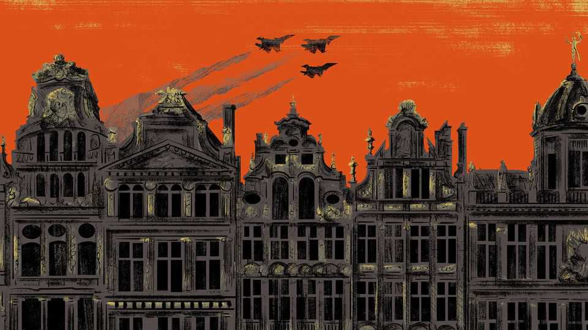

International | The Telegram
Brussels feels like a city preparing for war
Europe readies itself to survive in a world of hostile strongmen
October 23rd 2025

THOUGH IT IS outlandish even to type the words, Brussels the international capital—the home of the European Union and seat of the NATO alliance—feels like a city bracing for combat. “Europe is in a fight,” declared Ursula von der Leyen, the president of the European Commission, the EU’s executive and civil service, in a state-of-the-union address on September 10th. “Battle lines for a new world order based on power are being drawn right now.” Europe must fight for its values and for the right to choose its destiny, she said. Mrs von der Leyen described a world in which “dependencies are ruthlessly weaponised,” and in which “many major powers are either ambivalent or openly hostile to Europe.”

To be sure, the old flaws of pan-European governance—vapid oratory, bureaucratic turf wars and expensive something-for-everyone compromises —persist. For all that, in the headquarters of the EU and of NATO, very different institutions at opposite ends of the city, recent months have seen a stark change of mood.

Europeans “only start organising ourselves when we are threatened”, says an official. The threats are clear now. The most urgent involve three strongmen who view Europe with either disdain or hostility: Presidents Donald Trump, Vladimir Putin and Xi Jinping. Brussels has come to a grim realisation. War is raging on the European continent, in Ukraine, and none of those strongmen is guided by anything resembling European values.

Europe’s deep state is sounding the alarm that war could come even closer. On October 13th the head of Germany’s foreign-intelligence agency told his parliament that Russia is bent on expanding its influence into Europe, notably Germany, and “will not shy away from direct military confrontation with NATO if necessary”.

Serious times are being met with hard-headed politics. Over the past 30 years, Europe mostly enjoyed increasing security and prosperity. As new members joined the EU and NATO, and memories of war and dictatorship in Europe faded, life resembled a stately progress up the “hierarchy of needs” described in the 1940s by Abraham Maslow, an American psychologist. Few EU citizens must worry about the bottom tier, dealing with such basics as food and shelter for survival. Above that comes “safety and security”, whether that means an absence of war, a clean environment or freedom from acute want. As governments built welfare states and controlled pollution, progressives called for Europe to tackle problems that align with Maslow’s higher needs. Those include “love and belonging”, “esteem” and “self- actualisation”, or the pursuit of a life of purpose and joy.

European voters seem focused on more basic needs. They have elected a string of conservative national governments, who have sent correspondingly flinty politicians to run EU institutions. After years spent passing onerous environmental and social regulations, the bloc now spends much of its time repealing job-killing rules. New Euro-laws that can secure a majority,

whether in the European Commission or European Parliament, often involve get-tough policies, like the removal of asylum-seekers.

There is less naivety about other great powers. Early this year some European politicians sought closer ties with China as a hedge against American bullying. Today dependency on China is a greater concern, as that giant uses its chokeholds over rare-earth minerals and other critical inputs to win its trade war with Mr Trump, and treats European businesses as collateral damage.

Trade policy is marked by pragmatism. In interviews, officials in Brussels dismiss the griping over the EU’s “summer of humiliation” via one-sided trade talks with America. It would be unrealistic to hope to protect the EU’s self-esteem, given America’s clout and willingness to impose pain on trade partners. “There is no use complaining about” Mr Trump, an official says flatly.

And there is painful clarity about Europe’s defence alliance with America. In the wake of Mr Trump’s latest about-turn on Ukraine, there is exasperation over the time and energy European leaders spend on Trump “damage control”. But grief and denial about America’s unreliability have given way to resignation. It is now a planning assumption that America will give no more aid to Ukraine, and that even its willingness to sell advanced weapons to Europeans for donation to Ukraine will not last.

As for the broader defence of Europe, Plan A is to work with America for as long as possible. Europe still relies on America for “critical enablers” including intelligence from satellites, long-range weapons, air defences, heavy transport planes and the digital systems that glue different weapons together. There is much talk of building up Europe’s arms industry, but also agreement that it cannot entirely replace America as a supplier for ten years or more, which is too slow for a continent rearming to deter Russia from attacking it. Fear of Russia makes officials wary of even engaging with the most sensitive question of all, whether Europe needs a Plan B for its security, if America walks away one day. Some fear that to discuss American abandonment is to invite a Russian attack. Others seek to identify investments that work with both Plan A and Plan B: either making Europe a better partner for America, or helping it go alone.

European unity remains a goal. It is no longer dogma. If holding out for unanimity gives a veto to Moscow-friendly EU and NATO members, such as Hungary, coalitions of the willing are a practical way to co-ordinate European defence and support for Ukraine. It is deemed inevitable that countries closer to Russia will take a lead on deterring Mr Putin.

Europe’s seriousness is welcome, but change takes time. Alas, big players, starting with Britain and France, are financially broke. Europe sees the dangers it faces. With luck, it is not too late. ■

Subscribers to The Economist can sign up to our Opinion newsletter, which brings together the best of our leaders, columns, guest essays and reader correspondence.

This article was downloaded by zlibrary from https://www.economist.com//international/2025/10/21/brussels-feels-like-a-city- preparing-for-war

Business

OpenAI and Anthropic v app developers: tech’s Cronos syndrome Despite abstemious Gen Zs, the booze industry is going strong The mercenary business is on the brink of another boom In South Korea a corporate-governance revolution is under way Sports leagues find that streaming pirates have their purposes Beware the “romance of leadership” American big business faces a $1trn capex question