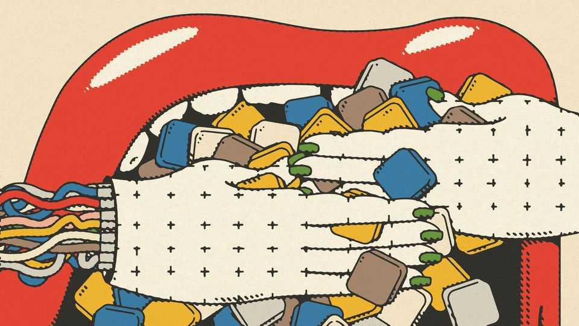

Business | AI’s balance of power
OpenAI and Anthropic v app developers: tech’s Cronos syndrome
Will the labs devour the apps that run on their models?
October 23rd 2025

IN THE USUALLY gossipy world of Silicon Valley, something strange is happening. It is hard to find a generative artificial-intelligence entrepreneur with a bad word to say about anyone. This may be an age thing. Many of those launching AI startups were born after sci-fi dystopias like “The Matrix” (né 1999) and are young enough to still believe AI will be a force for good for everyone. To them, even the word “frenemy” sounds too red in tooth and claw. Bonhomie aside, though, a competitive dynamic is emerging that will only grow fiercer. Take AI startups like Anysphere, whose Cursor app helps software developers write code, Harvey, which provides AI to law firms, and

OpenEvidence, which does the same for doctors (and on October 20th raised $200m at a valuation of $6bn). These apps are growing rapidly by making use of large language models (LLMs) provided by the likes of OpenAI, maker of ChatGPT, and Anthropic, maker of Claude. They pay to use the models, but unlike the AI labs, they do not burn through billions in a quest for superintelligence. That makes their path to profitability easier.

Meanwhile valuations for the cash-incinerating AI labs—$500bn for OpenAI and $183bn for Anthropic—are stratospheric, indicating that as their models become more capable, investors believe they will someday usurp the profits of the startups that rely on them. Think of the labs as Cronos, a titan in Greek mythology, trying to devour his children (or as Amazon, a titan of e-commerce, making products to undercut those that sell well on its platform). The question, as with Cronos, is: can the little ones survive and fight back?

The infanticide may have already started. The startups are far too nice to sound the alarm. But Ed Zitron, author of an acerbic newsletter about AI, reported on October 20th that Anthropic had spent a big chunk of its revenues this year and last on Amazon Web Services, one of its cloud providers. As a result, he said, it introduced service tiers that pushed up costs for big customers like Cursor to help fill the hole. Anthropic says service tiers are standard practice across the industry.

The threat goes beyond pricing. The big AI labs are striving to achieve artificial general intelligence, or AGI, which would make their models able to do most tasks that humans can do—including matching and potentially surpassing the appmakers’ capabilities. For now, there may still be room for everyone. But the writing is on the wall. Just look at coding, where generative-AI apps have been quickest to take off. Both Anthropic and OpenAI have developed coding tools that rival, with nuanced differences, the likes of Cursor.

The startups’ founders remain remarkably chipper. They believe that the balance of power will remain firmly in their favour for the foreseeable future. Tellingly, many are sceptical of AGI, albeit sotto voce (one asked The Economist not to name him as a doubter, lest he be blacklisted from the San Francisco party scene). They argue that rather than AGI, the capability

that businesses actually need to spur deeper adoption of generative AI is “artificial specialised intelligence”, ie, AI that is specific to a particular field, such as law or medicine. That is where they hope to retain the competitive edge.

Sierra, which makes AI “agents” that act alongside humans in customer service, uses a picture to illustrate the dynamic. It shows the tip of an iceberg: this is the market served by LLMs. Below is a plethora of more complex business processes that present much greater challenges and opportunities. None of them is generalisable. Value is to be found in “the most boring, mundane thing…hidden in the back of a company [that is] slow, expensive and consequential,” says Bret Taylor, Sierra’s co-founder (and also chairman of OpenAI).

To undergird themselves, the app developers are experimenting with new revenue models. They acknowledge that unlike in previous waves of software development, the bigger they become, and the more they use LLMs, the higher their marginal costs will be. To offset these rising costs, they need new techniques. One is to use a variety of models, including open- source ones, in order to route the simplest queries to where processing is cheapest. Another is to charge customers according to outcomes, rather than usage. Harvey, for instance, can afford to opt for the largest models because law firms are willing to pay for perfect accuracy.

Moreover, the app developers argue that the longer they remain in business, the more specialised data their agents will acquire, improving their performance—rather as self-driving cars become more reliable the more miles they travel. This is likely to make them “stickier” with customers, creating a competitive moat that the AI labs will struggle to cross. Cursor, for instance, uses real-time data to update its own LLM every two hours, which it believes improves its customers’ coding experience. Harvey looks beyond boilerplate stuff like AI-generated non-disclosure agreements. Its sights are set on far more complex tasks, like helping co-ordinate several law firms in a mega-merger, that will be harder for general-purpose models to replicate.

The appmakers still have disadvantages. Specialisation may make it harder to move beyond a particular field, such as law, medicine or customer

service, limiting the size of their potential market. General models may be able to go broader. Then there is recruitment. Being much smaller than the AI labs, appmakers will struggle to compete in the costly war for AI talent. But all will need top AI developers to build the best agents.

Yet even as the AI labs become more predatory, they too have a problem. There is so little difference between them, and it is so easy for software companies to switch from one LLM provider to another, that they are at risk of being commoditised. This has led HSBC, a bank, to estimate in a recent report that by 2030 LLM providers would reach only a 30% share of the $1.3trn global market for AI-enhanced IT services. The rest will belong to software vendors using the LLMs.

Such is the Cronos syndrome. In Greek mythology, Zeus, Cronos’s youngest son, survived and rescued his siblings. After a long battle, their father was cast into the underworld. That is not necessarily the fate that awaits OpenAI and Anthropic. But the AI labs’ omnipotence is not preordained either. ■

To stay on top of the biggest stories in business and technology, sign up to the Bottom Line, our weekly subscriber-only newsletter.

This article was downloaded by zlibrary from https://www.economist.com//business/2025/10/23/openai-and-anthropic-v-app- developers-techs-cronos-syndrome