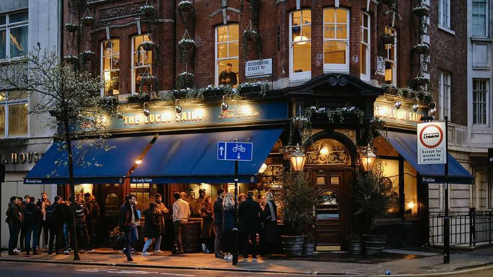
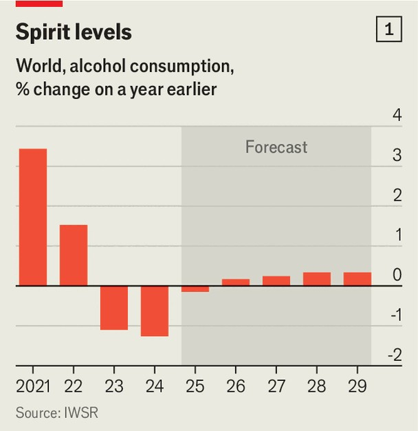
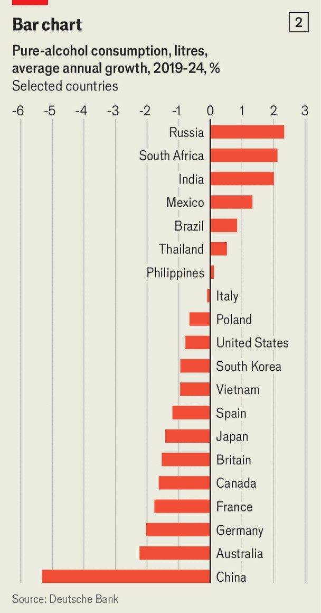

Business | Half empty v half full
Despite abstemious Gen Zs, the booze industry is going strong
It’s too soon to declare the death of drinking
October 23rd 2025

The Lucky Saint in central London looks like any other pub. Big wooden barrels double as tables. Bartenders pull pints. But this isn’t a regular watering-hole. Though booze is on offer, about 15% of sales are of Lucky Saint, the non-alcoholic beer brand that owns the place. Other patrons merrily sip alcohol-free cocktails and sparkling wine. “Go back a couple of years and people used to cleanse in January,” says Nate Roberts, one of the managers, “but now we see this 365 days per year.” For the drinks industry, these seem to be difficult times. Policymakers in America, Britain and elsewhere are pushing the idea that there is “no safe level” of alcohol intake. Consumers worry that booze is bad for their wallets

as well as their health—especially young ones, who drink less than earlier generations. No wonder investors speak of a “tobacco moment”: judged by the ratios of share prices to earnings, Diageo, Pernod Ricard and Rémy Cointreau, three leading makers of spirits, are less highly valued than British American Tobacco. The list of sorrows is certainly long. But the glass is fuller than you may think.

Start with rising concerns about health. Last year the World Health Organisation grouped alcohol with tobacco, fossil fuels and ultra-processed foods as leading causes of non-communicable disease in Europe. Then America’s surgeon-general issued advice pointing out the links between alcohol consumption and cancer. Consumers seem to be paying heed: in a recent Gallup poll of American adults, only 54% of respondents said they drank, the lowest share the firm has recorded in nearly 90 years of asking. Most said even a drink or two per day was bad for health.

Economic factors have helped take the fizz out of booze’s two biggest markets. In sluggish China, people are spending less on many things, from fancy handbags to nights out. In America, President Donald Trump’s tariffs have made cognac and Guinness dearer to import. Diageo (which brews Guinness) reckons new tariffs will cost it $200m a year, and has scrapped its sales-growth target partly because of uncertainty about trade policy. Rémy Cointreau, its smaller competitor, expects a €30m ($35m) hit from new tariffs and Chinese anti-dumping measures combined.

Data from IWSR, a research firm, show that the volume of alcohol consumed globally has dipped since covid-19 lockdowns, when many indulged to kill time (see chart 1). Beer-drinking has been roughly flat for five years; that of wine and spirits has flagged.

But the industry is far from drying up. Spending on drink has kept rising. Prices have risen more slowly than general inflation, but people have shifted to dearer tipples. According to IWSR around $1.2trn will be spent this year. And although Western consumers are more abstemious, those in emerging markets are getting thirstier. Some analysts now see a buying opportunity in alcohol shares.

The assumption that the trend in America and elsewhere for sobering up will go global looks questionable. Estimates from Deutsche Bank suggest alcohol intake is rising in several emerging markets, including India, South Africa and Brazil (see chart 2). These are populous places with growing, freer- spending middle classes. Trevor Stirling of Bernstein, a broker, says that at AB InBev and Carlsberg, two big brewers, emerging markets contributed over 65% of earnings before interest and tax in the last financial year. In 2025 AB InBev’s share price is up by 11% and Carlsberg’s by 16%.

In the West, the industry has been fretting that the young are drinking less than previous generations. That, says Marcel Marcondes, AB InBev’s chief marketing officer, was a short-term effect of lockdowns, which made it hard to socialise, and a weak job market, which left young people broke. In an IWSR survey, the share of Gen Z respondents above the legal drinking age saying they had consumed alcohol in the past six months jumped to 73% this March, from 66% two years earlier. Mr Marcondes reckons that generation is doing a lot of growing up a few years later than their parents did: “25 is the new 21,” he adds.

Rather than turning teetotal, people are drinking differently. Premixed cocktails are flying off supermarket shelves. Analysis by Deutsche Bank suggests per-person consumption of spirits has declined in most markets in

the past five years, but in ready-mixed options (often blends of spirits and sugary mixers) the opposite is true. Julian Braithwaite, boss of the International Alliance for Responsible Drinking, a non-profit group financed by the industry, believes some people are “drinking less but better”. Think young hipsters sipping pricey craft beer or natural wine.

There is money to be made from abstainers too. Big brands have poured money into alcohol-free varieties; Heineken 0.0 has sponsored Formula 1 motor-racing and Guinness 0.0 backs Six Nations rugby. Global sales of no- and low-alcohol beer will come to $28.6bn this year, forecasts Euromonitor, a research firm, up by more than 11% from 2024. And at the Lucky Saint in London, punters hand over £6.70 ($9) for an alcohol-free pint—about the same as for the conventional stuff. ■

To stay on top of the biggest stories in business and technology, sign up to the Bottom Line, our weekly subscriber-only newsletter.

This article was downloaded by zlibrary from https://www.economist.com//business/2025/10/20/despite-abstemious-gen-zs-the-booze- industry-is-going-strong