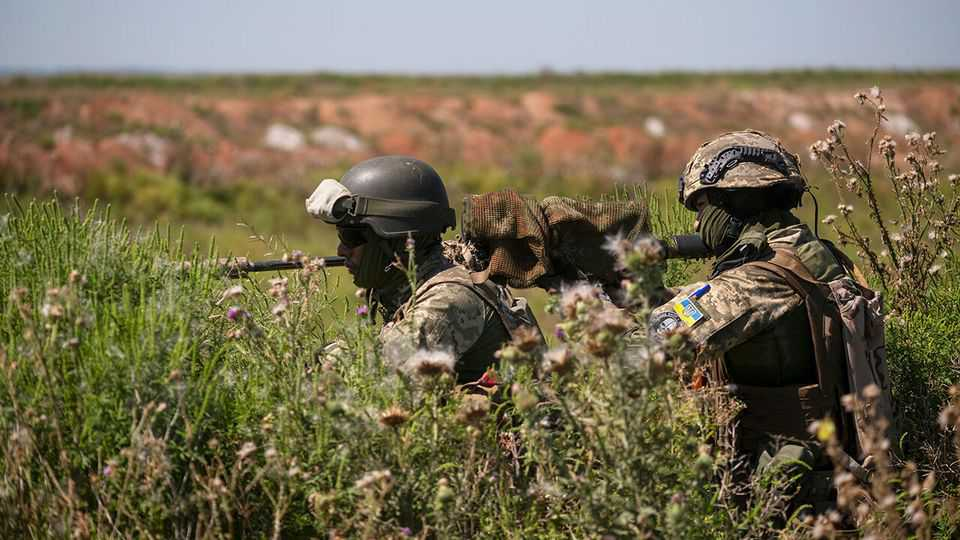

Business | Soldiers of fortune
The mercenary business is on the brink of another boom
Private military companies come in many different stripes
October 23rd 2025

THE MERCENARY, wrote Niccolò Machiavelli, was “useless and dangerous”. He was “unfaithful, valiant before friends, cowardly before enemies”. A private soldier would turn and flee when trouble arrived. “They have no other attraction or reason for keeping the field than a trifle of stipend, which is not sufficient to make them willing to die for you.” Yet, 500 years later, the business of private military companies (PMCs), to deploy the modern euphemism, is thriving. Conflict brings misery, but also fuels demand. When the Gaza Humanitarian Foundation (GHF) was hired to distribute aid in Gaza earlier this year, it brought in UG Solutions, an American company, to help with armed

security. When Russia needed men for its war in Ukraine and for operations in Africa, it turned to the Wagner Group, a Kremlin-backed outfit staffed by former Russian special forces. Colombian mercenaries (pictured) are among those fighting for Ukraine. In the West, the American government is PMCs’ biggest customer, says Dominick Donald, an analyst who once worked for Aegis, a British security firm.

The security business spans everything from pudgy rent-a-cops in shopping centres and armed guards hired by companies in dangerous places to soldiers of fortune who fight in wars. Many are drawn from the same pool: ex- soldiers, often special forces. And all parts of the industry have expanded in recent decades, as governments have trimmed their armed forces and private demand has grown. Now insiders are excited by a potential end to the war in Ukraine, hoping that reconstruction there will be as good for their business as it was in Iraq.

The early 2000s were a “real boom”, says Tim Spicer, a former British Army officer who founded both Aegis and Sandline International, another PMC. Iraq was home to tens of thousands of contractors, the vast majority in non- combat roles.

At the end of the war in Iraq, “cowboys” rushed in, Lieutenant Colonel Spicer says. But there are now half a dozen large private-security firms with “corporate structures”, including departments for legal advice, contracting and personnel. PMC-type work is only a sliver of their business. They include America’s Constellis (which had revenue of $1.4bn last year and employs over 12,700 people) and Canada’s GardaWorld (which operates in dozens of countries). Mr Donald says the market is divided between well- capitalised firms, backed by venture capital and private wealth, and more precarious outfits that lie “dormant” until a big contract turns up, at which point they are often bought by one of the big beasts.

The industry is “atomised” in other ways, too, says Sean McFate of the National Defence University in Washington, DC, an ex-paratrooper (who, he says, “raised small armies in Africa for US interests”). He divides PMCs into three “command languages”, according to the tongue in which orders are given, each with its own culture: an English-speaking cluster, drawn mostly from America, Europe and other Anglophone countries; Russian-

speakers; and a Spanish-speaking group of former special-forces operatives from Latin America, Colombia in particular, often trained by America’s elite Green Berets.

With governments struggling to recruit soldiers, PMCs provide an inexpensive substitute, in part because they do not require the same training, pensions and benefits. Colonel Spicer says his colleagues once calculated that one American contractor was about seven times cheaper than a regular soldier, and that a British mercenary was ten times cheaper. Colombian fighters are also a bargain. “They’re about a quarter of the price of me when I was in the industry,” says Mr McFate.

To those signing up, though, the pay can look appealing. Colombian hired guns earn far more than they would in government service and often live in cushier surroundings. Russian mercenaries in Ukraine were said to be paid twice as much as regular soldiers at one point. But money is not the only motivation. “A lot of the guys like I met in the industry went in not because the money was good, but because you can have control over your life,” says Mr McFate. “You can actually say no to a deployment. And that was very attractive.”

PMCs mostly do not engage in serious fighting. But in the past decade or so more have offered what Ulrich Petersohn of the University of Liverpool calls “combat solutions”. At one time, he says, there were more than 50,000 commercial operators in Ukraine, mostly low-skilled and on the Russian side, largely to obviate the need for a formal draft.

Colonel Spicer laments the pejorative connotations of the word “mercenary”. He complains that the rise of Wagner-like rogues, protected by authoritarian states, has tarnished more rule-abiding operators. Mr Petersohn finds that, from 1980 to 2016, the presence of mercenaries was associated with a 39% lower rate of civilian “victimisation”. PMCs based in democratic countries were associated with a 66% lower rate than firms from non- democracies. (A possible explanation is that, at least among more “corporate” outfits, a bad reputation is bad for business.) “Perceiving the industry as a collection of aggressive cowboys is misguided,” he concluded.

Yet Western firms have had their share of controversies. In Gaza the now- defunct GHF also used armed mercenaries from the Infidels Motorcycle Club, an anti-Islam American biker gang—though most deaths around aid- distribution points are thought to have been caused by Israeli regular forces. The Frontier Services Group, set up by Erik Prince, a notorious executive whose company, Blackwater, killed 17 Iraqi civilians in 2007, was subject to American sanctions in 2023 for training Chinese military pilots.

Many believe that the industry is set for another wave of expansion. “I think there’ll be another boom,” says Colonel Spicer. “I think the problems that one encountered in the reconstruction in Iraq will be hugely magnified in Ukraine.”

To meet demand, there is likely to be a ready supply of men. The Ukraine war will produce thousands of hardened soldiers versed in the latest technology, such as strike drones. Volodymyr Zelensky, Ukraine’s president, has said his country is considering establishing its own PMCs. Many elite American soldiers are also just emerging from “rest and recovery” after the fall of Kabul in 2021, says a person involved in the field. They are ready for America’s aggressive campaign against Latin American drug cartels, say, or the protection of critical-minerals mining in fragile states.

“The privatisation of warfare is well under way,” argues Mr McFate. “Those who understand it are embracing it, like Russia, and those who don’t, like the West, are going to have some challenges.” ■

To stay on top of the biggest stories in business and technology, sign up to the Bottom Line, our weekly subscriber-only newsletter.

This article was downloaded by zlibrary from https://www.economist.com//business/2025/10/21/the-mercenary-business-is-on-the- brink-of-another-boom