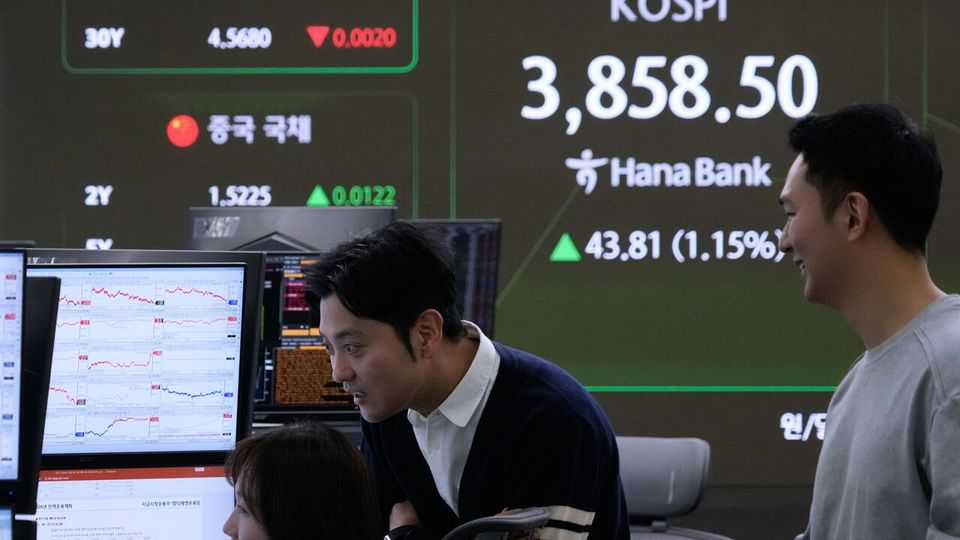
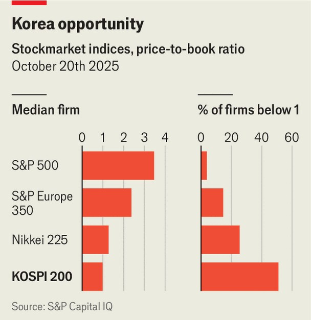

Business | Value proposition
In South Korea a corporate-governance revolution is under way
But the investor-friendly overhaul the government wants will take time
October 23rd 2025

In a year when most stockmarkets have impressed, South Korea’s has dropped jaws. In 2025 the KOSPI 200 index has risen by 69% (in won) to a record high, trouncing the 15% notched by America’s S&P 500. Artificial- intelligence hype has helped, especially for big chipmakers such as Samsung Electronics and SK Hynix. But the main reason is a state-backed effort to “value up” the country’s firms—ie, improve their wretched corporate governance and eradicate the “Korea discount” on their stocks. Lately the value-up drive, begun in early 2024, has got new impetus. Since Lee Jae-myung became president in June, parliament has twice amended the Commercial Act, which regulates public companies. Managers now have a

fiduciary duty to shareholders (previously their duty was to their firms alone). The law shifts power towards minority investors and away from the families that dominate companies, for instance by mandating electronic shareholder meetings and tweaking voting procedures. Another wave is expected by year’s end. Firms will probably be obliged to retire “treasury shares”, hoards of stock that dilute external shareholders and can be used to fend off activist investors.

Hundreds of firms have already said they will nix such shares. Listed firms have more than doubled share buy-backs since 2023. Activists are newly emboldened. For over a decade Infovine, a software-maker, had shrugged off criticism of its skimpy dividends and hoarding of treasury shares. But an activist campaign started in 2024 has borne fruit. Infovine has bought back shares and upped its dividend by a third—and its share price has tripled this year. Investors have encouraged KB Financial, the parent of South Korea’s biggest bank, to cut back on foreign acquisitions and return cash to shareholders, says Ben Preston of Orbis, an investment firm with shares in KB Financial. The stock has more than doubled since the start of 2024.

The transformation is far from complete. Convoluted ownership structures that favour majority shareholders (usually families) are still widespread. The management of Samsung C&T, the de facto holding company for South Korea’s biggest conglomerate, last year squelched an activist-led proposal for higher dividends. (The family of Samsung’s chairman holds sway over two-fifths of Samsung C&T’s shares.) Unlike in Japan, where companies’ stakes in one another are being steadily unwound, in South Korea progress has been scant.

Despite this year’s momentum, the Korea discount is intact. Over half the members of the KOSPI 200 trade below the book value of their assets, against 31% in Japan’s Nikkei 225 and 4% in the S&P 500 (see chart). And the broader market is still nearly 25% short of the president’s arbitrary “KOSPI 5,000” target. Much work remains. Will Mr Lee take on the country’s mighty families, or settle for what he has? ■

To stay on top of the biggest stories in business and technology, sign up to the Bottom Line, our weekly subscriber-only newsletter.

This article was downloaded by zlibrary from https://www.economist.com//business/2025/10/23/in-south-korea-a-corporate- governance-revolution-is-under-way

