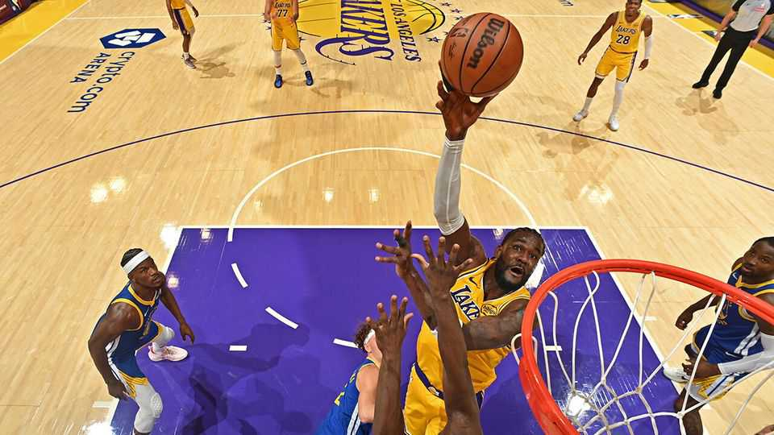

Business | If you can’t beat ’em, use ’em
Sports leagues find that streaming pirates have their purposes
There are ways of monetising their viewers
October 23rd 2025

Broadcasters still crave live sport. Take America’s National Basketball Association (NBA), whose new season, with a new rights deal, began on October 21st. ESPN, NBC and Amazon are paying a combined $76bn over 11 years to screen the league, smashing the old per-season rate. At that price (passed on to subscribers) the deal is also sure to maintain demand for pirated broadcasts. A study in 2021 suggested that the world’s sports leagues might bring in an extra $28bn a year if pirate sites were shut down. But data analysis and the rise of content creators are providing ways for leagues to hit back.

The contest between leagues and pirates resembles whack-a-mole more than hoops. In August Egyptian police arrested two people suspected of running Streameast, widely considered the world’s biggest sports-piracy operation. Now shut, it was supposedly visited 1.6bn times last year. Last month the operators of Calcio, a site popular in Italy, were apprehended in Moldova. But no one believes that illegal broadcasts can be halted altogether.

Fans are blasé about piracy. When LeBron James, the NBA’s biggest star, was spotted watching Streameast, fans were furious with him—not for illicit viewing, but for risking the site’s closure. A survey of 16 countries last year by Ampere Analysis, a research firm, found that 64% of fans had watched pirated content in the past month. Ampere’s Daniel Monaghan says this is partly because leagues are dividing rights into packages for different broadcasters, so that fans wanting to watch all their teams’ matches must buy several subscriptions. Sportico, a sports-business website, puts the price of seeing all 82 of an NBA team’s games this season at $650.

But sports leagues’ approach to piracy is evolving. They no longer just track and close unauthorised streams, but seek to capture detailed data on how many people are watching them. They can use this information, which gives a fuller picture of their fan bases, in negotiations with commercial partners. Some of the revenue lost to piracy is then won back through higher fees from sponsors.

A more liberal view of what constitutes piracy is also emerging. Leagues have hitherto sought to shut down anyone rebroadcasting their footage. But the rise of content creators with large audiences on social-media platforms has forced a rethink. The NBA has signed up a group of them as league ambassadors. A select few are now granted tens of thousands of hours of official footage each year. ■

To stay on top of the biggest stories in business and technology, sign up to the Bottom Line, our weekly subscriber-only newsletter.

This article was downloaded by zlibrary from https://www.economist.com//business/2025/10/23/sports-leagues-find-that-streaming- pirates-have-their-purposes