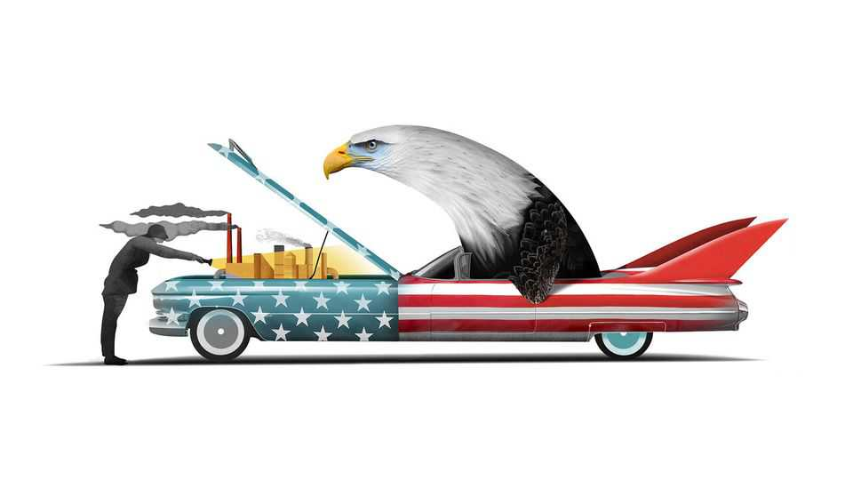

Business | Schumpeter
American big business faces a $1trn capex question
Looking under the bonnet of the non-AI economy
October 23rd 2025

CAN ANYTHING stop America Inc? As the biggest companies in the world’s biggest economy start rolling out their latest results, the answer appears to be an emphatic “Get out of the way!” Analysts reckon that big businesses’ net profits grew for the ninth straight quarter. Short-sellers who had bet that President Donald Trump’s seemingly anti-growth and pro- inflation policies on trade and immigration would cause America Inc to careen into a ditch are instead themselves resembling roadkill. The S&P 500 index of blue-chip stocks has risen by 14% this year, creating nearly $8trn in shareholder value. Vroom!

The foot-down frenzy is not confined to artificial intelligence. Yes, America’s ten mightiest tech titans—Nvidia, Apple, Microsoft, Alphabet, Amazon, Meta, Broadcom, Tesla, Oracle and Palantir—account for three- fifths of the S&P 500’s gains since January. But the remaining 490 firms in the index have added $3.3trn, or a respectable 10%, in collective market capitalisation. On October 20th better-than-expected earnings propelled the share prices of Coca-Cola, 3M and General Motors up by 4%, 8% and 15%, respectively. All three have risen by double digits in 2025. Investors don’t need AI to get excited. Soda, Post-Its and pickups suffice.

The generalised joyride is fuelled by falling interest rates, courtesy of the Federal Reserve, and by the business-friendliness of Mr Trump’s other policies: the extension of his tax cuts for firms, his deregulatory zeal (especially in finance, crypto and drilling) and hands-off approach to corporate dealmaking (so long as the dealmakers stay in his good graces).

Pop the bonnet of the non-AI economy, though, and you can detect signs of strain. Bankers point to the blow-ups of First Brands, which makes car parts, and Tricolor, an auto lender, as early evidence of a turning credit cycle. Coke may be a-fizz, but as a group, large producers of food and household basics have in recent months had the second-worst run since 1988, gauged by their stockmarket performance relative to the rest of big business, calculates Jefferies, an investment bank. GM’s share price jumped because its adjusted operating profit slumped by 18% in the third quarter, year on year, which was less dismal than anticipated. The carmaker says tariffs will cut its net profit by at least $2.3bn this year. Ford, its Detroit rival, expects a similar hit.

The problem is less the size of the tariff bill than its inconstancy—and that of Mr Trump’s policymaking more broadly. Will he really slap a 100% levy on China? Will more firms get the state as shareholder, as Intel did, or saviour, as farmers might? The limited impact on current earnings conceals a potentially lasting effect on future growth. For when it comes to investments in that growth, America’s non-AI businesses look as paralysed by the uncertainty as deer in the headlights.

Companies make costly investments when they feel confident these will generate a return. As a whole, members of the S&P 500 look as self-assured

as ever, preparing to splurge more than $1trn this year on capital expenditure. In the first half of 2025, 405 of its constituents collectively spent $554bn on facilities and equipment (excluding the financial industry and around 50 companies for which data were unavailable in S&P Capital IQ). That is $96bn more than in the same period last year, equivalent to a 21% increase in capital expenditure.

This robust net figure is deceptive, however. In one sense, it understates the capex binge. The firms that actually increased their spending year on year ratcheted it up by $123bn. That was a whopping 42% more than these same businesses laid out a year earlier. Yet the net result also overstates the bonanza. Fully 186 companies in our sample, or nearly one in two, cut their capital spending—by a collective $27.6bn. More than half of them are forecast to reduce their spending again in the next financial year.

These are no S&P 500 small fry. They include cruise lines (Carnival and Royal Caribbean, down by a combined $3.1bn), big auto (GM, Tesla and Ford, by $2.9bn), big pharma (Pfizer, by $777m) and big oil (Chevron, by $416m). All told, the capex-cutters account for 24% of the group’s total capital spending, 26% of its market value, 35% of its revenues and 37% of its global workforce.

Sectors that rely on imports, and are thus exposed to Mr Trump’s trade- warmongering, have been understandably stingy: the car industry cut spending by 20% in the first half of 2025, year on year; makers of food, drinks and smokes by 15%; producers of capital goods by 4%. Consumer- services firms reduced theirs by 14%, probably in response to American consumers’ dour mood throughout much of 2025. Producers of renewable energy such as AES and NextEra have put spending into reverse, too, owing to Mr Trump’s distaste for wind turbines and solar farms.

As notable as all the capex-cutting is the extreme concentration of capex growth. Most of the gross increase of $123bn was the result of big tech’s faith in AI’s moneymaking potential. Alphabet, Amazon, Meta, Microsoft and Oracle, whose data-centre building spree makes them the capex-happiest five of the AI terrific ten, were responsible for $73bn of the extra expenditure. Electric utilities (not counting the put-upon renewables firms)

would not have added the $9bn that they did were it not for those data centres’ power-hunger. Many other big spenders are also AI-adjacent.

If these AI bets pay off, non-AI business may benefit. In an artificially intelligent world, corporate AI users may generate higher revenues and profits without needing to plough their own cash into capital spending. That may be what the capex-shy are hoping for. Or they may be waiting until Mr Trump makes up his mind. Both prospects seem distant. The longer the wait, the likelier it will be that America Inc’s profit engines start to sputter. ■

Subscribers to The Economist can sign up to our Opinion newsletter, which brings together the best of our leaders, columns, guest essays and reader correspondence.

This article was downloaded by zlibrary from https://www.economist.com//business/2025/10/23/american-big-business-faces-a-1trn- capex-question

Finance & economics

How to make immigration palatable in a populist age The world economy shrugs off both the trade war and AI fears Why are American women leaving the labour force? Trumponomics is warping the world’s copper markets Can AI make the poor world richer? Why investors still don’t believe in Argentina China is being fuelled by inspiration, not perspiration