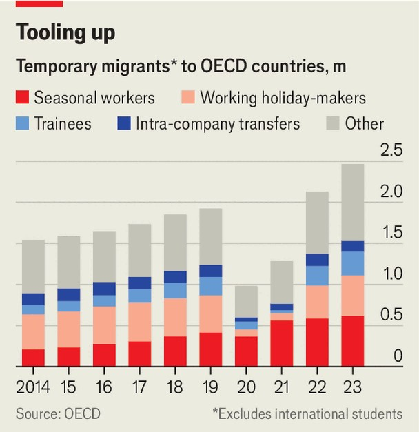

Finance & economics | Welcome labour
How to make immigration palatable in a populist age
Guest-worker schemes are booming. They offer vast benefits to both host countries and the workers themselves
October 23rd 2025

Businesses hiring migrants have a surprising new idol. The inspirational figure is neither a liberal nor a devotee of globalisation. It is Giorgia Meloni, Italy’s prime minister, who in 2022 climbed to power on a hard-right platform. She intends to issue 165,000 low-skilled work visas next year, up from 30,000 five years ago. Italy has also signed a labour-mobility deal with India that a recruiter praises as “one of the [world’s] most progressive”.

Ms Meloni is not the only hard-right leader learning to love immigration— or, at least, a certain sort of immigration. Although Viktor Orban, Hungary’s prime minister, once said that his country did not require a single migrant for its economy to function, he has quietly embraced guest-worker schemes. In 2024 around 78,000 non-EU migrants worked in Hungary, some 92% more than in 2019. Even as the Trump administration cracks down on illegal migration and squeezes routes for high-skilled immigrants, it is promising to speed up visas for farmers hiring short-term workers. Across the OECD, a club of mostly rich countries, some 2.5m trainees, seasonal and other temporary workers arrived in 2023, up from 1.5m in 2014 (see chart). France, Japan and Spain have experienced especially sharp rises. A model of migration associated with oil-rich Gulf states and the city-state of Singapore is taking over the world.

Its success reflects a clash between demography and politics. The rich world needs young workers, but even technocrats worry that bringing in less educated and less productive workers on a permanent basis is a false economy, especially in European countries with generous welfare states. Moreover, after an enormous post-pandemic surge in arrivals, anti- immigration populism is ascendant across the rich world. The hard right leads governments in America and Italy, and polls in Britain and France. Centrist leaders under threat are busy curtailing paths to citizenship. This

month the German government abolished a fast-track route that had enabled citizenship after three years; the British government is in the process of demanding ten years’ residence, up from five.

Temporary migration is a pretty good alternative to the permanent sort. Almost everywhere in the rich world, native-born workforces are shrinking, with industries such as child care, construction and farming facing staff shortages. Worse may be to come. For instance, forecasts suggest that South Korea’s GDP will start to shrink in the late 2040s because of its collapsing birth rate. Yet Michael Clemens of George Mason University points out that, if South Korea brought its temporary-migrant population to the same share as Australia’s (up from 3% to 15% of the total), it could offset most of the slump. Benefits for the migrants themselves can be vast, too. Lant Pritchett of the London School of Economics, an advocate for temporary migration, estimates that workers in the 11 largest developing countries could lift their wages by an average of 424% were they able to take low-skilled jobs in America.

Guest-worker visas are nonetheless a source of bien pensant squeamishness, with two worries taking precedence. The first has to do with integration. Perhaps the most famous scheme in European history is West Germany’s Gastarbeiter programme, which ran from 1955 to 1973 and brought in around 14m working migrants, including lots of Turks. Many stayed for decades without a path to citizenship; they often spoke little German and struggled to build good lives. As late as 1982, Helmut Kohl, then chancellor, mused about sending them back to their country of origin.

The second concerns abuse and exploitation, stoked by reports of harsh conditions in the Gulf. Many visas are tied to an employer, making it hard for the migrant to quit. In 2022 Japan’s health ministry found that 74% of firms employing guest workers were in breach of labour laws, including failing to meet safety standards and demanding unpaid overtime. In Europe, rule-skirting adds to the risk. Because some countries such as the Netherlands issue few non-EU permits each year, employers use a workaround. They recruit in, say, Poland or Slovenia, and then take advantage of the EU’s free-movement rules to bring the worker to the Netherlands. On paper, he or she is employed in the visa-issuing country; in

practice, many recruiters run little more than shell offices. Migrants do not know which country’s laws apply, leaving them dependent on middlemen.

Despite the risks for their citizens, developing countries—eager for remittances and a solution to domestic unemployment—are enthusiastic about guest-worker schemes. The result has been a barrage of bilateral agreements. Uzbekistan, for instance, has signed deals across Europe in a strategy that is bearing fruit. The country’s central bank recorded $8.2bn in remittances in the first half of the year, up from $6.5bn in the same period last year. That is sizeable, given Uzbekistan has a GDP of $132bn. Similarly, India has signed deals loosening restrictions on temporary migration with Britain, France, Italy, Japan and others. Some come with a sweetener for migration-sceptical Western politicians, being bundled with promises from the Indian government to help repatriate anyone who overstays their visas. So keen is the Vietnamese government that it sets targets for “labour exports”. This year it aims to send 130,000 workers abroad.

The benefits for the developing world may also go beyond cash inflows. Laurent Bossavie of the World Bank and co-authors find that returning migrants are far more likely to start their own companies, using money made abroad. Based on data on the employment and earnings of 5,000 Bangladeshi migrants, they suggest that a 50% drop in the cost of migration for workers heading overseas raises the country’s rate of business creation by 8%.

Growing appetite for temporary migration has led to a boom for businesses that pair workers and firms across borders. Margaret Mugwanja of Silver RayHR, a Nairobi-based company, was once a migrant herself. After working in South Africa as a nurse, and receiving an offer to do so in Britain, she instead established her own recruitment firm. Once it mostly hired support staff for American military bases in Afghanistan and Iraq. Now it sends Kenyans to rich countries, including Germany, Italy and Japan, to work in a variety of jobs, including as electricians, IT professionals, nurses and plumbers. Recruits have usually trained in their line of work already, but learn the language of their host country in Kenya before making the journey.

How should temporary-migration schemes operate? Despite their upsides, existing programmes have limitations. Looking at Denmark, Andrei Gorshkov of IFAU, a Swedish research institute, calculates that short-term migrants enjoy slower productivity gains than their permanent peers, reducing the benefits of migration for themselves, their employer and the host country. Employers, expecting high turnover, are often reluctant to invest in training, says Giovanni Peri of the University of California, Davis. Moreover, much of the improvement in the productivity of permanent migrant workers comes from their ability to switch between companies.

Economists who study migration therefore argue in favour of portable visas that enable job-switching. Such flexibility would increase the dynamism of labour markets, and help curb abuse. Companies that hire migrants are likely to resist this, since they often face a steep upfront cost and want to make a return: a British farmer, for instance, can spend £20,000 ($27,000) in fees when bringing in a worker. Yet change is nevertheless on the way. Last year Australia extended the amount of time migrant workers have to find a new employer after leaving their sponsor from 60 to 180 days. Canada and Japan are also making it easier for migrant workers to move jobs within industries. And even Texan Republicans are pushing for a portable visa for the state’s agricultural labourers.

In many countries, new political realities have made old forms of migration untenable, at the same time as the need for workers is becoming ever more pressing. Governments from across the political spectrum have little choice but to find forms of migration they and their voters can live with, as well as ways to improve and expand the paths for short-term work that already exist. Over time, that is likely to make migration look less like a ladder—taking migrants towards permanent settlement and citizenship with each step—and more like a revolving door. ■

For more expert analysis of the biggest stories in economics, finance and markets, sign up to Money Talks, our weekly subscriber-only newsletter.

This article was downloaded by zlibrary from https://www.economist.com//finance-and-economics/2025/10/22/how-to-make- immigration-palatable-in-a-populist-age