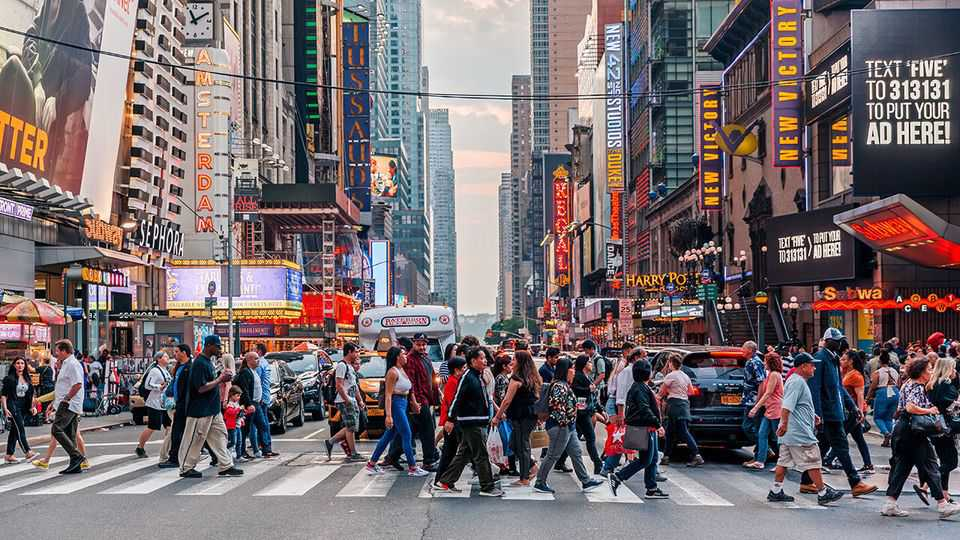
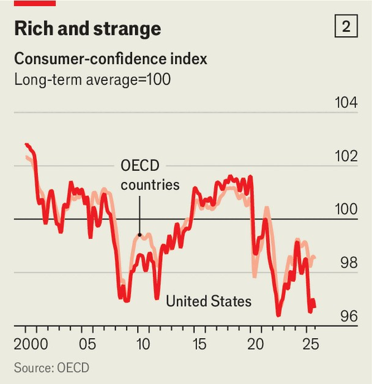

Finance & economics | Liberated
The world economy shrugs off both the trade war and AI fears
Can anything bring it down?
October 23rd 2025

SIX MONTHS ago, as President Donald Trump announced a trade war of unprecedented ferocity, firms and investors braced for a slump. Movements in financial markets pointed to a recession. American consumers’ confidence nosedived. So did some real-time measures of economic growth. Yet today, even as America and China trade bitter barbs, there are fewer “Liberation Day” effects than expected.

A “current-activity” indicator produced by Goldman Sachs, a bank, finds that after slumping in the spring, the global economy is growing nearly as fast as before Mr Trump got going (see chart 1). The JPMorgan global composite PMI, a high-frequency gauge of activity, looks strong: in August it hit a 14-month high. A real-time measure from the Federal Reserve Bank of Atlanta suggests that in the third quarter of 2025 America’s GDP grew by 3.9% at an annualised rate—a strong performance, though almost everyone expects the fourth quarter to be weaker. Just one OECD country, Finland, is in recession, compared with eight in early 2023. In April economists downgraded their forecasts for global economic growth in 2025 to 2.2%; now the consensus is 2.6%, where it was at the beginning of the year.

The global economy is doing well in part because Mr Trump’s tariff war is turning out to be less brutal than expected. His policies in April had implied an effective American duty as high as 28%. Following a series of climbdowns, imports currently face a tax of a little over 10%. Meanwhile, gung-ho fiscal policy, especially in America, is stoking demand. These favourable conditions may come to an end: Mr Trump could slap on fresh tariffs at any moment; at some point governments may find a way to reduce budget deficits. For now, however, financial markets believe that the economic momentum will last.

Investors expect a decent corporate-earnings season for the third quarter of this year, after a second quarter in which global company profits grew by 7% year on year—above the historical average. The MSCI ACWI, an index of global stocks, is at all-time highs. During economic expansions “cyclical” firms—those supplying discretionary items such as cars and construction equipment—typically outperform “defensive” firms, with products that people need whatever the weather. In sharp contrast to April, the share prices of global cyclical firms are on a tear.

On top of this, common economic worries are less fearsome than they first sound. One concern is that artificial-intelligence investment spending, especially on data centres, is the only thing keeping the party going, spelling disaster if investors cool on the tech. This argument is strongest in America, where investment in information-processing equipment and software (IPES) accounted for 40% or so of growth in real GDP over the past year. Yet, at a minimum, two-thirds of IPES has nothing to do with AI. The data include, for instance, a business buying a computer. In addition, outside America there is no evidence whatsoever that IT is driving growth.

A second concern relates to jobs. Employment growth in America has slowed, raising fears of AI-induced unemployment. Not so fast. A new study by the Yale Budget Lab finds that “the broader labour market has not experienced a discernible disruption since ChatGPT’s release.” Outside America there is little evidence of an employment slowdown. In the first half of the year other OECD countries added 3m jobs, in line with the norm before the covid-19 pandemic. To the extent that America’s labour market is weak, particular factors such as the Trump administration’s crackdown on immigration may be to blame.

A third worry relates to consumer confidence. Although in America it has risen from lows in April and May, it remains far below its pre-covid level (see chart 2). The situation is only a little better elsewhere. A global measure of economic-policy uncertainty remains high, as do Google searches for “tariffs”, suggesting Mr Trump’s policies still weigh on people. Others fear that an AI stockmarket bust would make people even more miserable. Economists typically argue that gloominess portends an economic slowdown. Yet, six months on from Liberation Day, if high uncertainty were to have such an effect, it surely should have done so by now. The global economy has become remarkably resilient to “crises”. ■

For more expert analysis of the biggest stories in economics, finance and markets, sign up to Money Talks, our weekly subscriber-only newsletter.

This article was downloaded by zlibrary from https://www.economist.com//finance-and-economics/2025/10/20/the-world-economy- shrugs-off-both-the-trade-war-and-ai-fears

