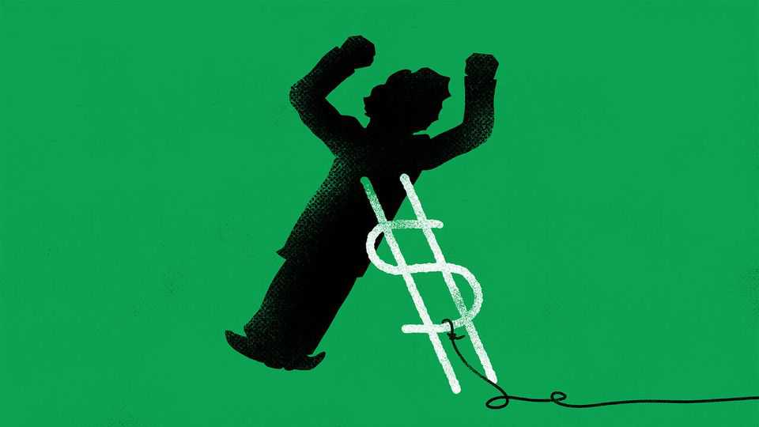

Finance & economics | Buttonwood
Why investors still don’t believe in Argentina
Despite the best efforts of Donald Trump and Scott Bessent
October 23rd 2025

A bail-out from America can stop a financial crisis in its tracks. In 1995 President Bill Clinton lent Mexico $20bn as its currency collapsed. Two days later, sniffing a bargain, investors were willing to buy the country’s bonds. On September 22nd Scott Bessent must have hoped for a similar reaction. The Argentine peso was sliding in the build-up to make-or-break midterms on October 26th. So America’s treasury secretary announced that he would support the currency unconditionally. “All options”, said Mr Bessent, “are on the table”. It did not have a Clintonian impact. After briefly rising against the dollar, the peso has fallen below where it was before Mr Bessent made his move. Yields on Argentina’s ten-year dollar debt are creeping up. Why are

investors unconvinced? Javier Milei, Argentina’s president and an ally of President Donald Trump, has ended many of the habits that led his country to the brink, such as running vast deficits and printing cash. The peso, in theory, now also has a rock-solid backstop from America.

That might seem like enough to reassure investors. But for Mr Bessent’s manoeuvre to work, he would have to be willing to take responsibility for the very worst that could emerge from Argentina’s political and financial mess. And despite Mr Bessent’s stated intention to do whatever is needed, the bail-out offered suggests something rather less.

So far, Mr Bessent has bought pesos worth $750m and confirmed a swap line with Argentina’s central bank that is worth $20bn. The dollars will help Mr Milei, who is fighting to keep the currency within a band system he established in April—but only up to a point. Together America and Argentina are burning through dollars at an extraordinary pace in their attempt to bolster the peso. On October 6th alone, Argentina is reported to have sold $480m.

Worse, Argentina has an onslaught of dollar debts due in the coming months. Repayments will require at least $18bn in 2026. If the government is unable to find the dollars required, it risks a nightmare. Out of firepower, Mr Milei would be able only to watch as capital fled the country and the peso tanked further, making debt repayments still less affordable. The government would be unable to borrow from anyone; the peso could be worthless.

Argentina’s own reserves are too depleted to cover the bill. On September 26th the government had just $2.2bn readily available. By October 7th traders reckoned that its usable reserves might have fallen to $700m. Even these are borrowed, since Argentina has long struggled either to export much or attract foreign investment. The country has all but exhausted the IMF, its biggest creditor. The fund’s officials plan to lend just $1.5bn to Argentina in 2026 (though they have agreed to bring forward payouts). In order to avoid a run on the peso, Argentina needs more dollars from elsewhere.

Exactly how many it will need depends on how long Mr Milei intends to prop up exchange rates. He has promised for a while that the peso will

eventually float. That, too, will require reserves. Argentina still places capital controls on its banks and businesses, meaning that a rush for dollars in the event of full liberalisation could leave some short.

Never floating the peso would be more dangerous. But freeing the currency from its guardrails would be unpopular: its value would plummet, raising the price of imports, including food and fuel, and therefore inflation. Mr Milei has so far shied away from the pain. Especially if he loses the coming elections, he may never take the plunge. He must face voters himself in 2027.

If he does not take the plunge, would America supply tens of billions more dollars? Mr Bessent serves a president who makes decisions on the fly, and has himself described America’s intervention as only a “bridge to the election”. On October 14th Mr Trump said that Argentina’s bail-out was conditional on Mr Milei’s victory; he is sceptical of foreign spending, even when it goes to friends. There is also a limit to the funds available without consulting other arms of the government, which are unlikely to indulge Mr Trump. The Emergency Stabilisation Fund, an instrument Mr Bessent plans to use, can lend for only six months without Congress’s say-so.

Before bailing out Mexico in 1995, Mr Clinton’s advisers cautioned him. “If you send that money”, one said, “and it doesn’t come back before 1996, you won’t be coming back”. Thirty years on, Mr Trump is not immune from such considerations. And investors know it. ■

Subscribers to The Economist can sign up to our Opinion newsletter, which brings together the best of our leaders, columns, guest essays and reader correspondence.

This article was downloaded by zlibrary from https://www.economist.com//finance-and-economics/2025/10/22/why-investors-still- dont-believe-in-argentina