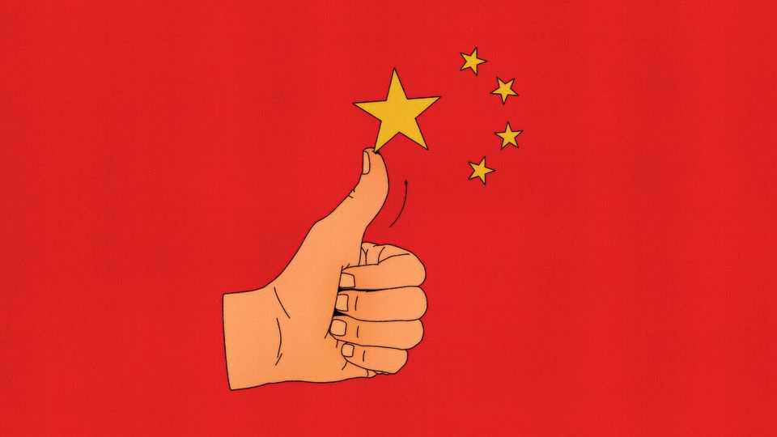

Finance & economics | Free exchange
China is being fuelled by inspiration, not perspiration
So long as its leaders are not lying
October 23rd 2025

When China’s leaders talk of the country’s economy, they often speak in Communist Party jargon, citing terms such as “dual circulation”, “new productive forces” and “involution”. Recent commentary has also featured a bit of jargon drawn straight from mainstream economics: “total factor productivity”, or TFP. A rise in TFP is the “hallmark” of new productive forces, Xi Jinping, China’s leader, said last year. On October 21st the People’s Daily, a party newspaper, urged China to pull “the bull’s nose of innovation and strive to improve total factor productivity”. Stirring stuff. But what exactly is this prize for which China must strive? TFP is best defined by what it is not. Some economic growth comes from

mobilising more workers and giving them more machinery and infrastructure with which to work. TFP growth captures everything else. It is the name economists give to increases in output that cannot be explained by increased inputs, such as capital, labour and other “factors” of production.

There are “at least 1,001 ways” to improve TFP, according to Arnold Harberger of the University of California, Los Angeles. One of his favourite examples is a clothing boss who got 20% more out of his seamstresses by playing background music in his factory. TFP is often associated with technology and efficiency, as opposed to effort or expense. Paul Krugman, a Nobel-prizewinning economist, once described it as “inspiration”, not “perspiration”.

China’s leaders, who met this week to review the country’s new five-year plan, want its progress to be less sweaty and more inspired. They have little choice. China will not be adding labour in the years ahead: its workforce has already fallen by over 20m since 2016. And China’s rapid rate of capital accumulation will become harder to sustain as its population ages and its saving rate declines. When China’s leaders reimagine the country’s growth model, they see TFP as an important yardstick for success.

China does not, however, often publish an official measure of TFP growth. The most widely cited estimate comes from the Penn World Table, begun by economists at the University of Pennsylvania in the 1970s and now overseen by Robert Feenstra of the University of California, Davis, as well as Robert Inklaar and Marcel Timmer of the University of Groningen. The project calculates comparable estimates of GDP and factors of production, holding prices constant across time and space. By one estimate, two-thirds of empirical work on growth across countries draws on it.

Recent editions suggest China’s growth has been bereft of inspiration. According to the tenth version, released in 2021, TFP actually shrank between 2009 and 2019 (the last year in the data). China’s economy, in other words, grew by less than you would expect given the extra inputs it amassed. Out of 118 countries with data, China’s TFP growth ranked 83rd. Figures like these have contributed to a pessimistic view of China. A similar calculation appeared in the book “Danger Zone” by Hal Brands of Johns Hopkins University and Michael Beckley of Tufts University, who coined

the term “Peak China”. They concluded that China is trapped in a “quagmire” reminiscent of the Soviet Union.

But the latest edition of the Penn World Table, released this month, paints a different picture. It reports that China’s TFP grew by 2.3% a year from 2009-19, ranking sixth in the world. Over the most recent decade in the data (to 2023) it ranked third. What explains the transformation? TFP performance reflects the gap between GDP growth and input growth. Although China’s input growth is largely unchanged, the new table has chosen a different measure of GDP. It has adopted China’s official figures, unlike earlier editions, which relied on numbers calculated by Harry Wu of Peking University. Since China’s official growth is faster than Mr Wu’s alternative estimates, its TFP numbers look better, too.

The switch was motivated by several concerns. Mr Inklaar worried that departing from the more familiar, official numbers might confuse researchers. “If we make too many of these...adjustments, people stop using the database because they can’t trace [its figures] to what others are reporting,” he says. Mr Inklaar is also wary of singling out China. Yes, its data has raised doubts. Yet so has that of other emerging economies.

Moreover, Mr Inklaar argues that not all of Mr Wu’s assumptions are as compelling today as they were when he first made them. To estimate industrial growth, Mr Wu starts with physical measures of the output of more than a hundred commodities, such as tonnes of coal, litres of liquor and metres of cloth. He then combines their growth rates into an index, carefully weighted to reflect the changing structure of China’s economy. For certain services such as education, finance, government and health care, Mr Wu takes a simpler approach. He assumes they grow only as fast as their workforces (ie, by 0% a year per worker). That contrasts with the 5-6% growth implied by the official figures.

His approach serves as a useful check on the official figures. But as Chinese industry has become more sophisticated, its output is harder to capture with physical measures. Services have also become a bigger part of the economy. Thus more rests on his assumption of 0% growth in output per worker. Although such a pace is in line with international experience, there are

exceptions. By Mr Inklaar’s count, growth has exceeded 2% per worker in at least seven economies, including India and Malaysia.

If anyone knows whether China’s figures are more realistic, it is presumably China’s leadership. If they are confident, they can look with satisfaction at the economy’s performance over the past decade. If they secretly believe that Mr Wu’s figures are better, they have work to do. There are 1,001 ways to improve TFP. China’s leaders might start by improving their statistics. ■

Subscribers to The Economist can sign up to our Opinion newsletter, which brings together the best of our leaders, columns, guest essays and reader correspondence.

This article was downloaded by zlibrary from https://www.economist.com//finance-and-economics/2025/10/23/china-is-being-fuelled- by-inspiration-not-perspiration

Science & technology

China’s chipmakers are cleverly innovating around America’s limits How the persecution of sparrows killed 2m people AI models ace their predictions of India’s monsoon rains Can bright light banish winter depression?