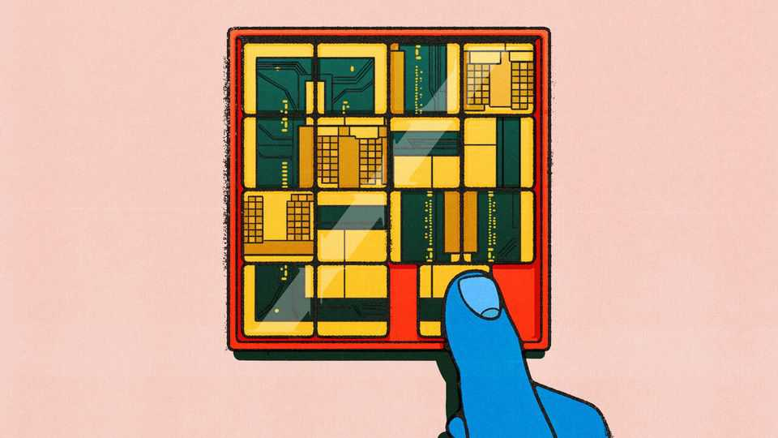
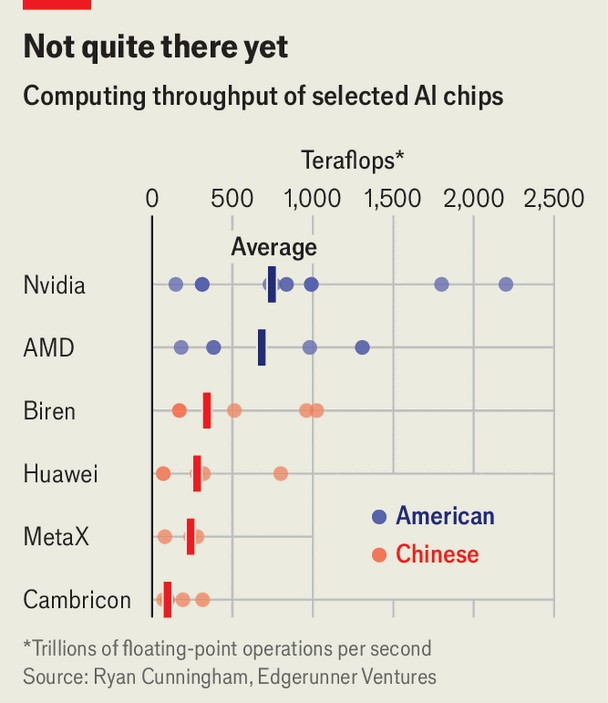
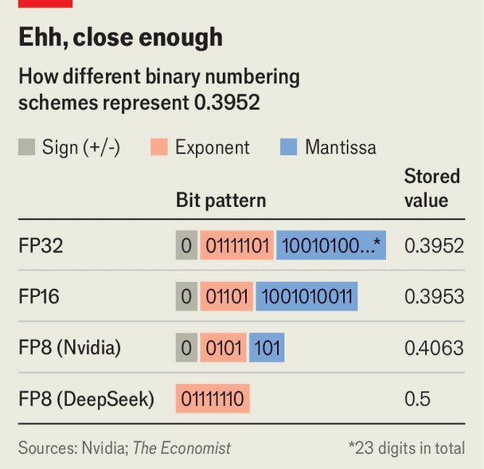

Science & technology | The mother of invention
China’s chipmakers are cleverly innovating around America’s limits
They are pushing tools to the edge, scaling up and relying on fuzzy maths
October 23rd 2025

THE MICROCHIP wars have been running since 2018. That was when America under Donald Trump (and later Joe Biden and Mr Trump again) began imposing increasingly onerous export restrictions on semiconductor firms hoping to sell their wares in China. This high-tech embargo was intended to frustrate China’s ambitions to build an advanced chipmaking industry of its own. Instead, it has spurred them. China’s government is hoping that its firms can do with hardware what they have already done with software, and innovate around America’s limits. In January DeepSeek, a Chinese software firm, surprised the world by releasing an artificial-intelligence (AI) model that

was competitive with Western rivals despite having been trained using a fraction of the computing power. China’s chipmakers are trying to perform a similar trick. They are stretching tools to their limits, building big clusters of processors to offset slower chips and fusing hardware and software to wring out every drop of performance. The question is whether China can connect these components—chips, systems and code—into a self-sufficient, competitive AI “technology stack”.

Start with the chips themselves. Data collected by Ryan Cunningham of Edgerunner Ventures, a venture-capital firm, suggests the median performance of Chinese AI chips is 114 teraflops (a trillion calculations a second), putting them significantly behind their American competitors (see chart). Huawei’s flagship AI chip, the Ascend 910C, delivers 800 teraflops compared with 2,500 teraflops for the B200, a high-end Nvidia product.

A big reason for the gap is that these chips are hard to make. For the past half-century the most reliable way to speed up a microchip has been to shrink its transistors, the tiny electrical switches whose on or off states represent the 1s and 0s of binary arithmetic. The B200 sports 208bn transistors divided into thousands of individual cores, all crammed into a sliver of silicon a few dozen millimetres across.

Only three firms—Samsung Semiconductor, a Korean company; TSMC, a Taiwanese one; and (to a degree) Intel, an American firm—can make chips with the very tiniest transistors. TSMC dominates the market, but American pressure means its most advanced factories are closed to Chinese customers. They must make do instead with local chipmakers such as SMIC, a partially state-owned firm, and Huawei, a tech giant that operates fabrication plants of its own.

But SMIC and Huawei face restrictions too. Chipmaking factories use advanced machine tools made by yet another set of companies. Lithography machines, for instance, use light to etch the circuit patterns that make up a microchip onto wafers of silicon. In the same way that a calligraphy pen can draw more precisely than a crayon, shorter wavelengths of light allow finer details to be etched. The most advanced machines use extreme-ultraviolet (EUV) light with a wavelength of 13.5 nanometres (nm; billionths of a metre). They are made only by ASML, a Dutch company, which spent decades perfecting the technology.

Thanks once again to American pressure, ASML will not sell EUV machines to Chinese chipmakers, whose only option is therefore to push their older “deep ultra-violet” (DUV) systems, which use 193nm light, to their limits. One tactic is “multi-patterning”. Instead of exposing a wafer to the light source once, engineers repeat the process several times, building up smaller features that would be impossible to produce in a single pass.

Multi-patterning also adds cost, slows production and reduces yield (the proportion of chips on each wafer that are free from defects). For China, self-sufficiency probably matters more than efficiency. But there are physical limits to how far DUV can be pushed. Most analysts reckon that, unless China can secure a supply of ASML’s EUV machines, large-scale production of the most advanced chips is still years away.

If China is still behind on quality, another option is to go for quantity. The mathematics of AI lends itself well to “parallelisation”, in which a task is chopped into smaller chunks to be worked on by many chips at once. In April Huawei announced the CloudMatrix 384, an AI system designed to slot into data-centre racks. It links 384 of the firm’s Ascend 910C chips

together, and is designed to compete with Nvidia’s GB200 NVL72 system, which sports 72 of that firm’s B200 chips.

SemiAnalysis, a consultancy, reckons each Ascend chip has about a third of the performance of a B200. Using five times as many thus gives Huawei’s system a bit less than twice the performance of Nvidia’s offering. The trade- off is power consumption: the Huawei system uses 600kW of electricity, more than four times more than Nvidia’s machine. But Mr Cunningham reckons that is a sensible trade-off. Energy, he notes, “is not a problem in China”.

Connecting lots of chips in this way also plays to Huawei’s strengths. The company built its reputation in computer networking. The CloudMatrix 384 shuffles data around as pulses of light rather than electricity. Optical networking, as that approach is called, uses less power and produces less waste heat than the electrical sort. It was once found mainly in long-distance fibre-optic cables, but is now moving into data centres. Qingyuan Lin, a chip analyst at Bernstein, an investment firm, says Huawei’s approach is “fundamentally changing” how AI infrastructure is built.

The final leg of China’s strategy is to closely tailor its hardware to the software that will run on it. One example is the way in which chips handle numbers internally. Most general-purpose processors represent numbers with 32 or 64 bits, or binary digits. As with decimal counting, the more digits you have available, the bigger the range of numbers you can represent. More digits also allow a better approximation of numbers that cannot be represented exactly, such as 2/3 in decimal, or 1/5 in binary—both of which will produce an infinitely repeating pattern of digits. But each bit—each 1 or 0—requires a transistor to represent it, and every extra transistor consumes more electrical power.

AI models, though, can tolerate some fuzziness in their maths. Many modern AI chips therefore make do with representing numbers with just 16, 8 or even 4 bits. Rakesh Kumar, an electrical engineer at the University of Illinois at Urbana-Champaign, calls this a “simple but very effective” way to optimise hardware. In August DeepSeek, which is rapidly becoming a standard-setter for Chinese AI, released a new numbering format. It stores

numbers in eight bits, does not distinguish between positive or negative numbers, and lacks a fractional component entirely.

Such a scheme cannot represent a big range of numbers, and lacks precision. But it should also be much more efficient. Shares in Cambricon Technologies, a Chinese chip designer, surged after DeepSeek’s announcement; its processors already support the company’s format. Huawei’s do not yet, but probably will soon.

China’s attempt to build a domestic AI stack, then, is off to a promising start. But there is far to go. Nvidia’s CUDA AI-programming tools remain dominant. Chinese designers still rely on American programs, made by firms such as Synopsys or Cadence, to design their chips in the first place. (America banned both firms from exporting to China in May, before relenting in July.) And though Chinese chips are closing the gap in inference —where AI models respond to user queries—they remain weaker in the training phase used to create those models in the first place. Training models requires huge amounts of data to be shuttled in and out of memory—and advanced memory chips are another component to which America has sought to restrict China’s access.

But if computing and AI are considered vital for national security, China’s industry does not need to be the world’s best to be useful. Hardware that is merely competitive could go a long way. Officially, at least, China is projecting confidence. In April America restricted sales of Nvidia’s H20 chip, a made-for-China product deliberately hobbled to meet export rules. But when the White House relented a few months later the Chinese government responded not with relief, but by urging its tech firms to double down. They should ditch Nvidia’s products entirely, it said, and use domestic alternatives instead. ■

Curious about the world? To enjoy our mind-expanding science coverage, sign up to Simply Science, our weekly subscriber-only newsletter.

This article was downloaded by zlibrary from https://www.economist.com//science-and-technology/2025/10/22/chinas-chipmakers-are- cleverly-innovating-around-americas-limits