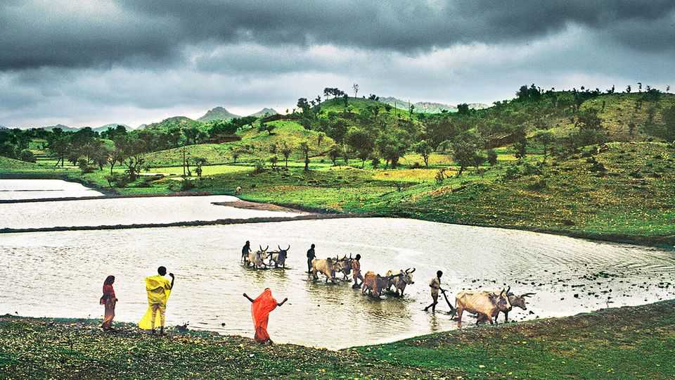

Science & technology | Meteorologic rise
AI models ace their predictions of India’s monsoon rains
Some weather forecasts can now be done on a laptop
October 23rd 2025

The Indian monsoon, which usually begins its slow northward sweep around the start of June, brings three-quarters of the country’s annual rainfall. That makes it essential for agriculture, on which almost half of Indians depend. But the monsoon is notoriously hard to predict. It is driven by differences in temperature between land and sea, the amount of snow cover on the Himalayas, soil moisture and many other far-flung influences. And climate change is making the guessing game even harder. The India Meteorological Department (IMD) does its best, using the numerical weather prediction (NWP) models that have been a staple of meteorology for decades. Run on supercomputers, these divide the world

into a three-dimensional grid, populate each box with variables representing temperature, pressure, wind speed and so on, and then crunch through zillions of calculations to try to simulate how things will evolve over time. Those models allow the IMD to offer broad guidance—such as whether to expect more rain than usual, or less—a month or so ahead. But detailed information about what the rains will do day-by-day is not considered reliable more than about five days out.

This year, though, the Indian government tried something new. About 38m farmers received forecasts generated not by an NWP model, but by ones powered by artificial intelligence (AI) instead. These work in a different way: rather than going to the trouble of trying to simulate, equation by equation, exactly what is going on in the atmosphere, they mostly make their predictions by comparing the patterns they see in weather data with previous, similar patterns in the historical weather records on which they have been trained.

The models aced their test. In some regions, they predicted when the rain would arrive 30 days ahead. They also forecast that rainfall would stall in the middle of the season—as it did, for 20 days—despite this not appearing in the NWP forecasts. Almost half of the farmers who paid attention to the messages later said that the information influenced their decisions on what to plant and when—though it is still too early to assess whether this will influence their eventual earnings.

None of this would have been possible even five years ago. But in 2022 Nvidia, an American chip designer, published the first results from FourCastNet, an AI weather program trained on decades of weather data. The company claimed that it accurately predicted hurricanes and rainfall a week in advance with just two seconds of computing time—thousands of times less than what an NWP model needs. Tech firms and weather agencies began racing to build their own.

It quickly became apparent that relying solely on AI came with problems of its own. Unconstrained by the laws of physics, forecasts could become worryingly unrealistic. Fed only past data, the models often struggled to predict rare or extreme events—the same “edge case” problem that has dogged driverless cars.

So the focus switched to trying to combine the best of the old and the new. One of the two models used to forecast this year’s monsoon was developed by the European Centre for Medium-Range Weather Forecasts (ECMWF), an institute widely considered the world’s best, for use alongside its existing NWP software. The other was a version of Google’s NeuralGCM, which still grinds through calculations to represent big atmospheric processes, but then uses AI to fill in the details.

Pedram Hassanzadeh, an AI and extreme-weather researcher at the University of Chicago, thinks AI models could lead to a “democratisation of weather forecasting”. Numerical forecasts demand supercomputers and plenty of weather-observing stations to supply them with numbers. Poor countries often lack both.

The Human-Centered Weather Forecasts Initiative (HCF), which Dr Hassanzadeh helps lead, encourages governments to use AI to overcome both barriers. India’s monsoon project, which was co-ordinated by the HCFI, used models that, once trained, could run on a high-end laptop. They could also be tweaked to focus on the best-quality data that were available. In India’s case, that meant a long-running set of readings from rain gauges.

The HCF has funding (from the Gates Foundation, a big charity, and the United Arab Emirates) for similar work in east and west Africa. Like India, both regions experience distinct rainy seasons. It is teaching meteorological and agricultural officials from Bangladesh, Chile, Ethiopia, Kenya and Nigeria how to use AI weather models for their own particular needs.

Other bottlenecks are easing too. Like numerical models, AI models still depend on data assimilation—the process of converting messy observations from satellites and weather stations into a well-ordered snapshot of the atmosphere. That work remains concentrated among rich-country agencies with the resources to do it.

Hence the excitement when the ECMWF announced in October that it would make both its most up-to-date forecasts and its assimilated data freely available (it has already opened its historical archive). Some of that will be used by private companies employing AI weather forecasts to anticipate

disruptions to their supply chains or make trading decisions. But it will also help many who previously struggled to get good forecasts at all. ■

Curious about the world? To enjoy our mind-expanding science coverage, sign up to Simply Science, our weekly subscriber-only newsletter.

This article was downloaded by zlibrary from https://www.economist.com//science-and-technology/2025/10/22/ai-models-ace-their- predictions-of-indias-monsoon-rains