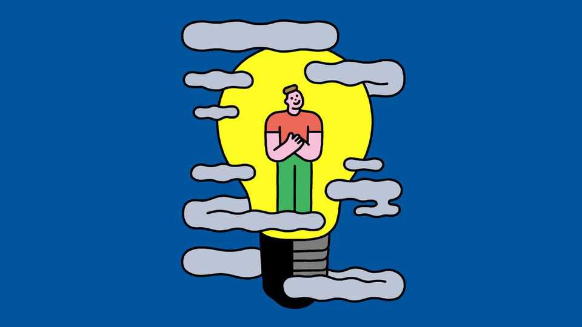

Science & technology | Well informed
Can bright light banish winter depression?
It seems so. And it might work for other kinds of depression, too
October 23rd 2025

FEW PEOPLE enjoy the gloom that comes with winter in the world’s higher latitudes. In up to a tenth of the population, the long nights can trigger a type of depression known as seasonal affective disorder (SAD). The exact physiological underpinnings of the disorder are not clear. Possible culprits include lower levels of melatonin, a hormone that regulates sleeping patterns; a drop in levels of serotonin, a neurotransmitter; and disruption to the body’s internal circadian clock, which controls all sorts of bodily processes. Antidepressants may help. But those often come with side-effects. Many people prefer to treat the root cause by buying gadgets designed to emit bright light, in the hope of banishing the gloom that causes SAD in the first

place. All sorts are available, from devices that look like ordinary desk lamps to ones that resemble a tablet or smartphone on a stand. Many doctors recommend them as a first-line treatment for the disorder.

How well they actually work is tricky to test. In a drug trial, for instance, it is relatively straightforward to give some patients the real thing and others a placebo sugar pill. But running that sort of trial with light therapy would mean preventing a large group of people from being exposed to anything resembling daylight for long periods of time. Even if you can find the volunteers, doing so is only really feasible in big institutions such as hospitals and care homes. A few studies have been done along these lines. Most, though, have to make do with less rigorous control.

With those caveats in mind, the evidence looks good. Last year a review of 21 studies, led by Tu Zhe-Ming at the Jingzhou Mental Health Centre in China, concluded that light therapy does indeed seem to work. Another review was published in March by Mihaela Bucuta, a psychologist at the Lucian Blaga University of Sibiu, in Romania, and her colleagues. It concluded that between 60% and 90% of patients see “symptom remission” with daily use.

As for which devices are the most effective, those that emit predominantly blue, green or white light all seem to have a similar impact. And intensity may be less important than the claims made in lamp advertising would have you believe. Many boast that they can reach brightnesses of around 10,000 lux—far brighter than standard indoor lighting, and closer to the outdoors on a reasonably nice day. But less intense light seems to work, too, though the lamp may need to be on for longer.

Nor do there seem to be many drawbacks. Although a few users report experiencing headaches, eye irritation and blurred vision, such complaints are rare.

The benefits appear to be significant enough that a good deal of research has been done into whether light therapy can help patients with other, non-SAD forms of depression. Here, again, the findings seem promising. Dr Bucuta’s review concluded that light therapy by itself can help with depression in 44% of cases. When it is combined with antidepressants, that number rises

to 76%. Observations such as this have led researchers to run experiments comparing the results of drug or light therapy on their own with a combination of the two. The results again suggest that doing both together seems to produce better results than taking drugs alone.

All that makes for a cheerful thought as the autumnal nights draw in. For those who suffer from winter depression, the light at the end of the tunnel may shine out of a lamp. ■

Curious about the world? To enjoy our mind-expanding science coverage, sign up to Simply Science, our weekly subscriber-only newsletter.

This article was downloaded by zlibrary from https://www.economist.com//science-and-technology/2025/10/17/can-bright-light- banish-winter-depression

Culture

Idi Amin, a pioneer of mass deportation In Vienna, the waltz is keeping in step with the times Philip Pullman’s magisterial fantasy series has come to an end The new Fondation Cartier is helping reshape central Paris The lessons from the brazen heist at the Louvre A comely “Frankenstein” for the Instagram age