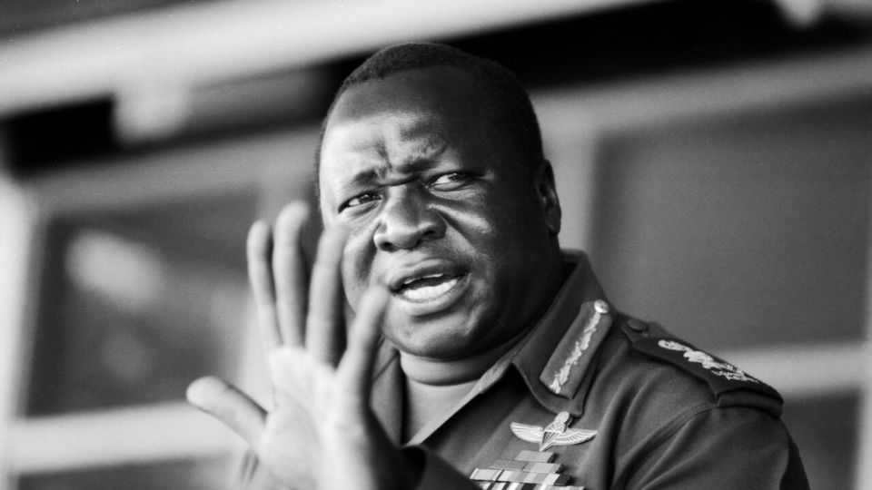

Culture | Idiocracy
Idi Amin, a pioneer of mass deportation
Expelling Asians from Uganda was popular. How did it work out?
October 23rd 2025

In 1976 Madame Tussauds, a waxwork museum in London, asked visitors to name the most hated figure in its collection. Idi Amin came second, after Adolf Hitler. Stories of the Ugandan dictator’s fiendish exploits filled British newspapers at the time. Some were true: he really was a mass murderer. Others were dubious—he probably didn’t keep heads in his fridge. Those who dismissed him as an evil buffoon could cite plenty of evidence, from his boastful speeches to his claim to be the “last king of Scotland”. Yet views of him in the West were also tinged by racism: Henry Kissinger once described him as an “ape without education”.

Two new books make the case for taking him seriously. He was a pioneer of populism. He styled himself as a straight-talking man of the people, thumbing his nose at the old imperial overlords and thwarting foreign saboteurs. He identified enemies who were supposedly holding Uganda back, such as its Asian population, and offered simple, dramatic solutions, such as deporting them all. He convinced his supporters that he was making Uganda strong, yet after eight years as president he left it poorer, nastier and more lawless.

Amin was a man from the margins. Born a Kakwa, an ethnicity slighted by other Ugandans, he found purpose as a boxing champion and soldier in the colonial army. According to family legend, he once dragged an English waiter over the bar by his collar after being refused service in the white officers’ mess. Apocryphal or not, the story shows the man that Amin thought himself to be. After independence he rose to be army commander. When he seized power in a coup in 1971, crowds celebrated in the streets.

The next year he announced that the 50,000 or so people of south Asian origin in Uganda would have to leave within 90 days. This cruel policy was popular, as Amin deftly fanned racial grievance. “The Africans have been regarded by these foreigners as second-class citizens in their own country,” he said. Many Asians had been in Uganda for generations, but they had sat

above black Africans in colonialism’s racial hierarchy and their economic success was resented. Amin declared their departure to be a “day of salvation”.

It was also the start of what he called an “economic war” to purge Uganda of all vestiges of colonialism. In his zero-sum mind, immigrants from Asia were taking opportunities away from the real Ugandans. He confiscated their businesses and gave them to his supporters, who ran them into the ground. It turned out the Asians had valuable skills, from book-keeping to running factories to dentistry.

Amin vowed to “make Uganda move once again” by acting at “supersonic speed”. This involved such things as micromanaging commerce by diktat. He accused African small traders of smuggling and price-gouging. Many were shot.

None of this was good for the economy, which collapsed. But it was exciting. Amin’s regime transformed “the boring, technical work of government into a thrilling battle for racial and political liberation”, writes Derek Peterson, an American historian. Campaigns to grow cotton or build roads were animated by patriotism.

The same was true of international relations. Many Ugandans loved the way Amin pricked Westerners’ pomposity. He offered to broker peace in Northern Ireland and set up a Save Britain Fund to send aid in a recession. To Richard Nixon he wrote of America’s “endless racial conflicts” and “the unfortunate Watergate affair”.

Trevor Noah, a South African comedian, once juxtaposed clips of Amin boasting about his brains and popularity with clips of Donald Trump doing the same. For Mr Peterson, the resemblance runs deeper. “It is not only the braggadocio,” he writes, but also “the demonisation of social and racial minorities, the targeting of immigrants, the sidelining of expert[s]”. Via the radio, Amin issued a barrage of decrees. No more teenage dances! Stop wearing wigs! Mr Peterson likens his scattershot bossiness to Mr Trump’s social-media posts.

This comparison should not be taken too far. Amin was vastly more brutal. Uganda’s chief justice was dragged from his chambers and murdered; an archbishop given a show trial and shot. On one occasion, Amin ordered a group of herders to be massacred simply because they refused to wear clothes. Estimates of the death toll range from 12,000 to 500,000. But the horror was not systematic, contrary to the myth of an “African Hitler”. Soldiers had been given free rein. They used it.

Amin’s rule of fear sent ripples far and wide. Of the Asians he deported, the largest contingent went to Britain. Among them was Mahmood Mamdani, now a professor of government at Columbia University (and the father of Zohran Mamdani, the probable next mayor of New York). He writes movingly of how those expelled felt like strangers wherever they went, guests even in their own homes. Though Britain rewrote its laws to try to keep out non-white former imperial subjects, the Ugandan Asians who got there prospered.

In 1979 Amin was toppled by the Tanzanian army, having foolishly invaded Tanzania. Seven years later a rebel called Yoweri Museveni fought his way to the Ugandan presidency, and has yet to leave. Mr Museveni, who is seeking re-election in January, boasts that he has restored stability. Though no democrat, he is nowhere near as bad as Amin was. But Mr Mamdani is outraged that he is a “grateful stooge” of the West, and chides him for

overseeing the “slow poison” of a nation by corruption, political violence and ethnic division. Many of the biggest businesses in Uganda today are foreign-owned. The frustrations that Amin exploited are still there.

History rhymes. Mr Museveni’s son and would-be heir, Muhoozi Kainerugaba, has adopted a persona on social media that borrows from Amin and Mr Trump: mocking his critics and boasting about torturing opposition activists in his basement. Meanwhile taxi drivers in Kampala stick pictures of Amin in their windows, nostalgic for a golden age that never was. ■

For more on the latest books, films, TV shows, albums and controversies, sign up to Plot Twist, our weekly subscriber-only newsletter

This article was downloaded by zlibrary from https://www.economist.com//culture/2025/10/23/idi-amin-a-pioneer-of-mass- deportation