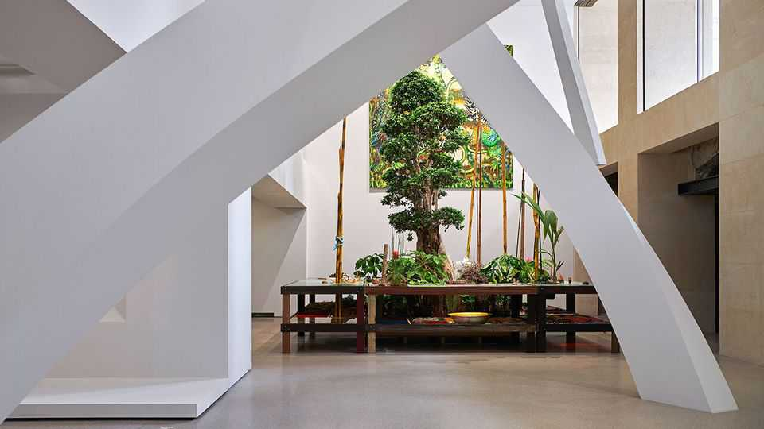
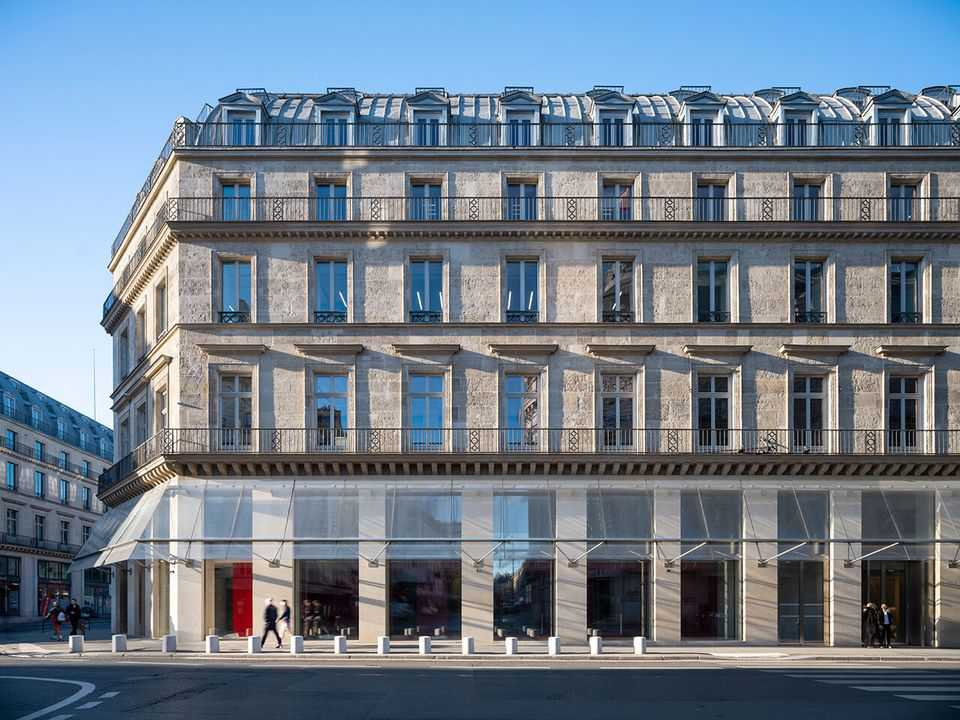
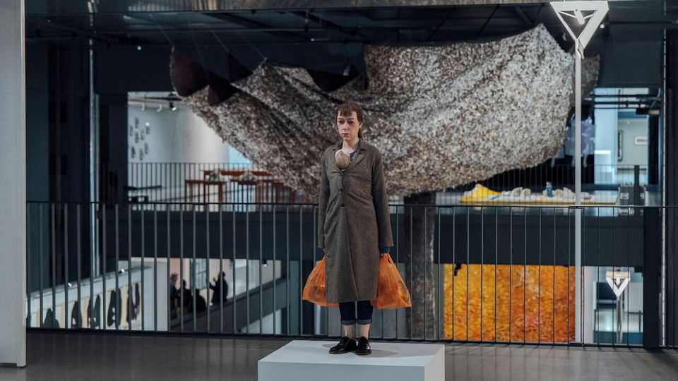

Culture | Bring the bling
The new Fondation Cartier is helping reshape central Paris
But will tourists like it?
October 23rd 2025

For much of its history the building opposite the Louvre, on the bustling Rue de Rivoli, was a popular department store. It even featured in a novel by Emile Zola, who liked to pen panegyrics about the poor; he described it as “a temple, with its blazing altars of temptation”. Now the building will tempt a different sort of devotee: art enthusiasts. On October 25th the Fondation Cartier, a museum backed by the French jeweller, is moving there after a years-long renovation. The building may look classically Haussmannian on the outside, but inside it feels very 2025—heavy on glass, concrete and steel. The inaugural show, on view until August, boasts works by around 100 artists who have taken part

in shows during the Fondation’s 41-year history, including Joan Mitchell, James Turrell and other less famous names. (The museum’s previous site was several kilometres away.)

The show is eclectic. Over here is a marble cat sculpture on a pedestal; over there are tens of thousands of feathers in the shape of a tree. Upstairs is a “hyperreal” sculpture of a desolate woman carrying plastic bags, not far from a self-portrait showing the map of the world upside down in glitter. Some wonder whether the museum is designed more for avant-garde French taste than that of the global tourist. It will not be everyone’s cup of thé.

Still, the opening is significant for three reasons. First, it is part of a broader trend of French luxury firms putting their mark on the arts through private museums, with the theory that associations with artists reflect well on their brands. Fondation Cartier pioneered this trend decades ago by funding living artists to create original works. Today people’s consumerism (and the resulting profits spun by firms) have changed the way visitors to Paris consume art. Fondation Louis Vuitton and the Pinault Collection mount shows that rival and sometimes exceed those put on by the state-run museums.

Second, Fondation Cartier shows how central Paris is entrenching its position as a “cultural hub”, observes Aurelie Cauchy, co-founder of the Twentieth, an art-advisory firm. Only a few minutes’ walk away is the Pinault Collection, which opened in the Bourse du Commerce in 2021, not to mention the Louvre, the Musée des Arts Décoratifs and Jeu de Paume.

Last, Fondation Cartier is a fascinating experiment in how a modern museum might look. Jean Nouvel, the architect, designed the space with five movable platforms ranging from 200 to around 360 square metres (2,150 to 3,875 square feet). “Every time the visitor comes back to the Fondation the architecture will look completely different” inside, explains Béatrice Grenier, the exhibition’s curator. The huge pulleys that move the floors are visible: almost works of art in their own right as well as reminders of the investment that this new museum required. Its pricetag has been estimated at hundreds of millions of euros. “The cost is ridiculous—and confidential,” said Alain Dominique Perrin, president of Fondation Cartier, sounding an awful lot like someone who has just splurged on a shiny new jewel. ■

For more on the latest books, films, TV shows, albums and controversies, sign up to Plot Twist, our weekly subscriber-only newsletter

This article was downloaded by zlibrary from https://www.economist.com//culture/2025/10/23/the-new-fondation-cartier-is-helping- reshape-central-paris

