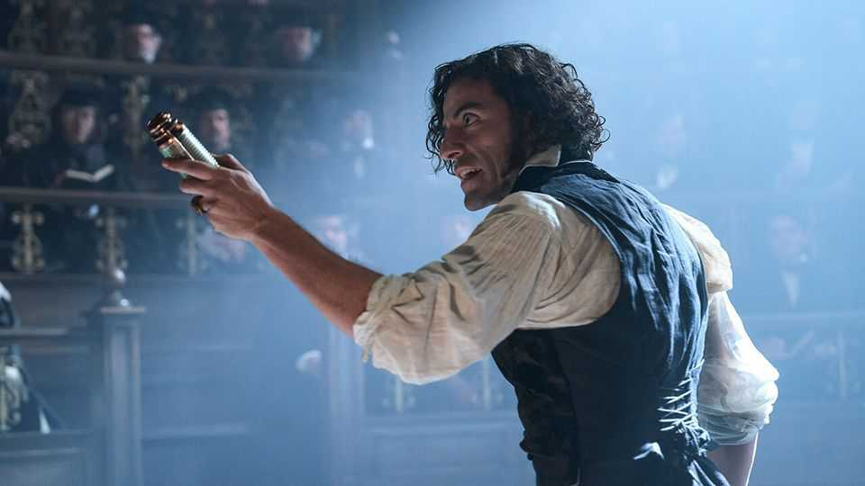

Culture | Back Story
A comely “Frankenstein” for the Instagram age
In Guillermo del Toro’s film, everything—including the monster—looks gorgeous
October 23rd 2025

He has watery eyes, flowing hair, yellow skin and black lips. He is eight feet tall. The creature dreamed up by a teenage Mary Shelley in “Frankenstein” is vividly corporeal. But, for film-makers, he is also an inviting outline. The story she hoped would “speak to the mysterious fears of our nature” offers a palette of mighty themes: God and science, nature and nurture, neglect and delinquency, fate and free will. Directors pick and mix these shades to craft a monster for their times. The latest to resurrect him is Guillermo del Toro, whose “Frankenstein” is out in cinemas now and on Netflix on November 7th. In his umpteen screen outings, the creature has appeared in every guise you can imagine, plus some

you probably can’t. He has been crossbred with Westerns, space adventures, spoofs, musicals and (like many new technologies) erotica; he has spawned highbrow riffs such as “Poor Things” and lower-brow ones like “Weird Science”. Even so, Mr del Toro’s colouring of the mythic yarn is distinctive and telling.

It looks gorgeous. Unfolding in the mid-19th century, decades after the book was published, the movie is a carnival of Byronic hairdos and velvet frock- coats. In a tweak to Shelley’s framing device, Victor Frankenstein (played by Oscar Isaac) recounts his lurid history to a Danish sea captain who rescues him from the polar ice. He assembles his humanoid in a gothic tower, the camera lingering gorily on his skill with eyeballs, bone saws and retracted skin.

This “Frankenstein” itself seems partly made up of cinema scraps. The protagonist harnesses lightning à la “Back to the Future”. Reviled by his maker and holed up in a barn, the creature (Jacob Elordi, pictured) befriends some rats like a hulking Snow White. He biffs people and (for some reason) wolves on Ramboesque rampages. Doctor and monster appear together in a mirror, a nod to a shot in the first screen adaptation, Thomas Edison’s silent version of 1910.

But this one has fresh touches too. It is unusually interested in where the funding—and body parts—for Frankenstein’s experiments come from. An arms dealer bankrolls them; the cadavers are harvested from hangings and battlefields. This is a fantasy with a modern conscience, embedded in a wider economy of death.

As for the sum of those scavenged parts: both morally and physically, he is much less hideous than Shelley’s ghastly original and many of his film predecessors. In the novel he murders Frankenstein’s brother, fiancée and best friend. Here the blood on his hands mostly belongs to extras. Compared with Boris Karloff’s neck-bolted ghoul from 1931, he is a dishy bit of rough, with a chiselled physique and comely brow; a body-conscious monster for the Instagram age.

And for the era of helicopter parenting. For of those abundant themes, Mr del Toro emphasises fatherhood. Whereas in the text Frankenstein’s father is loving, here he is distant and harsh. At first the doctor himself is enraptured by his own miraculous progeny, but, sleepless and frazzled, he is soon cranky and cruel—a deadbeat dad as well as a dead-meat dad. For heaven’s sake, you wind up thinking, get his creature a therapist.

Meanwhile there is a shift in Frankenstein’s underlying mission. In the book his main, hubristic aim is to discover “the elixir of life”. He wants to do that in the new film too, but his ultimate goal is at the other end of the life cycle: to use his unkillable creation to “conquer death”. In this he resembles less the necromancers of yore than the billionaires and scientists pursuing immortality today.

So Mr del Toro’s is a very contemporary “Frankenstein”. Yet there are doubtless many more revamps to come (starting with “The Bride!”, out next year, in which Maggie Gyllenhaal moves the action to Chicago in the 1930s). The science itself is due for a reboot. After all, the quest to engender life is no longer confined to laboratories which, like Frankenstein’s, run on organic tissue and cells. These days hopes and squeamish fears focus on artificial intelligence (AI). In the darkest prophecies, AI will enhance itself in a self-perpetuating cycle that renders humans obsolete.

In the novel, Frankenstein and his monster have a lot in common: obsession, a hunger for revenge, a longing for oblivion and searing loneliness. Perhaps in a future iteration of Shelley’s deathless fable, they may share something else. In a truly cutting-edge take, the creature would not be a human frame clad in flesh and blood but an AI model made of chips. So would the doctor. ■

For more on the latest books, films, TV shows, albums and controversies, sign up to Plot Twist, our weekly subscriber-only newsletter

This article was downloaded by zlibrary from https://www.economist.com//culture/2025/10/17/a-comely-frankenstein-for-the- instagram-age

Economic & financial indicators

Economic data, commodities and markets