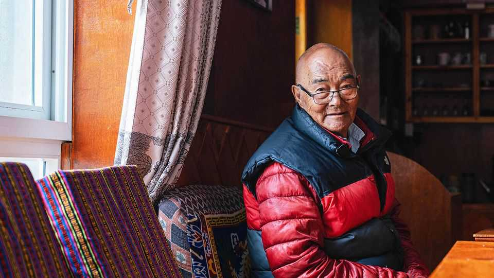
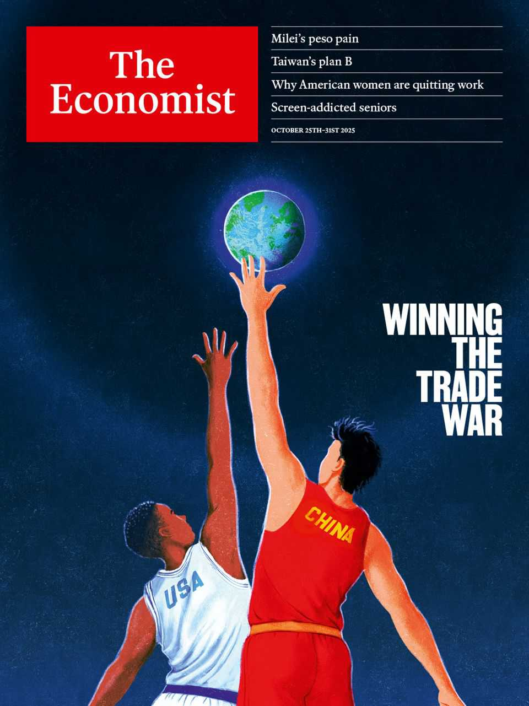

Obituary | Goddess or cash cow?
Kanchha Sherpa had mixed emotions about Everest
The last surviving member of the Hillary expedition died on October 16th, aged 92 or 93
October 23rd 2025

When Edmund Hillary and Tenzing Norgay reached the top of Everest on May 29th 1953, Kanchha Sherpa, then 19, was at the camp below. Two other Sherpas were with him, picked like him because they could manage, without supplementary oxygen, to climb to 27,000 feet. And not just climb, in a freezing wind that seeped into their bones and ex-army boots that hurt their feet. They also had to carry on their backs sleeping bags, ropes, spare oxygen cylinders and all the other gear the mountaineers needed for their last lap. At the South Summit they put up the tent in which Hillary and Tenzing stayed overnight; and it was not until the two men came down to them, jubilant, that they heard the news. After that moment of pure joy,

hugging and a bit of dancing, they got the stuff together to carry it to base camp again.

His primary duty all through the expedition, once the ascent was too steep for yaks, was to carry the kerosene and the stoves. It was on these that the mountaineers cooked their strange Western food, all in cans. He had tried it, and the powdered orangeade was all he could take. Sherpas and porters like him just ate their usual tsampa, barley porridge, hot or cold and mixed with melted snow. That was as good as oxygen to him.

Besides porterage, he had had to help with scores of other Sherpas to build six camps and lay a path up the mountain. At one point, Khumba Icefall, recent snowfall had opened up a huge crevasse that blocked their way. Without ladders to scale almost 3,000 feet they could not go on, so ten of them hiked back to his home village, Namche Bazaar, and cut down ten tall trees to make a bridge. Each Sherpa then carried a tree to the icefall. The advantage of living in that part of Nepal, the gateway to Everest, was that it had plenty of trees. His grandfather, who had helped to found the settlement, had also survived by raiding the forest, in his case for tubers and nettles.

That said, however, Namche was not an easy place to live. There was little to do but grow potatoes, which were traded for almost everything else: salt, sugar, even the corn and millet Kanchha’s family grew on their smallholding. His job from boyhood (having never gone to school) was to trade whatever the family had, walking for days through the vast mountains to India or Tibet. His first trip was to take 30 kilos of Nepalese paper to Tibet to make prayer-wheels. Later, with his keen teenage eye for opportunities, he sold surplus Himalayan sheepdogs, strays rounded up in the village, to eager buyers in India for eight rupees each. The mountains were his marketplace.

Yet he was still not prospering as he wanted to. Men in other villages had better clothes and more money. Fairly soon he realised that their secret lay in Darjeeling, where they found jobs guiding climbers. His father, himself a mountaineer, knew Tenzing, so Kanchha set off for Darjeeling (a walk of five days) to see him; and Tenzing hired him as a porter for the Hillary expedition. The job was for 90 days at eight rupees a day, enormous money. He was also given crampons, up-to-date climbing gear and extra-thick

clothes, all of which he sold later to feed his six children. It was therefore not surprising that, for two decades more, he worked as a high-altitude helper for mountaineers while his whole village grew rich round him.

Yet there was another side to all this that troubled him. As a child he was taught that Everest was the holiest of mountains: Chomolungma, Mother Goddess of the World. He never saw her close, but heard the tales from older folk. In those days no villager would dream of setting foot there. When he first did, on the expedition, he was careful to say his Buddhist puja, his commitment to the right path, and to climb with respect. As he gained height he increasingly marvelled at the pristine beauty of the mountain and the number of glaciers he could see. But when Chomolungma was “conquered”, that path he had laid soon drew dozens, then hundreds of people towards the peak. They left behind tents, mattresses, food wrappings, cigarette butts and their own filth, dirtying the goddess. This was terrible.

The mountains were also changing. Around Base Camp there was once lush grass, with yaks grazing. Gradually, it became packed earth and rocks. Peaks once white with snow turned black; glaciers melted almost before his eyes. He did not think this was global warming, though he had heard about that. The reason was simpler, that the goddess and the gods had been stepped on; and they were angry.

His answer was to have just one climbing season a year. But he could not pretend he was sorry that visitors had flooded into Namche. Without them, what would people do? It would be back to sitting around and living off potatoes; back to being poor, or trading illegally. For a while he sold Swiss watches, bought for 300 rupees in Kolkata, for 3,000 rupees to Chinese soldiers stationed in Tibet. Those handy profits landed him in jail.

Eventually he ran a hotel in Namche, Nirvana Lodge, where the specialities were Sherpa vegetable stew and a chance for visitors to talk to him, while his wife served milky sweet tea. (The trekkers had taught him to drink alcohol, but he had stopped that.) His children were not mountaineers; two sons ran hotels, on his firm advice. Yet when visitors called to hear his memories, as many did, he would quietly keep fingering his prayer-beads. When he took his morning walk, as a very old man, through streets full of cafés and climbing-gear emporiums, he slowly spun his prayer-wheel.

Several times a day he went to the four local monasteries to pray that climbers and trekkers would be kept safe from avalanches.

He never reached the summit of Everest himself. His best climb still fell 327 feet short. Seven times he asked for a government permit to go higher, but was turned down. Perhaps, after all, it was better he had not committed that ultimate trespass. ■

This article was downloaded by zlibrary from https://www.economist.com//obituary/2025/10/23/kanchha-sherpa-had-mixed-emotions- about-everest

Table of Contents

The world this week Politics Business The weekly cartoon Leaders Why China is winning the trade war Javier Milei faces his most dangerous moment yet To save the world’s tropical forests, learn from Brazil The migration schemes even populists love Never mind your children’s screen time. Worry about your parents’ Letters Should investors buy into shares of European companies? By Invitation Donald Trump is copying the wrong things from China, writes Dan Wang Briefing China is using America’s own trade weapons to beat it United States America’s gerrymander war is heating up A Supreme Court case could help entrench Republican power How the Trump administration could make sensible rules for drones America’s government shutdown is its weirdest yet Golf simulators and gyms are luring Americans back to the office In the race for Virginia governor, Democrats see boring as a plus Donald Trump has turned the war on drugs into a real war The Americas Javier Milei’s fate turns on an upcoming election. Can he win? Colombia has finally drawn Donald Trump’s ire The obvious economics of preserving the Amazon Asia What is Taiwan’s plan B? Takaichi Sanae becomes Japan’s first female prime minister How to win prizes and lose influence America and Britain target Asia’s sprawling scam industry

China Why America and China can’t escape their toxic cycle of trade talks China has a grave problem Why Hong Kong is going for gold Middle East & Africa How to preserve Africa’s natural riches for everyone Two flawed elections show the dangers of one-party rule Qatar is a crossroads at a crossroads After Gaza, Israeli politics are even less predictable Europe Germany’s much-ballyhooed “autumn of reforms” is a damp squib Poland refuses to extradite a Nord Stream suspect Western drones are underwhelming on the Ukrainian battlefield France puts a former president, Nicolas Sarkozy, behind bars Turkey’s fabled textile industry is coming apart at the seams Can Ukraine get past the bouncer on the EU door? Britain Labour is treating London shabbily What locals think of Birmingham’s ban on Israeli football fans How sumo wrestling became a hit in Britain Britain’s Parliament goes after Prince Andrew Britain’s welfare system has grown sicker Buckaroo! The British government’s favourite game International Meet the real screen addicts: the elderly Brussels feels like a city preparing for war Business OpenAI and Anthropic v app developers: tech’s Cronos syndrome Despite abstemious Gen Zs, the booze industry is going strong The mercenary business is on the brink of another boom In South Korea a corporate-governance revolution is under way Sports leagues find that streaming pirates have their purposes Beware the “romance of leadership” American big business faces a $1trn capex question Finance & economics How to make immigration palatable in a populist age The world economy shrugs off both the trade war and AI fears

Why are American women leaving the labour force? Trumponomics is warping the world’s copper markets Can AI make the poor world richer? Why investors still don’t believe in Argentina China is being fuelled by inspiration, not perspiration Science & technology China’s chipmakers are cleverly innovating around America’s limits How the persecution of sparrows killed 2m people AI models ace their predictions of India’s monsoon rains Can bright light banish winter depression? Culture Idi Amin, a pioneer of mass deportation In Vienna, the waltz is keeping in step with the times Philip Pullman’s magisterial fantasy series has come to an end The new Fondation Cartier is helping reshape central Paris The lessons from the brazen heist at the Louvre A comely “Frankenstein” for the Instagram age Economic & financial indicators Economic data, commodities and markets Obituary Kanchha Sherpa had mixed emotions about Everest