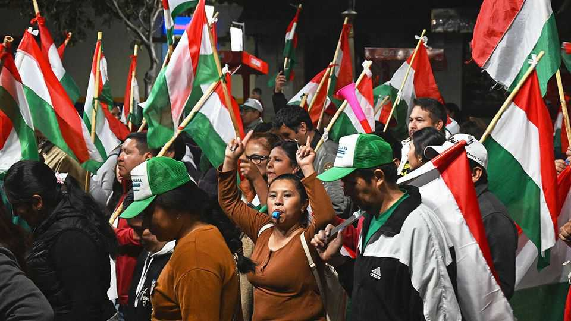

本周世界 | 政治
政治风云：拉美左翼失势，美俄关系恶化
从玻利维亚到阿根廷，左翼政党接连败北；美国对俄制裁升级，贸易战愈演愈烈
2025年10月23日

摘要：拉美政治版图正在重塑，左翼势力节节败退。玻利维亚20年左翼统治终结，阿根廷米莱的紧缩政策面临中期选举考验。同时，美俄关系跌至新低，特朗普对俄能源巨头实施制裁，贸易战升级。全球政治格局正在发生深刻变化。

玻利维亚总统选举尘埃落定，中派候选人罗德里戈·帕斯在决选中击败保守派对手，成功当选。左翼总统路易斯·阿尔塞因执政的社会主义运动党内部分裂，决定不参选。这个党已经连续执政20年，如今在玻利维亚多年来最严重的经济危机中黯然下台。帕斯承诺允许私营部门扩张以促进增长，同时保护福利项目。

阿根廷央行在中期选举前几天与美国财政部签署了200亿美元的货币互换协议。这次选举被视为对总统哈维尔·米莱紧缩政策的全民公投。美国财长斯科特·贝森特表示，该协议将为阿根廷带来经济稳定，美国不希望看到又一个拉美国家失败。不过，计划细节尚未公布，美国银行据称对此持谨慎态度。

美国与哥伦比亚的关系跌至新低。特朗普表示将对哥伦比亚商品加征关税并暂停援助，还指责其左翼总统古斯塔沃·佩特罗是"非法毒品头目"。此前，佩特罗将美国上个月在哥伦比亚水域对一艘涉嫌贩毒船只的军事打击称为"谋杀"。当消息传出美国首次在东太平洋打击涉嫌走私者时，佩特罗也称那次攻击是"谋杀"。

与此同时，波哥大一家法院推翻了对阿尔瓦罗·乌里韦贿赂证人罪的定罪。法院认定，对这位前保守派总统作证的关键证人不可信，用于证明调查合理性的窃听是非法的。乌里韦曾被判处12年监禁。佩特罗谴责了这一逆转。

美国遣返了两名在加勒比海对一艘涉嫌贩毒的潜水器进行军事打击中幸存的人员。另外两人在袭击中丧生。这两人被送回哥伦比亚和厄瓜多尔，意图对他们进行起诉。但厄瓜多尔释放了其公民，称未收到犯罪行为的正式报告。

美国副总统J.D.万斯、特朗普的中东特使史蒂夫·维特科夫以及在有影响力的和平协议斡旋者贾里德·库什纳访问以色列，以加强对与哈马斯停火协议的支持。武装分子早些时候向加沙以色列控制线后方地区发射火箭弹，造成两名士兵死亡。以色列反击并短暂暂停援助。巴勒斯坦官员称数十人在冲突中丧生，但未说明有多少是战斗人员或平民。美国代表团专注于让哈马斯解除武装，这是和平计划的下一阶段。

美国对俄罗斯两大石油公司俄罗斯石油公司和卢克石油公司实施制裁，此前克里姆林宫明确表示，弗拉基米尔·普京对与特朗普就乌克兰问题举行另一次峰会不感兴趣，因为其战争目标没有改变。美国财政部表示，这些制裁是特朗普政府首次直接针对俄罗斯能源的制裁，旨在阻止使用石油收入购买武器。油价大幅上涨。这是特朗普的又一次政策逆转。几天前在白宫，他据称告诉弗拉基米尔·泽连斯基向俄罗斯交出被占领的乌克兰部分地区。欧洲领导人聚集伦敦举行峰会，讨论使用冻结的俄罗斯资产援助乌克兰等问题。

尼古拉·萨科齐开始服刑五年，一个月前他因密谋使用利比亚非法竞选资金被判刑。他是自纳粹合作者贝当元帅以来首位被监禁的法国前国家元首。法国各地都有人质疑为什么萨科齐在上诉期间被送进监狱。他的律师已请求释放他。

埃马纽埃尔·马克龙表示，法国有争议的养老金改革——将最低退休年龄从62岁提高到64岁，并于2023年通过——是"必要的"，但现在由议会决定如何处理。这是法国总统在其新复职的总理塞巴斯蒂安·勒科尔努承诺在2027年下次总统选举前"暂停"新规则后的首次评论。勒科尔努在宣布这一消息后赢得了反对党社会党的支持，在议会中以微弱优势获得信任投票。

葡萄牙议会批准了禁止女性在公共场所（飞机、礼拜场所和外交职能除外）佩戴面纱（如罩袍和尼卡布）的立法。任何强迫女性遮脸的人可能被送进监狱。该法案由极右翼切加党提出，得到中右翼支持。总统仍可能否决该法案。

北塞浦路斯在1974年土耳其入侵塞浦路斯后宣布独立，举行了总统选举，支持岛国统一的图凡·埃尔胡尔曼获胜。他获得了63%的选票。土耳其是唯一承认北塞浦路斯的国家。针对这一结果，土耳其副总统杰夫代特·伊尔马兹表示，"祖国"站在土耳其塞浦路斯人一边。

英国成立的调查性侵团伙丑闻的委员会遭受了又一次打击，四名性侵幸存者退出了受害者小组。这四名女性对调查的透明度表示担忧，并认为其职权范围正在扩大，以调查所有儿童性侵案件，而不是主要由南亚裔团伙犯下的特定罪行。她们也不希望调查主席来自社会关怀或警察部门，这些机构正是让受害者失望的机构。内政大臣沙巴娜·马哈茂德坚持认为调查不会被"淡化"。

高市早苗就任日本新首相。据报道，高市正在准备一个大型经济方案，将应对通胀，投资人工智能和芯片制造等行业，并加强国家安全。为缓解通胀压力，政府计划取消自1970年代以来一直存在的燃料"临时"税。股市上涨，但日元下跌；高市表示政府应该对央行有更多影响力并"协调"政策。

【一｜拉美左翼失势】玻利维亚20年左翼统治终结，阿根廷米莱面临中期选举考验，左翼势力在拉美节节败退。

【二｜美俄关系恶化】特朗普对俄能源巨头实施制裁，贸易战升级，全球政治格局正在重塑。

【三｜地区冲突持续】以色列-哈马斯停火协议面临挑战，美国代表团访问以色列寻求解决方案。

【四｜欧洲政治变化】法国萨科齐入狱，葡萄牙禁止面纱，英国性侵调查遭遇挫折。

【五｜亚洲政治动态】日本高市早苗就任首相，准备大型经济方案应对通胀和国家安全挑战。

总的来说，全球政治格局正在发生深刻变化。拉美左翼失势、美俄关系恶化、地区冲突持续，各国都在应对各自的政治挑战。这些变化将对全球政治经济格局产生深远影响。
