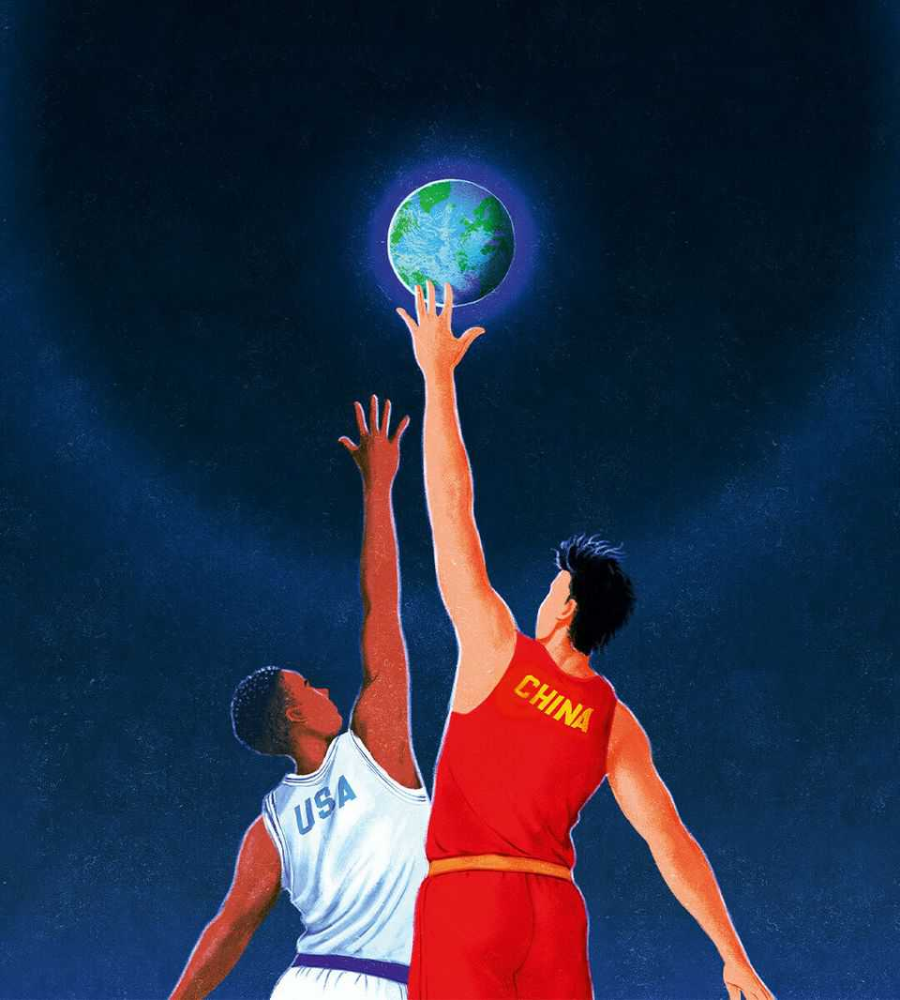

社论 | 中美关系
中国为什么在贸易战中占上风
它已经回击美国并重写了全球贸易规则
2025年10月23日

摘要：中美贸易战愈演愈烈，但中国正在占据上风。中国学会了有效升级和反击，正在试验自己的域外贸易规则，从而改变世界经济的路径。特朗普的威胁往往雷声大雨点小，而中国则通过精准反击和供应链重组展现出了强大的韧性。

特朗普和习近平下周将在韩国会面。不过，他们是否真的会见面还不确定。这就是世界上最重要关系的令人震惊的现状。几周来，美国和中国一直在互相攻击。美国收紧技术出口限制并威胁提高关税；中国挥舞制裁大棒，限制稀土出口。双方沟通不畅。白宫认为美国在这场神经和痛苦承受力的考验中占据上风。财长斯科特·贝森特说中国"很弱"。但现实不同。中国正在赢得贸易战。它学会了像美国一样有效地升级和反击。它正在试验自己的域外贸易规则，从而改变世界经济的路径。

当特朗普重新入主白宫时，他中国政策的防御部分很模糊：他是否准备保卫台湾和美国盟友免受中国军事威胁？答案仍然令人担忧地模糊。但他在对华贸易上的立场很明确。他将加大第一任期开始的压力运动。这意味着更多关税、更多高科技贸易控制以及热情使用制裁。政府的目的是削弱中国的制造业巨头，获得金融和商业让步，减缓中国的技术发展。特朗普团队中的一些人甚至梦想达成"大交易"，中国承诺改革国家资本主义，以换取美国松手。

六个月后，中国比美国呼吸更轻松，原因有三。首先，它证明能够承受美国的胁迫，并善于反击，实现了行话中所谓的"升级主导"。特朗普的一些批评者将此归因于TACO（特朗普总是退缩）。这也反映了中国的基础实力、准备和技巧。特朗普4月对中国实施的"解放日"关税在华尔街暴跌后被撤销。最近，在中国对高科技制造业使用的稀土出口实施限制后，特朗普威胁100%关税，结果又退缩了。他通过近乎全面禁运来削弱中国的威胁并不可信，因为这样做也会损害美国。那些断言中国处于危机中的人应该注意到，今年其股市以美元计算上涨了34%，是标普500指数涨幅的两倍。

中国学会了巧妙反击。在特朗普对抵达美国港口的中国集装箱船征收费用后，它用自己的港口费用回应。中国威胁进行反垄断调查，对杜邦、谷歌、英伟达和高通等美国公司施压。它拒绝购买美国大豆——去年是中西部农民120亿美元的市场，是美国对华最大出口——这让特朗普重视的选民群体陷入困境。尽管美国对中国的某些扼制仍然存在，比如飞机发动机，但习近平大力推动中国供应链摆脱外国投入，同时使中国成为其他国家供应链不可或缺的一部分。理论上，特朗普可以通过切断中国进入美元银行系统来提高赌注。但他可能不会；由此产生的金融市场动荡将严重伤害美国。

在所有针锋相对中，中国正在通过试错开发一套新的全球贸易规则。这是它的第二个成功领域。它想在旧的自由贸易秩序的废墟上建立一个中国主导的体系，这将与特朗普的关税帝国竞争。中国已经转移了贸易地理：截至9月的一年中，其商品出口增长超过8%，即使对美出口下降27%。中国限制稀土出口的威胁令人恐惧，因为它主导市场，可能削弱西方制造业供应链。但它们也很引人注目，因为它们显示中国试图强加一个全球许可制度。这是美国用来控制半导体行业的剧本的更激烈版本。期待更多中国重塑贸易规则的例子，因为它利用其作为复杂制造商和70多个国家最大贸易伙伴的地位。

中国获胜的最后一个原因是贸易战使习近平和共产党更强大，而不是更弱。局外人指出中国的巨大问题，包括其房地产地狱、胆怯的消费者、被吓倒的企业家以及其产业政策造成的产能过剩和资本错配。然而，对许多中国人来说，特朗普的欺凌证明了习近平12年项目，即通过成为技术工业超级大国为中国在敌对世界中做准备。本周共产党领导层开会讨论新的五年计划。预计将加倍投入习近平的技术民族主义方法。

中国仍可能出很多问题。将出口从美国转移可能促使更多国家设置关税。其新生的许可制度可能为自己和他人创造官僚噩梦。正如美国正在发现的，使用经济力量作为大棒是有风险的。其他国家快速增长的动机是多样化和创新，以减少对你的依赖。

如果特朗普和习近平确实在韩国会面，对双方来说展示降级可能很方便。美国可能暂停关税，以换取延迟实施稀土控制，加上一些大豆购买和对提议的将中国控制的社交媒体平台TikTok出售给美国所有者的交易的祝福。然而，不要搞错：展开的前景不是两个国家克服分歧，而是好战的巨人将经济力量武器化。即使中国正在赢得特朗普的贸易战，从开放商业的撤退最终使每个人都成为输家。■
