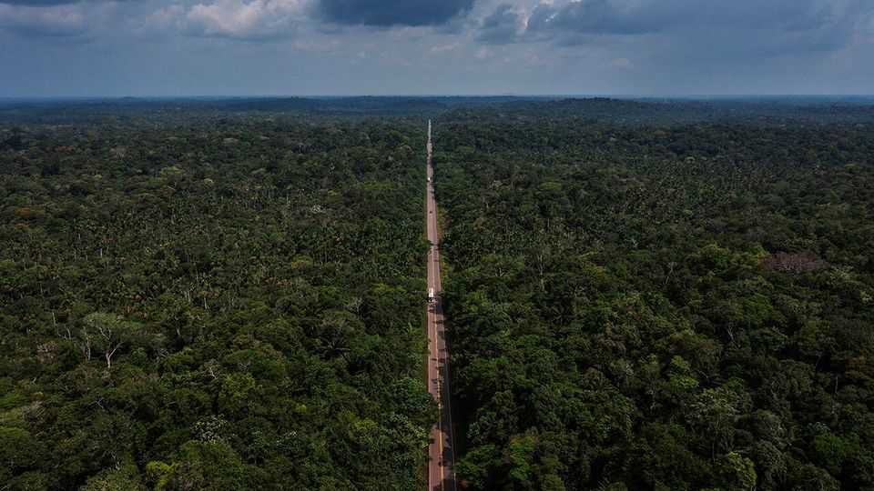

社论 | 席尔瓦的伐木剧本
拯救世界热带森林，向巴西学习
去年它失去的雨林比任何其他国家都多。然而还有希望
2025年10月23日

摘要：砍伐雨林是愚蠢的。清理一片典型的巴西亚马逊雨林的社会成本可能是养牛收益的30倍。问题是，这些成本包括加剧气候变化，分散到全世界人口，而砍树的利润却归指挥电锯的人。世界必须找到让保护付费的方法。去年约6.7万平方公里的原始雨林被毁，面积约等于爱尔兰。

砍伐雨林是愚蠢的。清理一片典型的巴西亚马逊雨林的社会成本可能是养牛收益的30倍，这是2023年的一项估计。问题是，这些成本包括加剧气候变化，分散到全世界人口，而砍树的利润却归指挥电锯的人。世界必须找到让保护付费的方法。其失败从太空可见。去年约6.7万平方公里的原始雨林被毁，面积约等于爱尔兰，几乎是2023年清理面积的两倍。世界领导人在2021年COP气候会议上承诺到2030年停止森林砍伐，但远未实现：尽管有波动，全球森林砍伐速度与十年前大致相同。

去年整个热带地区的损失向大气中增加了31亿吨温室气体，比印度燃烧化石燃料增加的还多。更重要的是，森林砍伐可能引发恶性反馈循环。排放提高温度，使植被干燥，导致野火（这是2024年森林砍伐的最大驱动因素），造成更多排放。危害可能是局部的，也可能是全球的。雨林创造自己的天气系统：树冠蒸发形成"飞行河流"，为数千公里外的农田供水。保护主义者担心亚马逊接近临界点，这个水循环系统崩溃，加速森林破坏。下月在巴西举行的今年COP将充满紧张。

然而还有希望。尽管巴西去年因野火失去的雨林比任何其他国家都多，但它也显示了更好的政策如何能产生影响。在2019年至2023年担任总统的右翼分子雅伊尔·博索纳罗领导下，几乎没有努力阻止电锯。相比之下，他的继任者路易斯·伊纳西奥·卢拉·达席尔瓦和强硬的环境部长玛丽娜·席尔瓦挥舞着明智的棍棒和胡萝卜组合。全副武装的联邦特工逮捕非法伐木者并炸毁非法矿山。发生非法森林砍伐的财产被列入补贴信贷黑名单。森林砍伐速度在卢拉第一个任期（2003-11年）下降了80%，当他2023年回归时再次下降，然后野火使情况倒退。

巴西的政治图景仍然积极。博索纳罗将环保主义视为发展的障碍，而卢拉政府知道破坏雨林会削弱巴西农业。它更努力保护土著保护区，其居民通常是森林的好管家，并澄清亚马逊的产权，这些产权是重叠和记录不良的混乱主张。如果你知道谁拥有一块土地，你就知道该惩罚谁破坏它或奖励谁保护它。令人高兴的是，随着数字成像技术的进步，违法行为可以在几天内被检测和报告，允许当局快速反应。

所有这些教训都应该应用到其他有雨林的国家。不幸的是，许多国家的治理比巴西差得多。刚果民主共和国今年引入了土地使用法，旨在保护土著群体，但刚果政府对其领土只有摇摇欲坠的控制。一些当地现金换保护计划显示出希望。然而，保护刚果广阔森林的主要因素是它严重缺乏道路。如果这些改善比法治更快，伐木者可能会失控。

由于保护雨林是全球公共产品，世界应该帮助支付。但这又是说起来容易做起来难。富裕国家对援助感到厌倦。碳信用市场未能起飞，部分原因是很难说给保护项目的钱是否真的保护了树木。最简单的方法是向森林砍伐停止的国家（或省份）政府付款，通过卫星图像验证。巴西正在努力鼓动对这一想法的兴趣。然而，如果相关政府腐败或专制，捐助者可能有疑虑。拯救世界肺部的斗争需要创造力、外交和清醒。■

【一｜森林砍伐代价巨大】清理雨林的社会成本是养牛收益的30倍，去年6.7万平方公里原始雨林被毁。

【二｜巴西政策转变】博索纳罗时期几乎没有努力阻止伐木，卢拉政府用棍棒和胡萝卜组合保护雨林。

【三｜技术助力执法】数字成像技术让违法行为几天内被检测，当局能快速反应。

【四｜全球合作困难】富裕国家对援助厌倦，碳信用市场未起飞，需要创造力、外交和清醒。

【五｜保护雨林是公共产品】世界应该帮助支付，但需要找到让保护付费的方法。

总的来说，拯救世界热带森林需要向巴西学习。尽管巴西去年失去的雨林最多，但它也显示了更好的政策如何能产生影响。卢拉政府用明智的棍棒和胡萝卜组合保护雨林，技术助力执法，但全球合作仍然困难。保护雨林是全球公共产品，需要创造力、外交和清醒。
