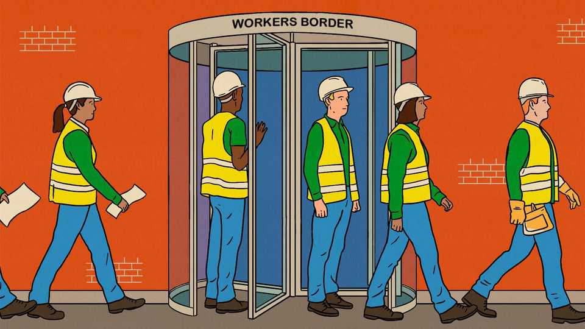

社论 | 跨境临时工
连民粹主义者都爱的移民计划
为什么临时工带来巨大好处
2025年10月23日

摘要：在富裕世界，临时移民正在增加。2014年至2023年间，提供给工作移民的短期签证数量增加了近100万，达到250万，没有放缓迹象。设计良好的临时工计划为各方带来巨大好处。随着政治潮流转向反对移民，它们可能是接纳低技能工人的唯一可行方式。

在富裕世界，临时移民正在增加。2014年至2023年间，提供给工作移民的短期签证数量增加了近100万，达到250万，没有放缓迹象。增长不仅限于通常对移民更开放的地方；甚至民粹主义的匈牙利和意大利，以及传统上反对移民的日本和韩国，都在拥抱它们。短期移民的想法让西方许多观察者感到不安。对一些人来说，它让人想起工人在恶劣条件下长时间工作、工资微薄的画面。老板没收护照或雇主剥削移民女佣的恐怖故事定期成为头条。事实上，设计良好的临时工计划为各方带来巨大好处。随着政治潮流转向反对移民，它们可能是接纳低技能工人的唯一可行方式。

从美国和英国到法国和意大利的民粹主义政党煽动了反移民情绪，并在投票箱中受益。但随着当地人口老龄化，公司迫切需要工人。短期签证提供了一种穿针引线的方式，这就是为什么意大利向低技能职业的移民发放了大量临时签证。尽管日本、韩国和台湾提供很少的永久居留途径，但它们每年都引进数十万这样的工人。

与此同时，对低技能移民是否给福利国家造成负担的担忧正在上升。移民的财政影响取决于移民的技能和规范其获得公共福利的规则。在大多数西方国家，停留足够长时间的低技能移民在年老时获得养老金和医疗保健，而支付的税收远少于高技能移民。政府可以通过限制移民获得福利来避免这些成本，如海湾国家所做的那样，或坚持他们在退休前回家。许多人选择后者。因此客工计划的流行。

临时移民也为移民和来源国带来巨大好处。伦敦经济学院的兰特·普里切特指出，美国的低技能工作为来自11个最大发展中国家的移民提供了将工资翻五倍的机会，即使考虑到国内较低的价格。如果富裕世界劳动力中三分之二的人口不足被临时工人数量增加所抵消，到2050年全球工资将按今天的价格增加6万亿美元。来源国在移民寄钱回家、创办企业和供亲戚上学时受益。去年低收入和中低收入经济体收到的汇款总额占其GDP总和的5.4%。

然而，为了使临时移民计划在政治上更可接受，必须改进它们。许多缺乏灵活性。在中东部分地区，卡法拉制度将移民绑定到单一雇主，因此被解雇就是被送回家。这是虐待的配方。改革卡法拉的国家，如沙特阿拉伯，使其劳动力市场更具活力，允许工人转向更高薪和更有生产力的雇主。

可携带签证允许移民换工作，对移民和东道主都更好。去年澳大利亚将工人在离开第一个担保人后寻找新雇主的时间从60天延长到180天。这种灵活性提高效率并遏制残酷老板的权力。

另一个变化涉及法治。如果移民怀疑者担心客工会溜进阴影，他们对临时移民的支持就会减弱。但有方法阻止这种情况。例如，新西兰的季节性农场工人比澳大利亚的同行明显不太可能逾期居留，原因有两个。第一个是企业因工人逃跑而被罚款，给雇主强烈的动机筛选和监控员工。第二个是没有机制让工人提出庇护申请，允许他们或多或少无限期地留在该国，削弱了他们尝试这样做的动机。

客工的好处有限，特别是与永久移民相比。短期签证使移民难以成为企业家，限制创新。可携带签证更好，但仍不如自由流动灵活。高技能移民带来如此巨大的好处，国家应该努力留住他们，而不是用10万美元的签证费排斥他们，如美国现在所做的那样。

当选民怀疑永久移民时，客工比完全没有移民更好。设计良好的计划对接受它们的人来说更安全，为东道国带来更多好处，并在移民怀疑主义和自由主义原则之间取得平衡。■

【一｜临时移民增加】富裕世界临时移民增加，2014-2023年短期签证增加近100万，达到250万。

【二｜民粹主义拥抱客工】即使民粹主义国家也在拥抱临时工，因为当地人口老龄化，公司迫切需要工人。

【三｜临时工带来巨大好处】美国低技能工作让移民工资翻五倍，来源国在汇款中受益，占GDP的5.4%。

【四｜需要改进计划】许多计划缺乏灵活性，需要可携带签证和法治保障。

【五｜客工比没有移民更好】当选民怀疑永久移民时，客工是唯一可行的方式，设计良好的计划更安全。

总的来说，连民粹主义者都爱的移民计划是临时工。在富裕世界，临时移民正在增加，因为当地人口老龄化，公司迫切需要工人。设计良好的临时工计划为各方带来巨大好处，但需要改进灵活性、可携带签证和法治保障。当选民怀疑永久移民时，客工比完全没有移民更好。
