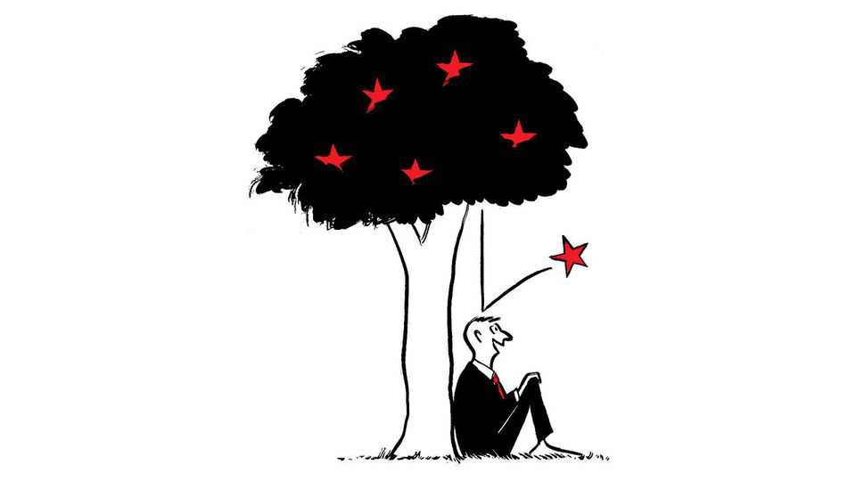
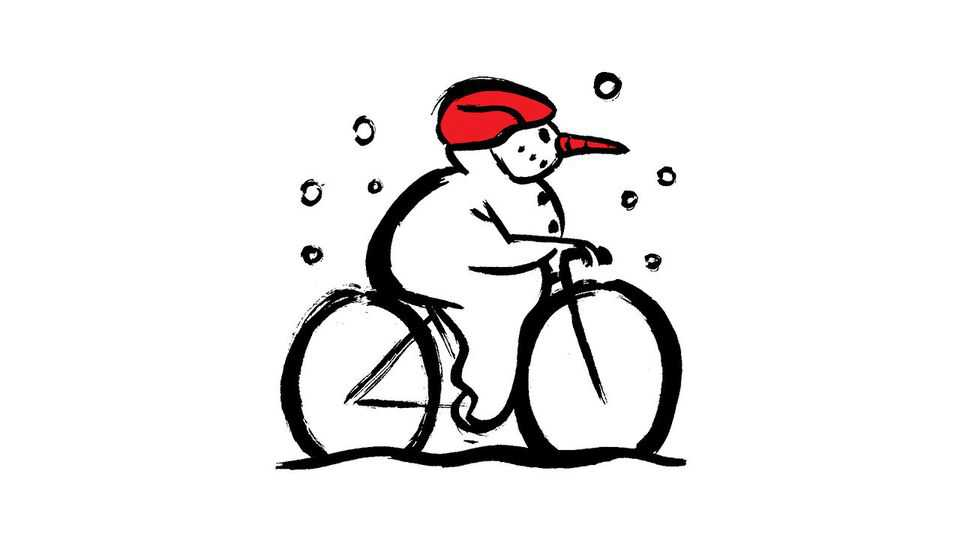

读者来信 | 精选通信
投资者应该买入欧洲公司股票吗？
本周还有：穆罕默德·阿里、文化战争和骑行者、约翰·辛格·萨金特、乔治·奥威尔和酒吧
2025年10月23日

摘要：欧洲公司股票正在吸引全球投资者的注意，因为估值动态和美国市场集中风险变得更加突出。标普500指数近40%的价值现在集中在仅十家公司，让投资者面临名义上比实质上更广泛的敞口。这种不平衡促使寻找多元化，投资者越来越多地关注欧洲公司。

欢迎通过电子邮件发送信件至letters@economist.com了解更多关于我们如何处理您的信件的信息

欧洲公司股票正在吸引全球投资者的注意，因为估值动态和美国市场集中风险变得更加突出。Buttonwood（9月20日）强调了欧洲日益增长的吸引力，特别是在核心市场之外。但故事不仅关于欧洲的韧性；也关于美国股票格局的结构性转变。

标普500指数近40%的价值现在集中在仅十家公司，让投资者面临名义上比实质上更广泛的敞口。这种不平衡促使寻找多元化，投资者越来越多地关注欧洲公司，从意大利的工业领导者到希腊的勇敢地区银行，估值更温和，市场领导力分布更均匀。

尽管这些公司可能无法达到华尔街首次公开募股承诺的高度，但它们无需搬迁即可获得美国资本。国内上市与交叉交易配对提供了可见性和流动性的接地路径，而不放弃国内市场。欧洲公司股票长期以折扣交易，为重新发现定价。

杰森·帕尔特罗维茨
董事兼执行副总裁
OTC Markets Group
纽约

历史重演。那些提议通过摆脱中层管理者来"去层级化"组织的人（"去老板化"，10月11日）应该看看迈克尔·哈默的理论在1990年代初对企业造成的损害。那时中层管理者以"业务流程重组"的名义被大量解雇，哈默的公司运营根本性重新设计策略。它造成了很大损害，原因非常简单。是中层管理者知道组织如何真正运作，而不是说应该发生什么的过程手册。

布莱恩·基尔科斯
加利福尼亚州格拉斯谷

关于美国"为什么药品定价战争会失败"（10月4日），制药公司花费巨资创造治疗慢性病的品牌药物，因为它们比其他药物更可能获得监管批准、定期使用并命令高价。相比之下，便宜、救生的概念如心血管多药丸，一种可以预防大量心脏病和中风的英国发明，被忽视，因为公司及其投资者无法获得大量货币回报。

早期获得重磅药物值得吗？不。尽管美国在医疗保健上的人均支出远高于其他富裕国家，但在结果上表现明显不佳。您正确地指出，减少强大中间商的浪费和利润可以节省资金。但必须做更多。兰德提出了十项政策来激励高价值、降成本医疗保健技术的开发和采用。如果实施，美国的天才和自由企业将完成其余工作。

阿特·凯勒曼博士
弗吉尼亚州里士满

确实，左撇子运动员在某些运动中似乎有先天优势（"邪恶优势"，9月27日）。一个例子是1966年穆罕默德·阿里和卡尔·米尔登伯格之间的拳击比赛，米尔登伯格是德国人，是第一个为世界重量级冠军而战的左撇子。冠军被米尔登伯格施加的邪恶困难所挫败，比赛进行了12轮。阿里通过技术击倒获胜，但米尔登伯格能够用身体拳击锤击和伤害阿里的肝脏区域，考虑到他在中段传奇的不败性，这很了不起。

斯坦·科瓦尔斯基
新罕布什尔州康科德

您关于骑行如何"革命化交通"的文章提到蒙特利尔是北美领先的骑行城市（"四轮好，两轮更好"，10月11日）。您在夏季月份从那里报道。大雪使骑行在一年中的许多其他时候变得危险。当自行车道被添加到已经狭窄的街道上，资源被转移到清理它们而不是汽车道时，交通为了少数顽固骑行者而受阻。

理查德·约翰斯顿
加拿大埃德蒙顿

您将城市交通问题呈现为自行车和汽车之间的选择。但如果新骑行者不是从汽车转换而来，而是前步行者或公共交通使用者呢？新自行车道以道路空间为代价，增加拥堵，并加深面临乘客下降的公共交通运营商的财务困境。

哈维尔·阿森西奥
巴塞罗那

我用来代替汽车的自行车拥有和运营花费了我5000美元。相比之下，根据AAA的数据，美国汽车拥有的平均成本约为每月1000美元，25年30万美元，或我花费的60倍。这对经济很重要。广泛的自行车采用将导致GDP的非周期性收缩。认真地说，如果我们通过学习用更少做更多来拯救地球和我们自己，我们如何偿还在无限GDP增长假设下产生的公共债务？

大卫·帕特考
加拿大纳尔逊

您文章中关于自行车道文化战争的一个重要视角缺失：普遍在人行道上骑行的骑行者。我在华盛顿特区街道上行走时，几乎没有一周不与骑行者发生近乎碰撞。显然不知道在人行道上骑行是非法的，警察忽视了它。骑行者似乎不介意危险地从行人身边冲过。我对骑车上班或与骑行者共享道路没有意识形态抱怨。只要他们留在自己的车道上。

亚当·胡夫塔伦
弗吉尼亚州雷斯顿

您关于对约翰·辛格·萨金特兴趣复兴的文章，像最近的展览一样，专注于画家对深口袋赞助商的奢华肖像（"给我画一个富豪"，10月4日）。新的热情是受欢迎的，但萨金特最雄心勃勃的作品无法在展览中看到。它在波士顿公共图书馆。在那里，在否则无人访问的顶层的高墙和天花板上，生活着他直到1925年去世都在努力的广阔、部分镀金的壁画。它们描绘的不是奢侈的肖像，而是宗教的混乱历史，如萨金特所见，从阿斯塔特到新约。穿插着对战争恐怖的图形离题，壁画与现在的相关性可以说超过了1884年萨金特年轻社交名流肖像"X夫人"的肩带。

本杰明·梅里克利
波士顿

又一首对Wetherspoon的赞歌，一家便宜但愉快的英国酒吧连锁店（"奥威尔田园"，10月11日）。但乔治·奥威尔，他在1946年"提炼了英国酒吧的精髓"，真的会怎么想？Wetherspoon使用奥威尔的"月亮在水下"作为其几家机构的名称感觉像一种盗窃。读这篇文章，去一个Spoon。你会明白我的意思。

马特·莫里斯
格拉摩根谷迪纳斯波伊斯

【一｜欧洲股票吸引投资者】欧洲公司股票吸引全球投资者注意，因为美国市场集中风险突出，标普500近40%价值集中在十家公司。

【二｜多元化需求增加】美国市场不平衡促使寻找多元化，投资者关注欧洲公司，估值更温和，市场领导力分布更均匀。

【三｜历史教训】中层管理者知道组织如何真正运作，去层级化可能造成损害，历史重演。

【四｜药品定价问题】制药公司花费巨资创造品牌药物，便宜救生概念被忽视，美国医疗保健支出高但结果不佳。

【五｜文化战争】左撇子运动员有先天优势，骑行革命化交通但面临挑战，萨金特作品值得重新发现。

总的来说，投资者应该买入欧洲公司股票。欧洲公司股票正在吸引全球投资者注意，因为美国市场集中风险突出，需要多元化。历史教训显示中层管理者的重要性，药品定价和医疗保健问题需要解决，文化战争涉及多个方面。欧洲公司股票长期以折扣交易，为重新发现定价。
