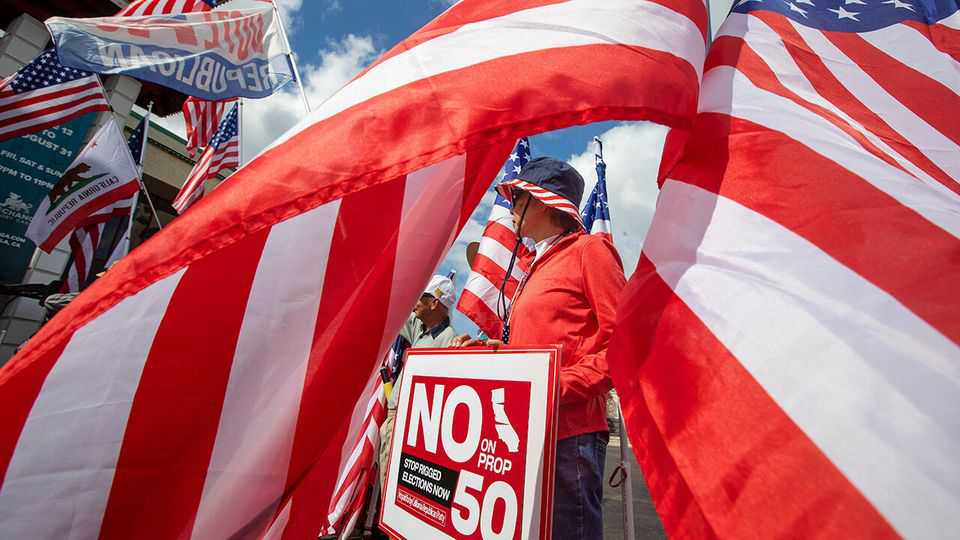

美国 | 加州阴谋
美国的选区划分战争正在升温
民主党在国会重新掌权的希望可能取决于11月4日加州的一次投票
2025年10月23日

摘要：罗德·吉斯不羞于分享他的政治观点。他在加州农业中部大城市贝克斯菲尔德的一个小屋外迎接人们时说，他不相信气候变化，坚持认为该州民主党州长加文·纽瑟姆必须被召回。但一个不同的问题让他今天早上出来：反对第50号提案的集会，这是一项投票措施，将允许加州立法机构实施有利于民主党的新国会地图。

罗德·吉斯不羞于分享他的政治观点。在加州农业中部大城市贝克斯菲尔德的一个小屋外迎接人们时，他说他不相信气候变化，坚持认为该州民主党州长加文·纽瑟姆必须被召回。但一个不同的问题让他今天早上出来：反对第50号提案的集会，这是一项投票措施，将允许加州立法机构实施有利于民主党的新国会地图。"第50号提案将摧毁加州剩余的一切，"他说。在正常情况下，重新划分每十年在人口普查后发生一次，以调整人口变化。但7月，总统特朗普开始向德克萨斯州的共和党人施压，要求他们分割国会地图，为他们的党在众议院提供五个更多席位。此举引发了没有现代先例的全国重新划分战争，最终可能涉及十几个州（见地图）。加州投票措施最初是纽瑟姆的虚张声势，让德克萨斯州共和党人退缩。"也许我们也会在加州这样做，"州长在同月的播客中沉思。

当德克萨斯州在8月通过新地图时，纽瑟姆的厚颜威胁变成了有组织的全州运动。作为美国人口最多的州，加州是民主党在中期选举前能找到足够席位对抗德克萨斯州党派重新划分的唯一地方。但由于金州有独立的重新划分委员会，立法机构需要选民批准他们的计划。如果第50号提案通过，立法者将能够重新划分选区到2030年。选举日是11月4日，但数百万加州人已经在提前投票。

通常总统的党在中期选举中失去席位。特朗普的支持率正在下降，但随着民主党陷入困境，蓝波似乎比2018年党夺回下院时不太可能。在势均力敌的竞争中，重新划分的边际收益可能决定众议院，因此决定特朗普是否必须考虑失去对国会的控制。（共和党在参议院的前景比在众议院好得多；无论如何，重新划分在那些全州投票中无关紧要。）然而，重新划分战争将如何结束远未确定。

民调显示加州选民勉强支持第50号提案。当选举被框定为对抗特朗普干预德克萨斯州的尝试时，他们的支持略有增加。由于民主党在加州的选民登记优势，纽瑟姆不需要改变独立和共和党选民的想法；他只需要确保更多民主党人对特朗普愤怒，而不是想保护加州的独立委员会。州长可能正在成功。到10月22日，约13%的选民已经投票。民主党约占该州登记选民的45%，但到目前为止负责51%的提前返回。

反对派承认落后。"我认为第50号提案很难击败，"反对该措施的共和党州立法者卡尔·德马约说。第50号提案正在成为有史以来最昂贵的投票措施之一。还有两周时间，支出接近1.5亿美元，民主党筹集资金是共和党和良好治理组织的两倍。

重新划分有时产生几乎滑稽的选区形状（见地图）。贝克斯菲尔德的人群听到重新划分的第2区将包括俄勒冈边境沿线的许多共和党人，以及拥抱海岸并舀起湾区民主党人的悬臂时，明显倒吸一口冷气。除了使2026年民主党多赢得五个席位外，新地图将支持脆弱地区民主党现任者的支持。

众议院民主党可能无法在全国重新划分战争中获胜，无论第50号提案发生什么。他们正在与马里兰州和伊利诺伊州的立法者讨论重新划分那里的地图。"我们的希望是每个当选的民主党人都站出来，"众议院民主党党团主席皮特·阿吉拉尔说。2026年前重新划分在俄勒冈州也是可能的，但很难在那里画出另一个民主党席位而不危及现任成员的连任。

简单地说，有更多共和党控制的州愿意并能够重新划分他们的地图。密苏里州共和党人通过分割堪萨斯城为他们的党找到了另一个席位——尽管诉讼和潜在的全民公投可能阻止那里的新地图。本周北卡罗来纳州为总数增加了另一个共和党席位。总统正在寻找对会抵抗他的政客施加杠杆的新方法。印第安纳州共和党州长在当地广播节目中暗示，如果选择不重新划分，他担心他的州会失去联邦资金。

新罕布什尔州共和党州长凯利·阿约特如果反对重新划分，可能面临来自特朗普盟友的初选挑战。如果最高法院及时削弱投票权法案的一部分以影响2026年中期选举，共和党人继续重新划分狂欢，那么民主党领导的众议院更难想象。

重新划分地图以有利于某个党并不保证胜利。共和党人只能对他们德克萨斯州南部的两个新选区感到自信，如果投票给特朗普的拉丁裔人仍然坚定地支持他。然而，特朗普在年轻和拉丁裔选民中的受欢迎程度自上任以来已经下滑。加州民主党人调整了第22区的边界，这是一个包括贝克斯菲尔德的多数拉丁裔地区，希望他们最终能从共和党人手中夺取这个摇摆席位。但它仍然可能是抛硬币。"我认为民主党人正在做出非常糟糕的假设，就像德克萨斯州共和党人正在做出非常糟糕的假设一样，"研究拉丁裔选民的共和党策略师迈克·马德里说。所有这些针锋相对的结果可能是两党都没有获得巨大优势。

全国重新划分浪潮可能还有其他成本。研究表明，在竞争较少的地区选民投票率受到影响。两党都接受了失去权力可能对美国造成灾难性后果的想法。这可能使其他类型的选举干预更可能。边境巡逻人员在纽瑟姆第50号提案运动启动时出现。他声称特朗普政府派他们恐吓加州人集会阻挠总统。

重新划分战争将如何结束？最近的历史提供很少线索。上一次中期重新划分席卷全国是在镀金时代，当时事情只有在共和党人轻松获胜时才冷却下来，哈佛大学的尼古拉斯·斯特凡诺普洛斯说。在现代，法院和全民公投可以是对作弊的检查。阿吉拉尔坚持他的党会乐意解除武装。"我相信独立重新划分是好的，正确的，公平的，"他说。"但如果只有六七个州这样做就不是。"■

【一｜加州重新划分战争】第50号提案将允许加州立法机构实施有利于民主党的新国会地图，引发全州运动。

【二｜全国重新划分战争】特朗普向德克萨斯州共和党人施压分割国会地图，引发没有现代先例的全国重新划分战争。

【三｜民主党希望渺茫】加州是民主党在中期选举前能找到足够席位对抗德克萨斯州党派重新划分的唯一地方。

【四｜民调显示支持】加州选民勉强支持第50号提案，民主党筹集资金是共和党的两倍，支出接近1.5亿美元。

【五｜重新划分风险】重新划分地图以有利于某个党并不保证胜利，可能使其他类型的选举干预更可能。

总的来说，美国的选区划分战争正在升温。第50号提案将允许加州立法机构实施有利于民主党的新国会地图，引发全州运动。特朗普向德克萨斯州共和党人施压分割国会地图，引发全国重新划分战争。民主党在中期选举前重新掌权的希望可能取决于11月4日加州的一次投票，但重新划分战争的结果远未确定。
