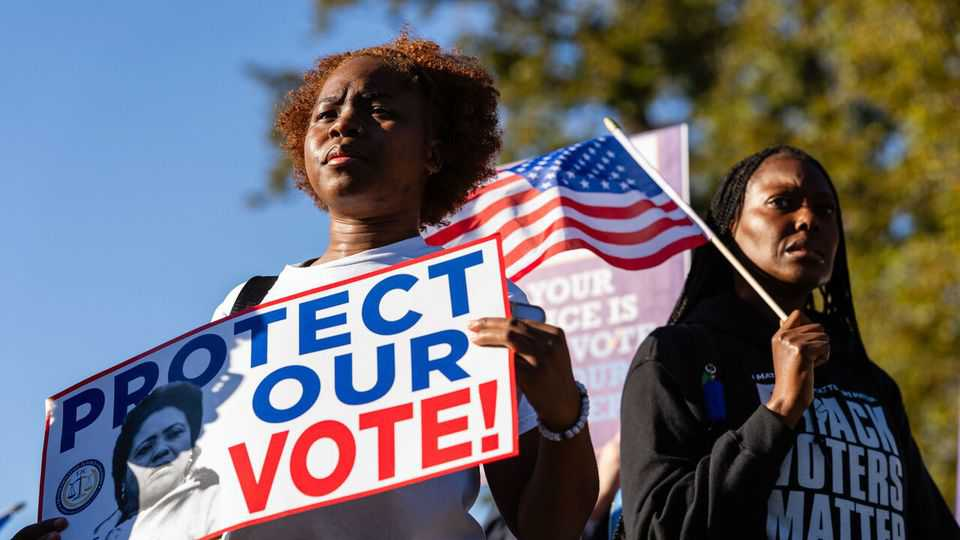

美国 | 重新划分
最高法院案件可能帮助巩固共和党权力
法官们正在权衡是否要掏空投票权法案
2025年10月23日

摘要：1965年颁布的里程碑式民权法《投票权法案》第二条禁止任何"导致拒绝或剥夺"公民因种族而投票权的州选举规则。几十年来，法院一直使用第二条来保护种族少数群体在立法机构绘制选区地图时的投票权。那个时代可能很快结束，如果结束，这一变化可能为共和党提供新的强大可能性，通过党派重新划分来巩固政党权力。

1965年颁布的里程碑式民权法《投票权法案》第二条禁止任何"导致拒绝或剥夺"公民因种族而投票权的州选举规则。几十年来，法院一直使用第二条来保护种族少数群体在立法机构绘制选区地图时的投票权。那个时代可能很快结束，如果结束，这一变化可能为共和党提供新的强大可能性，通过党派重新划分来巩固政党权力。争议的是一个待决的最高法院案件，路易斯安那州诉卡莱斯案，涉及路易斯安那州的国会地图。在10月15日的口头辩论中，首席大法官约翰·罗伯茨和他的五位保守派同僚给出了每一个迹象，表明他们可能在绘制此类地图时禁止将种族作为考虑因素，通常由州立法机构绘制。法院将在明年夏天之前发布决定，但法官们可能决定更早行动。

在实践中，应用第二条约束了共和党的党派重新划分。如果它被掏空，许多共和党控制的州可能会尝试雄心勃勃的重新绘制。一项估计表明，共和党人可能消除众议院中多达19个民主党控制的选区，或该党当前党团的9%。更现实的估计表明，数字在6到12之间，假设共和党人采取激进方法，如他们最近在德克萨斯州、密苏里州和犹他州所做的那样。

这些数字不会保证共和党人在下院获得永久多数。如果民主党人以类似于2018年所谓"蓝波"中期选举的幅度赢得普选（九个百分点），他们几乎肯定会克服这种重新划分。但可能的共和党优势可能是巨大的，大约五到六个百分点——比民主党人当前的民调领先更大。这种扭曲的选举制度将类似于匈牙利和新加坡等非自由民主国家中主导政党采用的制度。美国将在其富裕的民主同行中独树一帜。■

【一｜投票权法案面临威胁】《投票权法案》第二条保护种族少数群体投票权，但最高法院可能禁止将种族作为绘制选区地图的考虑因素。

【二｜共和党重新划分机会】如果第二条被掏空，共和党控制的州可能消除多达19个民主党选区，巩固政党权力。

【三｜民主党仍有机会】如果民主党人以2018年蓝波幅度赢得普选，仍可能克服重新划分。

【四｜选举制度扭曲】共和党优势可能达到五到六个百分点，类似非自由民主国家的选举制度。

总的来说，最高法院案件可能帮助巩固共和党权力。如果《投票权法案》第二条被掏空，共和党控制的州可能消除多达19个民主党选区，巩固政党权力。但民主党人仍有机会克服重新划分，如果以2018年蓝波幅度赢得普选。这种扭曲的选举制度将类似非自由民主国家的制度，美国将在其富裕的民主同行中独树一帜。
