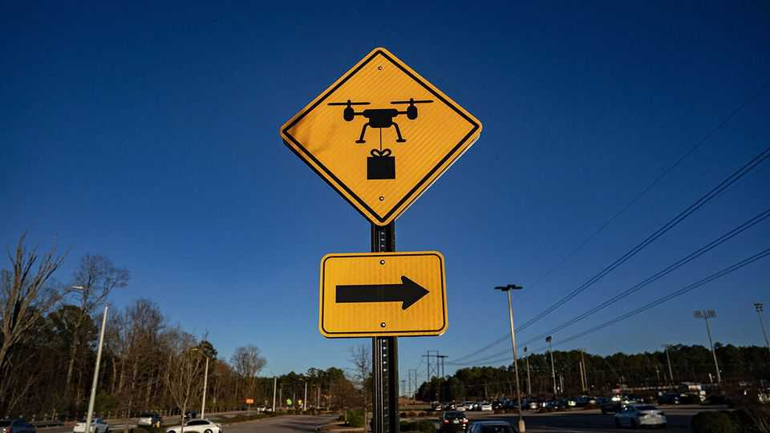

美国 | 嗡嗡前进
特朗普政府如何为无人机制定明智规则
安全与创新需要平衡
2025年10月23日

摘要：很快，美国的商店扒手可能不仅要看身后，还要看头顶。建造无人机的Flock Safety公司开发了系统来追捕从零售店逃跑的小偷或工厂现场的入侵者。通过在场外安全中心按一个按钮，零售商官员可以指示无人机离开码头并跟踪嫌疑人，直到警察到达。对许多美国人来说，这可能听起来像更多的无人机炒作。

很快，美国的商店扒手可能不仅要看身后，还要看头顶。建造无人机的Flock Safety公司开发了系统来追捕从零售店逃跑的小偷或工厂现场的入侵者。Flock航空副总裁拉胡尔·西杜说，通过在场外安全中心按一个按钮，零售商官员可以指示无人机离开码头并跟踪嫌疑人，直到警察到达。对许多美国人来说，这可能听起来像更多的无人机炒作。自亚马逊推出Prime Air以来，已经过去了十多年，激起了无人飞行器将包裹快速送到家中的期望。但该公司直到去年才获得联邦特殊监管豁免，允许其操作超出操作员视线的无人机。尽管这家零售商夸耀它现在向两个城市的客户递送重达5磅（2.3公斤）的包裹，并在其他几个城市扩张，但其无处不在的蓝灰色电动货车和货运自行车在大多数美国城市仍然更加引人注目。

尽管有多年承诺，美国的"低空经济"在很大程度上仍然是理论性的，即使中国在进步。中国的监管机构更加宽松；美国的监管机构必须更多地担心公众反弹和许多在低空空域操作的私人飞机飞行员的需求。联邦航空管理局（FAA）仍在考虑如何放宽对超出操作员视线的无人机飞行的限制，这是最诱人的应用所需要的。

总统特朗普在6月发布行政命令，命令他们加快速度。FAA在8月回应了关于超出操作员视线飞行的新提议规则。迄今为止，像亚马逊这样寻求在其视觉范围外飞行无人机的公司必须从联邦政府获得定制豁免。在新制度下，它们仍需要联邦批准，但政府希望其标准清晰、统一和可行。

无人机飞行将被禁止在户外公共集会上空和大多数情况下400英尺（122米）以上。操作员必须购买能够在没有视觉监督下飞行的无人机，但只要符合规格，每架离开生产线的无人机只需要测试，不需要联邦适航认证。

更多被允许远行的廉价无人机可以带来很多好处。诊所可以派遣患者血液进行快速实验室测试。农民可以进行精准农业，无人机在田地的不同部分喷洒特定数量的杀虫剂和肥料。桥梁、电力线和铁路维护可能变得更容易和安全。

启用这些用途是政府的意图，但从无人机制造商到热气球飞行员的每个人都抱怨其计划。冲突在如何防止低空空域空中碰撞方面特别激烈。在监管机构吸收所有评论后，这些规则的最终形状将决定美国无人机活动的速度和规模。

直升机和其他飞机的飞行员说，无人机应该总是给载人车辆让路，这是现在的做法。行业组织国际垂直航空的贝利·伍德说，一架"携带墨西哥卷饼的无人机"比载人热气球更灵活。然而，当载人飞机没有广播其存在的"显眼"电子设备时——不是所有都必须有——简单的无人机可能不知道它们应该避开它们。

无人机行业代表警告，要求大量安全硬件，如多种类型的飞机避让技术，将使无人机更复杂地建造和操作，降低其有用性。也许低空空域的所有飞机都应该被要求广播位置信号，警告无人机和其他任何东西，如一些行业倡导者建议的那样。

行业组织商业无人机联盟的政策主任利兹·福罗说："只要要求无人机必须给所有显眼飞机让路，所有在500英尺以下操作的飞机都需要显眼。"这样做确实比政府当前的计划更简单，要求载人飞机上的显眼套件似乎是确保无人机业务起飞和天空保持安全的小代价。如果美国监管机构制定正确的规则——他们要到明年初才能完善其提议——美国商业的新时代可能仍会在头顶无人机的微弱嗡嗡声中到来。■

【一｜无人机应用扩大】Flock Safety开发系统追捕小偷和入侵者，亚马逊向两个城市递送包裹，无人机应用正在扩大。

【二｜监管挑战】美国"低空经济"仍是理论性的，FAA仍在考虑如何放宽对超出操作员视线的无人机飞行限制。

【三｜特朗普推动】特朗普发布行政命令加快速度，FAA回应新提议规则，要求标准清晰、统一和可行。

【四｜安全与创新平衡】无人机行业警告要求大量安全硬件会降低有用性，需要平衡安全与创新。

【五｜新商业时代】如果监管机构制定正确规则，美国商业的新时代可能仍会在头顶无人机的微弱嗡嗡声中到来。

总的来说，特朗普政府正在为无人机制定明智规则。无人机应用正在扩大，从追捕小偷到递送包裹，但美国"低空经济"仍是理论性的。特朗普推动加快速度，FAA回应新提议规则，但需要平衡安全与创新。如果监管机构制定正确规则，美国商业的新时代可能仍会在头顶无人机的微弱嗡嗡声中到来。
