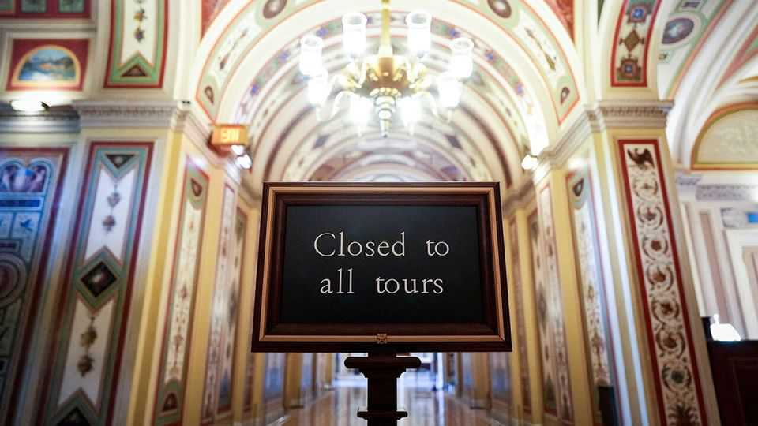

美国 | 尴尬的沉默
美国政府的关闭是其最奇怪的
对民主党和共和党来说都奇怪地可容忍，至少现在如此
2025年10月23日

摘要：美国政府的关闭现在是历史上第二长的。10月22日，它超过了1995-96年的21天关闭，那次关闭将政府资金变成了今天的人质机制。当时，由纽特·金里奇领导的共和党人提出了一个大幅削减社会福利项目的支出法案，这对总统比尔·克林顿来说是令人厌恶的。克林顿拒绝签署。深夜谈判最终达成了妥协。但这次几乎没有这种紧迫性。

美国政府的关闭现在是历史上第二长的。10月22日，它超过了1995-96年的21天关闭，那次关闭将政府资金变成了今天的人质机制。当时，由纽特·金里奇领导的共和党人提出了一个大幅削减社会福利项目的支出法案，这对总统比尔·克林顿来说是令人厌恶的。克林顿拒绝签署。深夜谈判最终达成了妥协。"我们应该结束这个，"共和党参议院领袖鲍勃·多尔恳求道。"它已经到了有点荒谬的地步。"这次几乎没有这种紧迫性。众议院共和党人自9月中旬以来一直没有在国会山开会，远在10月1日关闭开始之前。众议院共和党议长迈克·约翰逊说，他的党通过了一项保持支出在当前水平的权宜法案完成了工作。民主党人现在在参议院拒绝了该法案12次。他们继续要求延长将于年底到期的医疗保健补贴。总的来说，美国人仍然将关闭归咎于共和党人，根据代表《经济学人》的YouGov民调。但公众对双方都越来越不满。

然而，民主党和共和党人看起来都不太可能很快让步。尽管最初对潜在经济损害的担忧，关闭已经证明奇怪地可容忍，至少现在如此。唐纳德·特朗普进行了预算诡计，一些人说非法，以最小化痛苦。例如，战争部重新分配了约80亿美元的资金来支付130万武装部队成员。来自ICE、FBI和国土安全部的一些特工似乎也在收到他们的工资支票。在其他地方，总统承诺使用关税收入为低收入母亲及其子女资助食品援助计划。他还说他将恢复30亿美元的农业援助支付。"特朗普正在尽一切努力使关闭尽可能可管理，"一位共和党国会助手说。

与此同时，政府正在试图伤害民主党人。它冻结或取消了约280亿美元，这些资金主要用于民主党控制的地区。管理和预算办公室（OMB）主任拉塞尔·沃特试图解雇4100名联邦工人，并计划总共削减至少10000个政府工作岗位。但民主党人似乎不为所动。如果有的话，它加强了他们的决心。许多人认为这些威胁是空洞的，特别是因为他们认为OMB无论如何都想进行联邦裁员。"他们在政府关闭之前就在左右解雇人，"资深民主党参议员迪克·德宾指出。

大多数美国人还没有感受到痛苦。该国不到2%的工作在联邦政府。通常的关闭刺激似乎已经软化。例如，人们仍然去该国的国家公园，政府已决定保持开放。

这一切如何结束？经济成本将随着关闭拖得越久而堆积。牛津经济咨询公司估计，关闭持续每周可能从年度GDP中削减0.1到0.2个百分点。更紧迫的是，为数百万人提供食品援助的补充营养援助计划（更常被称为食品券）的资金将在11月1日之前在几个州开始用完。国会助手说，这可能足以让国会山集中注意力。

有一些努力正在进行以达成妥协。共和党参议院领袖约翰·图恩提议就医疗保健补贴进行投票，但只有在民主党人重新开放政府之后。然而，很少有民主党人信任共和党人遵守诺言。特朗普一再撤销国会拨款资金的举动让许多立法者想知道他们为什么要签署一个可能被总统简单忽视或被顺从的共和党多数派撤销的预算。这不仅荒谬；这是华盛顿的新现实。■

【一｜关闭历史第二长】美国政府的关闭现在是历史上第二长的，超过了1995-96年的21天关闭。

【二｜缺乏紧迫性】这次几乎没有1995-96年关闭的紧迫性，众议院共和党人自9月中旬以来一直没有开会。

【三｜特朗普预算诡计】特朗普进行预算诡计最小化痛苦，战争部重新分配80亿美元支付武装部队，使用关税收入资助食品援助。

【四｜政府试图伤害民主党】政府冻结280亿美元民主党地区资金，试图解雇4100名联邦工人，计划削减10000个政府工作岗位。

【五｜经济成本堆积】关闭持续每周可能从GDP中削减0.1到0.2个百分点，食品券资金将在11月1日前开始用完。

总的来说，美国政府的关闭是其最奇怪的。关闭现在是历史上第二长的，但这次几乎没有1995-96年关闭的紧迫性。特朗普进行预算诡计最小化痛苦，政府试图伤害民主党人，但经济成本将随着关闭拖得越久而堆积。食品券资金将在11月1日前开始用完，这可能足以让国会山集中注意力。
