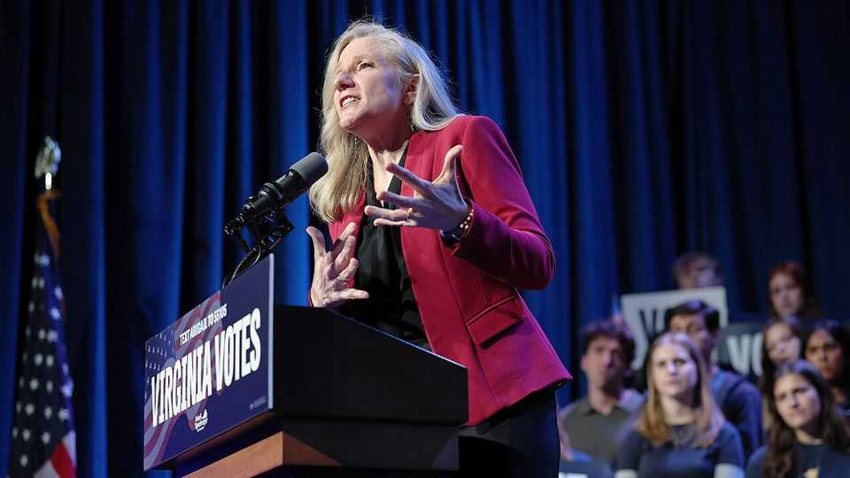
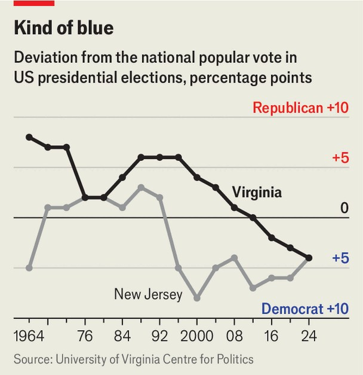

美国 | 书呆子魅力
在弗吉尼亚州长竞选中，民主党人认为无聊是加分项
阿比盖尔·斯潘伯格的竞选活动异常实质性
2025年10月23日

摘要：当科学人比尔·奈在夏洛茨维尔的杰斐逊剧院登台时，人群欢呼。这位科学教育电视节目的主持人在那里为阿比盖尔·斯潘伯格助选，她是11月4日选举中竞选弗吉尼亚州长的民主党人。他解释说，两人首先通过关于科学和太空政策的对话建立了联系。"有些人称她为温和派。我称她为关注的人。"斯潘伯格在竞选活动中拥抱了她内心的书呆子，如果民调准确，这似乎正在起作用。

当科学人比尔·奈在夏洛茨维尔的杰斐逊剧院登台时，人群欢呼。这位科学教育电视节目的主持人在那里为阿比盖尔·斯潘伯格助选，她是11月4日选举中竞选弗吉尼亚州长的民主党人。他解释说，两人首先通过关于科学和太空政策的对话建立了联系。"有些人称她为温和派。我称她为关注的人。"斯潘伯格在竞选活动中拥抱了她内心的书呆子，如果民调准确，这似乎正在起作用。这位前缉毒警察和CIA官员现在在民调平均值中领先该州共和党副州长温索姆·厄尔-西尔斯约九个百分点。她的竞选演讲是关于弗吉尼亚的经济。

竞选活动最近被一个涉及令人厌恶的文本的纠纷打断，这些文本幻想杀死弗吉尼亚州众议院议长，由竞选总检察长的民主党人杰伊·琼斯在2022年发送，他与斯潘伯格一起竞选。斯潘伯格称这些信息"令人厌恶"，但没有要求琼斯退出。她处理此事的方式有时很尴尬，共和党人试图利用政治暴力的共鸣问题来减缓她的势头。

然而，像这样的纠纷要颠覆竞选，民主党人必须有很多事情出错。弗吉尼亚是唯一一个现任州长不能寻求连任的州。在总统选举后一年举行的公开竞选意味着国家情绪更重要。在过去十次竞选中，白宫的党只赢得了一次弗吉尼亚州长职位。

今年选民可能特别热衷于惩罚唐纳德·特朗普的党。该州联邦工人的比例比几乎任何其他州都高，特朗普政府已经解雇了大批人。政府关闭现在拖到了第四周。这伤害了北弗吉尼亚受过良好教育的通勤者和汉普顿路（该州南部海岸的军事中心）的工人阶级国防承包商。

与11月选择州长的另一个州新泽西不同，弗吉尼亚一直在稳步向左移动。自2012年以来，其选民在每次总统投票中都比美国其他地区更加民主党（见图表）。2016年和2024年，弗吉尼亚是唯一拒绝特朗普的南方州，尽管他在11月比2020年表现更好。人口统计学有助于解释民主党人在该州的韧性。"我们是美国白人郊区女性的首都，"雷斯顿的民主党策略师本·特里贝特说，"这是卡玛拉·哈里斯获得支持的少数选民群体之一。"

斯潘伯格是三个学龄女孩的母亲，正在使用她的中间派资历进行大帐篷竞选。2018年，她翻转了共和党长期持有的众议院席位。在国会，她斥责民主党人呼吁"撤资警察"，并说乔·拜登的新政启发雄心走得太远。几个月后，拜登在电话中问候她说："你好，阿比盖尔，我是罗斯福总统。"

自从将目光投向里士满以来，斯潘伯格将自己塑造成"香草，但以深思熟虑的方式"，弗吉尼亚大学政治中心的J.迈尔斯·科尔曼说。她的竞选活动几乎可笑地实质性，每周发布关于医疗保健、住房和关税的立场文件。这可能解释了为什么她的对手试图将她描绘成激进左派似乎失败了。

模仿特朗普对哈里斯女士的最佳嘲讽，厄尔-西尔斯声称"斯潘伯格是为了他们/他们，不是为了我们"。但斯潘伯格最煽动性的镜头显示她说LGBTQ人应该"享有与其他人相同的法律权利"。

厄尔-西尔斯有杰出的传记。作为来自牙买加的移民，她在成为前邦联首都第一个全州当选的黑人女性之前在海军陆战队服役。但她的州长竞选活动"缺乏任何信息"，一位共和党操作员说。她筹集的资金不到斯潘伯格的一半，跳过了与商业团体的典型会议，对当地媒体冷淡。特朗普没有支持她。

与总统的距离可能给厄尔-西尔斯一些自由，在最后阶段匹配斯潘伯格的务实竞选。她认为弗吉尼亚应该多元化其经济以保护自己免受联邦政府的行动。"他们打喷嚏，我们感冒，"她说。但可能来得太晚了。斯潘伯格的胜利将表明，在白宫有像特朗普这样的破坏者时，很多人渴望一个有点无聊的人。■

【一｜书呆子魅力】斯潘伯格拥抱内心的书呆子，科学人比尔·奈为她助选，民调显示她领先共和党对手九个百分点。

【二｜竞选活动实质性】她的竞选活动几乎可笑地实质性，每周发布关于医疗保健、住房和关税的立场文件。

【三｜弗吉尼亚向左移动】弗吉尼亚一直在稳步向左移动，自2012年以来选民更加民主党，是唯一拒绝特朗普的南方州。

【四｜联邦工人影响】该州联邦工人比例高，特朗普政府解雇大批人，政府关闭拖到第四周，伤害选民。

【五｜无聊是加分项】斯潘伯格的胜利将表明，在白宫有破坏者时，很多人渴望一个有点无聊的人。

总的来说，在弗吉尼亚州长竞选中，民主党人认为无聊是加分项。斯潘伯格拥抱内心的书呆子，竞选活动异常实质性，每周发布立场文件。弗吉尼亚一直在向左移动，联邦工人比例高，特朗普政府解雇大批人，政府关闭伤害选民。斯潘伯格的胜利将表明，在白宫有破坏者时，很多人渴望一个有点无聊的人。
