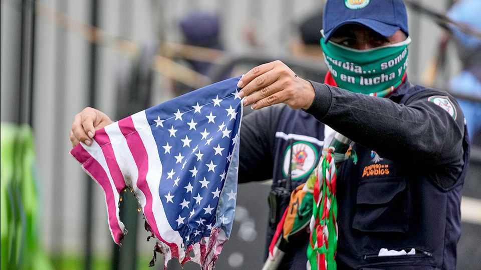

美洲 | 口水战
哥伦比亚终于激怒了唐纳德·特朗普
古斯塔沃·佩特罗声称受到右翼阴谋的攻击
2025年10月23日

摘要："哥伦比亚总统古斯塔沃·佩特罗是非法毒品头目，"唐纳德·特朗普在10月19日的社交媒体上宣布。他承诺结束对哥伦比亚的所有援助并对该国的出口征收关税。特朗普还威胁对哥伦比亚的"杀戮场"采取军事行动，指的是25.3万公顷的古柯叶种植园，其中大部分用于制造可卡因。

"哥伦比亚总统古斯塔沃·佩特罗是非法毒品头目，"唐纳德·特朗普在10月19日的社交媒体上宣布。他承诺结束对哥伦比亚的所有援助并对该国的出口征收关税。特朗普还威胁对哥伦比亚的"杀戮场"采取军事行动，指的是25.3万公顷的古柯叶种植园，其中大部分用于制造可卡因。对佩特罗（他不是"非法毒品头目"）的爆发似乎是由他前一天指责美国9月15日在加勒比海对一艘小船进行军事打击杀死了一名无辜的哥伦比亚渔民引发的。美国自9月以来轰炸了至少九艘小船，作为反毒品走私者运动的一部分，在一系列几乎肯定非法的袭击中杀死了至少37人。10月17日，美国袭击了一艘它声称与ELN有关的船只，ELN是一个哥伦比亚反叛组织，走私大量可卡因，已被美国指定为恐怖组织。10月21日，它在太平洋袭击了一艘船只，在哥伦比亚海岸附近。在此之前，特朗普政府声称其目标是将毒品从委内瑞拉运出，委内瑞拉没有太平洋海岸。

只要它仍然只是口头上的，与特朗普的战斗很可能在国内外帮助佩特罗，将选民从明年总统选举中的右翼亲特朗普候选人中转移。佩特罗经常声称右翼与特朗普合谋推翻他的政府。这在10月21日成为焦点，当时右翼前总统阿尔瓦罗·乌里韦因贿赂和证人篡改的定罪被推翻。佩特罗立即说特朗普"与这些政客和乌里韦结盟"，将寻求对他实施制裁。

特朗普可能发现很难履行他在社交媒体上关于关税和援助削减的承诺。哥伦比亚长期以来一直是美国在该地区最亲密的盟友。没有该国的合作，特朗普的新禁毒战将变得更加困难。■

【一｜特朗普攻击佩特罗】特朗普称哥伦比亚总统佩特罗是"非法毒品头目"，承诺结束援助并征收关税，威胁对"杀戮场"采取军事行动。

【二｜美国军事打击】美国自9月以来轰炸至少九艘小船，杀死了至少37人，袭击几乎肯定非法。

【三｜佩特罗反击】佩特罗指责美国军事打击杀死无辜渔民，声称右翼与特朗普合谋推翻他的政府。

【四｜政治影响】与特朗普的战斗可能帮助佩特罗，将选民从右翼亲特朗普候选人中转移，乌里韦定罪被推翻。

【五｜合作困难】哥伦比亚是美国在该地区最亲密的盟友，没有其合作，特朗普的新禁毒战将变得更加困难。

总的来说，哥伦比亚终于激怒了唐纳德·特朗普。特朗普称佩特罗是"非法毒品头目"，承诺结束援助并征收关税，威胁采取军事行动。美国进行了多次军事打击，杀死了至少37人，袭击几乎肯定非法。佩特罗反击，指责美国杀死无辜渔民，声称右翼与特朗普合谋。但哥伦比亚是美国在该地区最亲密的盟友，没有其合作，特朗普的新禁毒战将变得更加困难。
