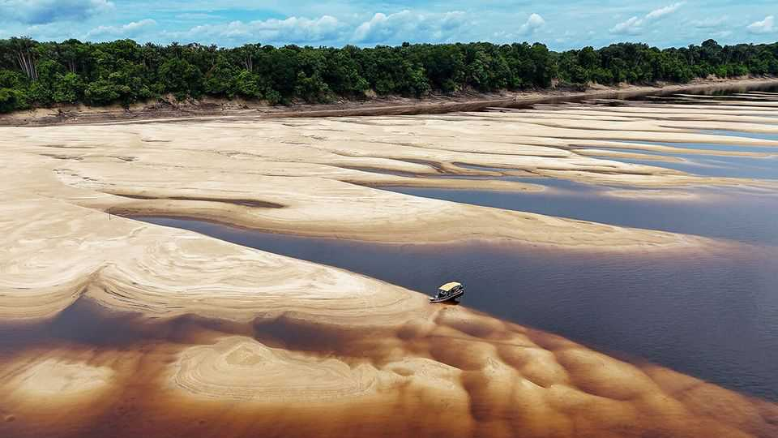

美洲 | 巨大的绿色世界
保护亚马逊的明显经济学
它为巴西的世界级农民提供水，并为其他人锁住碳
2025年10月23日

摘要：参加11月在亚马逊河口贝伦市举行的联合国年度COP气候变化会议的代表们不需要走很远就能看到雨林曾经存在的空白。沿着BR-010高速公路向南进入帕拉州内陆，他们很快就会到达从茂密热带森林中切割出来的广阔开放空间。白色瘤牛蜷缩在少数剩余树木下遮荫，或在灌木丛中觅食。

参加11月在亚马逊河口贝伦市举行的联合国年度COP气候变化会议的代表们不需要走很远就能看到雨林曾经存在的空白。沿着BR-010高速公路向南进入帕拉州内陆，他们很快就会到达从茂密热带森林中切割出来的广阔开放空间。白色瘤牛蜷缩在少数剩余树木下遮荫，或在灌木丛中觅食。

理论上，停止亚马逊的森林砍伐是遏制全球变暖的最便宜方法之一。巴西的"法律亚马逊"地区，包括九个州和整个森林的60%（也延伸到秘鲁、哥伦比亚和其他邻国），在2018年排放的变暖气体相当于该地区2800万人每人33吨二氧化碳。几乎所有排放都来自清理雨林用于农业。它们每人约与卡塔尔一样高，卡塔尔是一个通过生产大量石油和天然气而致富的国家，在此过程中排放二氧化碳。

法律亚马逊的居民从石油国家规模的碳排放中受益很少：该地区的人均GDP为5900美元。卡塔尔的数字约为76000美元。"没有哪个国家排放这么多[每人]并创造如此少的财富，"贝伦智库Imazon的贝托·维里西莫指出。破坏亚马逊不仅在环境上具有破坏性，在经济上也没有回报。

这表明一种交易。法律亚马逊的人们从森林中只获得微薄的生计，但它为世界其他地方提供了无价的服务，储存了大约五年的全球二氧化碳排放量。它也服务于巴西。树木通过根部吸水，用它循环养分，然后让其中一些通过叶子蒸发到大气中。结合盛行的西南风，亚马逊的4000亿棵树创造了富含水分的风，最终撞击安第斯山脉后，转向南方，在巴西的农业中心地带降雨。没有这种水运输机制，巴西和南美洲大部分最好的农田将是干旱的。

如果森林被破坏，任何实现2015年巴黎COP协议目标的机会都将消失，该协议旨在将全球变暖限制在比工业化前平均温度高2°C以下。巴西的农业综合企业，很容易成为该国出口导向经济的主要部分，如果没有其免费的大气渡槽也会枯萎。森林是否会消失，如果是的话什么时候，不能仅仅通过推断当前的森林砍伐率来确定。过去半个世纪，亚马逊约五分之一被破坏，但科学家担心它现在接近临界点，超过这个点，其水运输系统将不再维持它，更不用说巴西的农民了。

将森林视为经济资产——将其碳储存、水调节和生物多样性视为提供的服务，而不是免费礼物——将使保护在经济上合理，并可能使其居民更富有。其服务非常有价值。一项研究表明，亚马逊每年为每平方公里立木森林提供约40000美元的价值，给它约3万亿美元的公平资产价值，比与其同名的零售商多约50%。保持其完整成本要低得多。里约热内卢天主教大学和普林斯顿大学的经济学家朱利亚诺·阿松桑和何塞·亚历山德雷·沙因克曼估计，每吨25美元的碳价格将挤出养牛场主，因为土地所有者可以通过允许重新造林赚更多钱。与富裕国家自己缓解气候变化的努力相比，这是一个便宜货：例如，欧盟的排放交易系统对排放一吨碳的许可证收费80欧元（93美元）。

巴西将在COP上推广这种交易的版本。其政府热衷于启动热带森林永久设施（TFFF）来捐赠雨林。政府、主权财富基金和慈善机构将用提议的250亿美元为基金提供资金；巴西已宣布将提供10亿美元。然后通过在国际市场借款并将收益投资于更高收益的新兴市场和企业债券来杠杆化，创造约1250亿美元的池子。然后基金将向限制森林砍伐到每年0.5%的政府付款，通过卫星图像验证。如果森林覆盖下降更快，他们什么也得不到。付款的五分之一必须给土著人民或"传统社区"。巴西估计，如果一切顺利，这将每年为每平方公里立木森林支付约400美元。

巴西的数字可能是乐观的。富裕国家正在削减援助预算，害怕反绿色民粹主义者。气候峰会有启动新基金的历史，这些基金陷入治理和实施问题；做出承诺但资金不跟随。TFFF的收入最终来自承担投资风险。其投资组合中的债券将出现违约。即使它是一个巨大的成功，TFFF单独也不会覆盖保护亚马逊的成本。该地区需要一个既能保护森林又能为居住在那里的人们带来繁荣的经济模式。

从太空看，森林砍伐看起来像鱼骨架。高速公路是脊柱。在1972年跨亚马逊高速公路开通之前，亚马逊不到1%被砍伐。这条路是军事独裁政权改变这一点的策略的一部分。当时的总统埃米利奥·梅迪西将军参加了道路开通，一棵巴西坚果树被仪式性地砍倒。其树桩旁边的牌匾将道路描述为"征服这个巨大绿色世界的历史发射台"。

独裁政权将亚马逊视为既是不安全的边界又是无生产力的荒地。开放它旨在使巴西更安全、更富有。当时的口号是"没有人的土地给没有土地的人"。鼓励定居者搬入并提供税收减免、补贴和其他激励措施来建立养牛场。已经在森林中的土著人民经常被谋杀或绑架以让他们让路。

从脊柱分支的肋骨通常来自反常的激励。它们是土地掠夺者的工作，被称为grileiros（蟋蟀），以将昆虫放在装有欺诈土地契约的盒子中的做法命名，以老化文件并使对该领土的声称合法化。在被占领的土地上放牛有类似的效果。巴西宪法包括对"生产性财产"的特殊保护。农业只是一个诡计。帕拉州典型的养牛场，森林砍伐的历史边界，每平方公里生产不到100个动物单位，这是牲畜肉类的标准衡量。这在农业上是落后的。巴西最好的农场拥有约400个。

经济学家谈论生产的"广泛"和"密集"边际。从劳动力角度考虑：公司可以雇佣更多工人，从而沿着广泛边际增加生产。或者他们可以尝试从他们已经拥有的工人那里获得更多产出，扩大密集边际。土地也是如此。亚马逊的养牛方法是广泛的。它使用大量土地，但不是很密集。这受到希望占领尽可能多森林的军事独裁政权的鼓励，也受到相信巴西在贸易中的比较优势主要来自其巨大陆地而不是技术或技能的经济学家的鼓励。

然而，自1970年代和研究机构Embrapa成立以来（在同一梅迪西将军领导下），巴西通过应用科学知识来提高其农业综合企业的密集边际，已成为世界领先的农业出口国之一。该机构的技术人员开发了更适合热带气候的大豆、玉米和棉花品种。他们想出了通过在土壤中放入石灰石来耕种塞拉多酸性土地的方法，塞拉多是一个与亚马逊接壤的类似稀树草原的生态系统。大多数巴西经济学家现在得出结论，该国自1970年代以来农业产出的八倍增长总体上是"土地节约"。大部分收益来自减少每单位农业生产使用的土地面积。

通过使用现代农业技术提高亚马逊森林砍伐土地产量的密集养牛将让巴西增加出口，同时仍留下足够的土地让森林重新生长。更密集的模式也需要更多劳动力，帕拉的牧场主和大豆农民弗拉维奥·卡米纳蒂建议。他夸耀他的养牛场使用来自荷兰的最新转基因草更快地养肥更多牛，既更高效又比不太热衷于花哨技术的邻居雇佣更多人。因为农业扩张过去如此无生产力，清理了如此多森林，现在在法律亚马逊中发展和自然之间几乎没有权衡。

在被清理的土地中，约一半现在被归类为"退化牧场"，当养分从土壤中被剥离时留下的荒地。另外28%用于典型的低效养牛，其余留给其他类型的农业。采用在磨损牧场上养牛的最佳技术将让该国出口更多肉类，同时也为重新造林留下土地。例如，Mombak是一家碳信用公司，其客户包括微软和谷歌，它恢复退化牧场中土壤的养分状况。这加速了重新生长并增加了封存的碳量。

然而，提高农业生产力并不一定导致节约土地。虽然技术进步意味着可以用更少的土地生产更多食物，但供需力量有时意味着提高效率只是导致更多消费。如果你可以用更少生产更多，为什么不用更多生产更多？每平方公里更高的产出提供了砍伐更大面积雨林的激励。集约化只有在人们将土地视为立木森林时才会节约土地。

产权及其执行有助于此。"哪里有空白，哪里就有机会，"巴西环境警察Ibama的环境保护主任雅伊尔·施密特说。由于法律亚马逊的规模和偏远，巴西国家无法在整个地区实际存在。施密特将其比作昔日的美国西部。因此，为了执行法律，Ibama不仅依赖执法人员，还依赖卫星图像。它交叉引用土地所有权、林业许可证等信息，以确定一片森林是否被非法砍伐。如果它确定发生了环境犯罪，它会发布"禁运"，意味着该地区不再有资格获得向农民提供廉价贷款的农村信贷计划。更合法的企业，如大豆贸易商，应该检查这些禁运。

Imazon估计，巴西亚马逊28%没有所有权信息。2008年至2012年间，该地区40%的森林砍伐发生在这些未注册地区。它们通常位于州政府而不是联邦政府的管辖下，Ibama负责联邦政府。（其他联邦机构在土著和环境保护区执行法律。）州和市警察有自己的优先事项。禁运地区可以洗钱牛，将它们卖给中间商，中间商在将它们转移到育肥农场之前掩盖所有权。屠宰场努力评估整个牛供应链，这通常深入几个农场。

但虽然不完美，巴西的执行模式确实有效。2004年至2012年间，在巴西现任总统路易斯·伊纳西奥·卢拉·达席尔瓦（被称为卢拉）的前两个任期内，森林砍伐下降了80%。随着政治家放松（或者，在极右翼前总统雅伊尔·博索纳罗的情况下，鼓励森林砍伐），它再次上升，但从未达到1990年代末看到的破坏水平。这部分归功于保护区的扩散和交给土著居民的森林数量增加。

总部位于华盛顿的压力组织世界资源研究所（WRI）计算，巴西土著人民控制的土地面积从1985年的75000平方公里增长到2017年的110万平方公里，或从不到巴西土地的1%增长到近13%。同期保护区从130000平方公里增长到130万平方公里。结合起来，这意味着现在有一个刚果民主共和国大小的区域有明确的所有权，切断了促进土地掠夺的模糊性。

随着更多亚马逊掌握在居住在那里的人们手中，下一步是让他们自由地有利可图地使用他们的土地。在环境经济学的行话中，这是"货币化生态系统服务"，这个术语用来指人类从自然中免费获得的经济利益。对亚马逊来说，这些分为三类：储存数十亿吨碳；调节大量水流；以及作为生物多样性的水库，为数百万种在地球上其他地方不存在的物种提供家园。

让世界其他地方为亚马逊的碳储存服务付费是一项艰巨的工作。虽然TFFF没有明确关于为碳付费，但它是一段时间以来最有希望的努力。相比之下，货币化亚马逊的水文服务将主要涉及巴西境内的付款。通过亚马逊的水流产生水力发电，满足该国约三分之二的需求。根据经济学家拉斐尔·阿劳霍即将发表的论文，这每年为巴西人节省约6.6亿美元的电力成本。它还有助于灌溉巴西的农业中心地带，为农民节省机械灌溉的财富。适当定价这些对巴西其他地方农民的间接利益将为保护森林的地区提供转移支付。成本可以传递给巴西大豆的最终消费者，其中许多在中国。

"我们专注于生物经济，"环境部长玛丽娜·席尔瓦说。这个术语指的是森林生物多样性的可持续收获，结合现代科学和传统知识。来自阿萨伊浆果等产品的利润，一种用于时尚早餐菜肴的棕榈树果实，取决于保护森林。其他树木为传粉者提供养分和家园。

圣保罗的精致餐饮厨师亚历克斯·阿塔拉指出，亚马逊是欧盟的两倍大，拥有更广泛的物种。法国葡萄园之间的变化产生鉴赏家非常重视的风味，其牧场通过奶酪制造商也是如此。他建议，亚马逊可以做同样的事情。在他的餐厅，他提供一种蚂蚁，为味觉带来柠檬草的爆发。雨林给了世界巧克力和乳胶：它还可能包含什么其他乐趣？

Embrapa迄今为止专注于从每单位土地中挤出更多，现在将可持续性与生产力打包。其研究人员推广新型农林复合经营以及保持更多树木并保护和恢复土壤的新养牛模式。其新的林业系统模仿原始雨林，混合阿萨伊、可可、黑胡椒和木材物种，使耐荫作物在更高的树冠下茁壮成长，增加有机物质和更深的根。这些可以种植在退化牧场上，提高产量和生物多样性，并储存比养牛场多得多的碳。但它们有前期成本，这使得它们对在高利率国家工作的小农民来说难以实施。它们可能需要几十年才能扎根。

森林有两种经济，圣保罗大学的爱德华多·阿马拉尔·哈达德说。一种涉及生产阿萨伊等商品。另一种是生产使整个世界受益的服务。生物经济的价值与这些全球服务相比总是很小。虽然COP的代表们将在会议之间咀嚼热带水果或在再生的码头享受阿萨伊黑啤，但世界其他地方主要对亚马逊作为碳排放巨大汇的作用感兴趣。WRI估计，亚马逊的生物经济在2020年价值约20亿美元，相对于森林作为碳汇每年产生的1200亿美元价值来说微不足道。然而，两者可以共存，阿萨伊的利润可能有助于弥合25美元所需碳价格与森林将从TFFF获得的收入之间的差距，后者可能更低。

阿松桑和沙因克曼先生估计，历史上巴西将真实森林的价值等同于每年储存的每吨碳约6美元。这基于该国在2008年之前没有尽可能多地砍伐森林的事实，当时挪威和德国开始通过亚马逊基金支付它不要这样做。巴西人现在对亚马逊的重视可能更高。巴西现任政府表示将在2030年前将森林砍伐降至零。

自由派巴西人担心卢拉和席尔瓦女士正在变老，他们依赖一个由对手主导的国会。巴西明年将选举新总统。没有其他总统和环境部长的组合成功地将森林砍伐减少到他们所达到的程度（席尔瓦女士也是卢拉前两个任期期间的环境部长）。无论世界其他地方是否挺身而出保护亚马逊，只有巴西人有权力保护他们巨大的绿色世界。■

【一｜森林砍伐代价巨大】停止亚马逊森林砍伐是遏制全球变暖的最便宜方法之一，但破坏亚马逊在经济上没有回报。

【二｜水运输机制重要】亚马逊的4000亿棵树创造富含水分的风，为巴西农业中心地带降雨，没有这种机制，大部分农田将干旱。

【三｜经济模式需要改变】该地区需要一个既能保护森林又能为居住在那里的人们带来繁荣的经济模式。

【四｜产权和执行关键】产权及其执行有助于保护森林，巴西的执行模式确实有效，森林砍伐在卢拉任期内下降了80%。

【五｜生物经济潜力】生物经济可以货币化生态系统服务，阿萨伊等产品的利润取决于保护森林。

总的来说，保护亚马逊有明显的经济学。森林砍伐代价巨大，水运输机制对巴西农业至关重要，需要改变经济模式。产权和执行是关键，巴西的执行模式确实有效。生物经济有潜力货币化生态系统服务，但只有巴西人有权力保护他们巨大的绿色世界。
