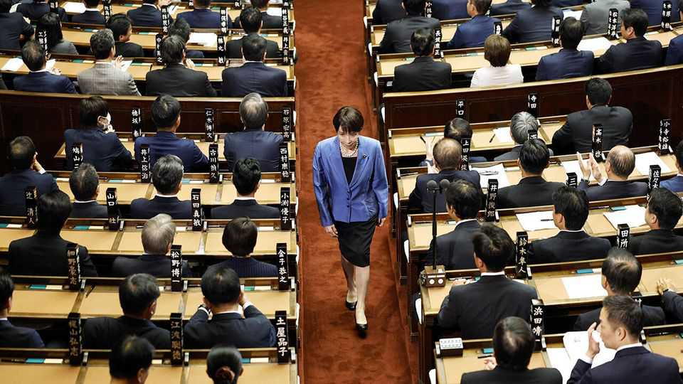

亚洲 | 打破模式
高市早苗成为日本首位女首相
安全政策鹰派，财政政策鸽派，社会政策传统主义者，她将把国家推向右边
2025年10月23日

摘要：保守强硬派高市早苗已成为日本第104任首相，也是首位担任此职的女性。日本国会10月21日投票批准了她的提名，此前她本月早些时候当选为执政的自民党党首。她的确认标志着在世界上最父权的民主国家之一中性别平等的重大进步。然而，高市这位安全鹰派、财政鸽派和极端社会保守主义者，承诺将日本政治推向右边。

保守强硬派高市早苗已成为日本第104任首相，也是首位担任此职的女性。日本国会10月21日投票批准了她的提名，此前她本月早些时候当选为执政的自民党党首。她的确认标志着在世界上最父权的民主国家之一中性别平等的重大进步。然而，高市这位安全鹰派、财政鸽派和极端社会保守主义者，承诺将日本政治推向右边。

作为警察和工薪族的女儿，高市在日本西部的古都奈良长大，在那里她骑摩托车并在重金属乐队中打鼓。她在电视新闻短暂工作后于1993年进入议会；她以既是一个注重细节的政策专家又是一个传统主义文化战士而闻名。凭借她的普通人背景、两极分化的观点和民族主义天赋，她符合全球政治时代精神。但她的保守主义品牌是更老派的。她称英国的铁娘子玛格丽特·撒切尔为榜样，并将自己定位为已故安倍晋三的政治继承人，安倍是另一位日本首相。

自民党希望高市帮助该党重新确立对日本政治的控制。该党在过去一年的选举中失去了两院的大量席位，使其领导少数政府。高市希望赢回被年轻、民粹主义组织吸引的右翼选民。所以她以一篇反对行为不端外国人的长篇大论开始了她的竞选。她反对在风向标社会问题上的改革，比如是否允许已婚夫妇保持不同的姓氏或是否允许皇室女性继承。

然而，通过任命女性首相，日本仍然为性别平等打了一拳。该国的女性在商业和政治中长期代表性不足：在《经济学人》的玻璃天花板指数中，它在29个OECD国家中排名第27位。高市承诺让更多女性进入她的内阁；她的团队将包括首位女性财政部长。她还公开谈论了自己与更年期相关的健康斗争，并承诺扩大女性健康服务的获取。

高市在通往首相职位的道路上早期就跌跌撞撞。自民党的长期盟友公明党在她当选党领袖后离开了执政联盟；有一段时间，反对党有可能达成协议，将她排除在最高职位之外。最终，高市通过与日本维新会（Ishin）形成新的合作伙伴关系来支撑支持，维新会是一个总部设在该国第二大城市大阪的中右翼组织。但自民党和维新会仍将只在议会两院中持有少数席位，这意味着他们需要联盟外立法者的支持来执行他们的议程。

在许多方面，维新会对自民党来说比公明党更自然的合作伙伴。两党共享一个更自豪、更强壮的日本的愿景。相比之下，公明党经常充当自民党更鹰派计划的刹车。新联盟将能够在安全政策上更快行动：它旨在放松对日本武器出口的限制并扩大其情报收集机构；它可能推动将国防支出提高到该国目前计划到2027年达到的GDP的2%以上。

然而，也会有新的紧张。两党都希望帮助与生活成本上升作斗争的家庭，但他们在如何做到这一点上并不完全一致。高市偏爱政府刺激；维新会是一个小政府党，呼吁"深度改革"。作为支持的条件，维新会要求自民党提出削减国会席位数量的计划，并建立一个专注于从公共部门削减脂肪的"政府效率局"。

很快，外交事务也将开始要求高市的注意。作为日本领导人，她将于本月底参加两个大型峰会：在马来西亚举行的东盟领导人会议和在韩国举行的亚太经济合作组织（APEC）国家领导人聚会，这是一个包括美国和中国的区域组织。她对日本战时历史的修正主义观点可能使维持与韩国关系的最新进展和稳定与中国的关系变得困难。

最大的挑战将是与唐纳德·特朗普建立联系。高市可能后悔她的前任与美国总统达成的5500亿美元关税和投资协议，但她知道日本不能承受疏远其唯一安全盟友的代价。她的内阁包括该协议的首席谈判代表，这是日本打算坚持到底的迹象。特朗普预计将在前往APEC会议的路上访问日本。高市在国际舞台上的首秀准备时间很少。■

【一｜首位女首相】保守强硬派高市早苗成为日本第104任首相，也是首位担任此职的女性，标志着性别平等的重大进步。

【二｜政治立场复杂】高市是安全政策鹰派、财政政策鸽派和极端社会保守主义者，承诺将日本政治推向右边。

【三｜自民党困境】自民党在过去一年选举中失去大量席位，领导少数政府，高市希望赢回被民粹主义组织吸引的右翼选民。

【四｜新联盟挑战】维新会取代公明党成为合作伙伴，两党共享更强壮日本的愿景，但仍有新紧张，需要联盟外支持。

【五｜外交挑战】高市将参加东盟和APEC峰会，修正主义观点可能影响与韩国和中国关系，最大挑战是与特朗普建立联系。

总的来说，高市早苗成为日本首位女首相，标志着性别平等的重大进步。她是安全政策鹰派、财政政策鸽派和极端社会保守主义者，承诺将日本政治推向右边。自民党面临少数政府困境，维新会取代公明党成为合作伙伴，但仍有新紧张。高市将面临外交挑战，特别是与特朗普建立联系。
