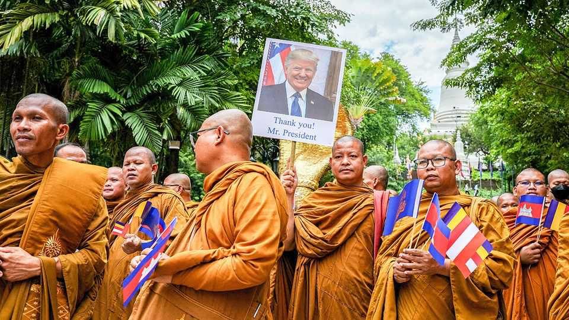
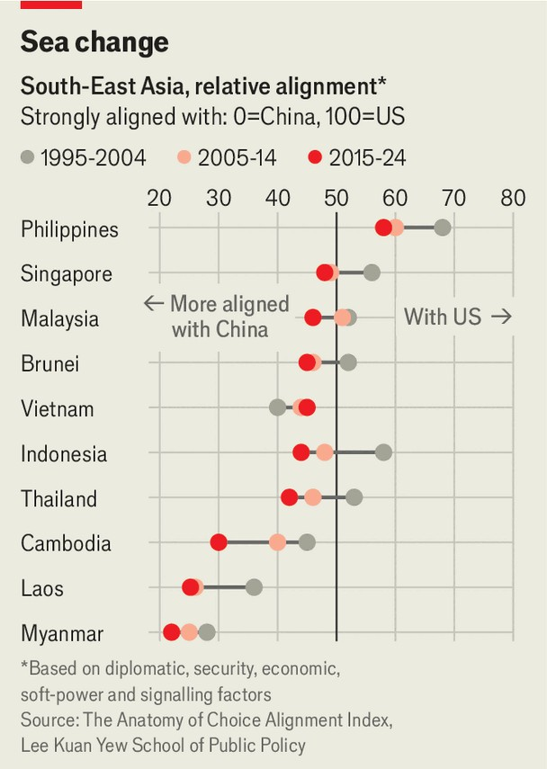

亚洲 | 东南亚的特朗普
如何赢得奖项却失去影响力
美国总统推动在马来西亚举行和平会议
2025年10月23日

摘要：唐纳德·特朗普似乎特别想从他的即将到来的东南亚之行中得到一件事。他是目前预计飞往马来西亚首都吉隆坡的十几位国家领导人之一，参加10月26-28日举行的一系列区域会议。该地区的外交官低声说，特朗普计划加入他们的主要原因不是讨论围绕台湾或南海的紧张局势等重大安全问题。相反，他们说，他想亲自主持柬埔寨和泰国之间和平协议的签署。

唐纳德·特朗普似乎特别想从他的即将到来的东南亚之行中得到一件事。他是目前预计飞往马来西亚首都吉隆坡的十几位国家领导人之一，参加10月26-28日举行的一系列区域会议。该地区的外交官低声说，特朗普计划加入他们的主要原因不是讨论围绕台湾或南海的紧张局势等重大安全问题。相反，他们说，他想亲自主持柬埔寨和泰国之间和平协议的签署。这源于7月的冲突，当时两个邻国在共同边界地区进行了五天的冲突，这些地区存在长期的领土争端。43人在最新一轮战斗中死亡；数十万人流离失所。老敌人看起来可能会继续向对方发射导弹，直到特朗普威胁要提高对两国产品的美国关税。这种非正统的干预确实似乎加速了停火。

然而，争端仍在闷烧，即使强度不完全相同。泰国和柬埔寨都同意从边界阵地撤回军队；他们尚未这样做。泰国拒绝归还冲突期间被俘的18名柬埔寨人；东盟观察员尚未被允许访问争议地区。柬埔寨的暴躁强人洪森，据称在2023年退休，继续在Facebook上对泰国大放厥词。至于泰国的新首相阿努廷·查恩维拉库尔，他在上个月上任时承诺对边界争端采取强硬路线。

特朗普对这一切的了解不清楚。参与谈判的外交官说，他想要的是一个仪式，显示他将两国首相聚集在一起——从而加强他作为伟大和平缔造者的声誉。理论上，他可以尝试利用那个时刻迫使柬埔寨和泰国（美国的盟友）做出痛苦的让步，以确保更持久的和平。那些外交官说，更可能的是，他将满足于双方签署一个协议，该协议在很大程度上重申了他们7月支持的停火条款（这次有闪光灯闪烁）。

考虑到美国总统很少成功地将东南亚之行挤进他们的日程，这有可能成为特朗普马来西亚之行的主要焦点似乎不是最优的。将参加东亚峰会的美国盟友——在吉隆坡举行的大型会议之一——计划呼吁中国在台湾的剑拔弩张和其在南海的激进行动。

然而，特朗普的日程表明他将在该活动甚至开始之前就离开马来西亚。日本新首相高市早苗也将提前离开；她预计将回家以欢迎特朗普到日本，他接下来要去那里。这很可能允许中国（由总理李强代表参加活动）在峰会的最后一天成为主导声音。它计划签署与东盟自由贸易协议的升级，这将缓解数字服务和气候技术的销售。

特朗普几乎不是第一个对东南亚峰会给予短暂关注的美国领导人。乔·拜登跳过了他任期内举行的除一次之外的所有区域会议；特朗普本人在他的第一个任期内只参加了一次。两人的助手都认为，尽管如此，他们改善了与几个关键东南亚国家的关系。但新加坡李光耀公共政策学院最近发表的一项研究为那些认为美国在该地区失去影响力的人提供了经验支持。它发现，十个东南亚国家中有九个近年来变得更加"与中国一致"（见图表）。

中国的影响力主要源于其与该地区的经济联系，但"它通过一致的外交支持这一点"，悉尼智库洛伊研究所的一份报告说。相比之下，美国"是一个更边缘的存在"，特别是对于最接近中国边界的东南亚国家。特朗普对该地区最近冲突的堂吉诃德式干预将无助于改变这一点。确实，对该邻里的短暂和分心的访问可能会加速美国在该地区的衰落。■

【一｜特朗普推动和平会议】特朗普想亲自主持柬埔寨和泰国之间和平协议的签署，源于7月冲突，他威胁提高关税加速了停火。

【二｜争端仍在闷烧】泰国和柬埔寨都同意撤回军队但尚未这样做，泰国拒绝归还被俘柬埔寨人，东盟观察员未被允许访问争议地区。

【三｜特朗普想要仪式】特朗普想要一个显示他将两国首相聚集在一起的仪式，加强他作为伟大和平缔造者的声誉。

【四｜美国影响力下降】特朗普将提前离开马来西亚，中国可能成为峰会最后一天的主导声音，美国在该地区失去影响力。

【五｜东南亚更倾向中国】十个东南亚国家中有九个近年来变得更加"与中国一致"，特朗普的干预无助于改变这一点。

总的来说，特朗普如何赢得奖项却失去影响力。他想亲自主持柬埔寨和泰国之间和平协议的签署，源于7月冲突，他威胁提高关税加速了停火。但争端仍在闷烧，特朗普想要的是仪式而不是实质。他将提前离开马来西亚，中国可能成为峰会主导声音，美国在该地区失去影响力，东南亚更倾向中国。
