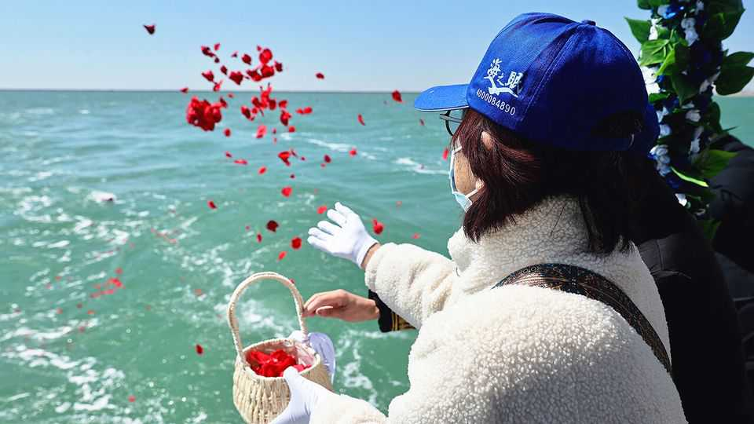

中国 | 昂贵的告别
中国有一个严重的问题
忘记巨大的坟墓——为什么不把你爱人的骨灰撒在海里？
2025年10月23日

摘要：那些希望向已故的中国前总统江泽民致敬的人不会找到墓碑。据官方媒体报道，作为共产党的领导人，他是一个"彻底的唯物主义者"（读作：不感伤）。所以在他2022年去世后，他被火化，骨灰撒在上海附近的海里。这座城市现在希望更多的人效仿江的例子。本月它表示将给同意给已故亲属"海葬"的居民3000元（420美元）。直到最近，这样的事情还是禁忌。

那些希望向已故的中国前总统江泽民致敬的人不会找到墓碑。据官方媒体报道，作为共产党的领导人，他是一个"彻底的唯物主义者"（读作：不感伤）。所以在他2022年去世后，他被火化，骨灰撒在上海附近的海里。这座城市现在希望更多的人效仿江的例子。本月它表示将给同意给已故亲属"海葬"的居民3000元（420美元）。直到最近，这样的事情还是禁忌。中国家庭经常在纪念已故亲属的坟墓上花费巨大。每年他们回来清理坟墓并烧祭品。在中国农村，一些农民仍然提前准备自己的棺材和墓地。在中文中，"死无葬身之地"这个短语被用作诅咒（通常是小说中恶棍的命运）。但态度的改变正在进行中。

党长期以来将精心制作的坟墓视为落后的传统，更糟糕的是，浪费了好土地——这在城市中供应短缺。在农村地区，它本来可以用来种植作物。党禁止在授权墓地外的坟墓。在建成区，它（理论上）使火葬成为强制性的。官员们认为骨灰最好在自然中处理，或有效地包装到骨灰堂的壁龛中。政府对殡葬行业的法规一直反对"迷信、庸俗和奢侈"。但事实证明，对死亡的态度相当难以改变。中国的火葬率在2000年代上升到约50%，然后趋于平稳。即使在火葬率很高的地方，许多家庭仍然认为储存装有亲属骨灰的骨灰盒的最佳地方是在一个大的、华丽的墓碑下。

最近，党似乎取得了更多成功。中国的火葬率在2017年开始再次上升。它在2021年达到59%，这是有官方数据的最后一年。中国人似乎也在坟墓上的花费显著减少。高端殡葬公司福寿园在2025年上半年收入同比下降44%，主要是因为其坟墓每块售价低得多。这是自12年前上市以来首次出现亏损。中国其他上市的殡葬公司在此期间也看到销售下滑。

什么在伤害需求？中国正在快速老龄化，所以不缺死亡。但其经济在房地产危机中步履蹒跚，该危机削减了许多人资产的价值。这可能在改变优先事项。在北京为一个花哨的坟墓花费可能高达20万元（28000美元），仅前20年。之后需要进一步付款来保持这个地方。越来越多的家庭选择将亲属的骨灰埋在较小的坟墓下，在骨灰堂中，甚至在一个刻有数十人名字的集体墓碑下。

对于那些愿意完全没有任何标记的人，中国许多地方现在为官员所称的"生态"埋葬提供现金激励。这包括在树下或竹林中撒骨灰等做法，以及上海正在推广的海葬。去年全国此类埋葬总数为194700。这仍然只占总数的3.2%，但比2019年多67%。

位于北京西南的太子峪公墓的一名工人说，省钱不是中国人越来越愿意没有坟墓的唯一原因。她说，中国的许多老年人想为他们的孩子免除访问他们坟墓的义务。她的公墓曾经有计划扩展到附近的农村。她说，现在这可能不会发生。毕竟，当埋葬是"生态的"时，同样的土地（或海洋）区域可以一次又一次地使用。

不是每个人都似乎完全适应新的做事方式。公墓墙外有一个标志，坚持所有备用土地必须用于农业；它呼吁报告所有违反此规则的人。几米外，半隐藏在灌木丛后面并由石狮守卫，有人竖起了一个大的白色墓碑。■

【一｜江泽民海葬】已故中国前总统江泽民被火化，骨灰撒在上海附近的海里，上海希望更多人效仿，给海葬居民3000元。

【二｜传统观念改变】中国家庭经常在坟墓上花费巨大，每年回来清理坟墓并烧祭品，但态度的改变正在进行中。

【三｜党推动火葬】党将精心制作的坟墓视为落后传统，浪费好土地，禁止授权墓地外的坟墓，使火葬成为强制性。

【四｜火葬率上升】中国火葬率在2017年开始再次上升，2021年达到59%，中国人坟墓花费显著减少，福寿园收入下降44%。

【五｜生态埋葬兴起】中国许多地方为"生态"埋葬提供现金激励，包括海葬，去年全国此类埋葬总数为194700，比2019年多67%。

总的来说，中国有一个严重的问题。已故前总统江泽民海葬，上海希望更多人效仿，给海葬居民3000元。传统观念正在改变，党推动火葬，火葬率上升，中国人坟墓花费减少。生态埋葬兴起，包括海葬，但传统观念仍然根深蒂固，不是每个人都完全适应新的做事方式。
