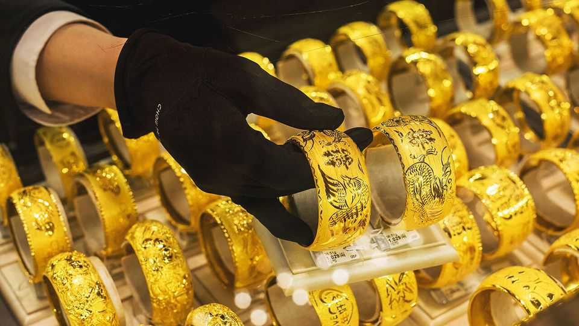

中国 | 堆积不确定性
为什么香港要追求黄金
它想成为贵金属的交易中心
2025年10月23日

摘要：一个重要的金库隐藏在香港繁忙的机场内。里面坐着近150吨闪闪发光的黄金，按当前价格价值超过200亿美元。未来三年的计划是将这个仓库扩大到持有近七倍的量。这将是竞争对手新加坡樟宜机场附近储备的两倍。黄金价格在过去一年上涨了60%，本月超过了每盎司4380美元。价格随后在10月21日下跌了5.3%——五年来最陡峭的单日跌幅——因为希望全球贸易紧张局势可能缓解。然而，尽管存在不确定性，香港政府希望进入一个新的黄金时代。

一个重要的金库隐藏在香港繁忙的机场内。里面坐着近150吨闪闪发光的黄金，按当前价格价值超过200亿美元。未来三年的计划是将这个仓库扩大到持有近七倍的量。这将是竞争对手新加坡樟宜机场附近储备的两倍。黄金价格在过去一年上涨了60%，本月超过了每盎司4380美元。价格随后在10月21日下跌了5.3%——五年来最陡峭的单日跌幅——因为希望全球贸易紧张局势可能缓解。然而，尽管存在不确定性，香港政府希望进入一个新的黄金时代。

几十年来，金条市场主要通过伦敦和纽约运行。虽然这些城市分别主导全球价格设定和期货交易，但香港希望将自己定位为通往中国的可信门户，中国是世界上最大的黄金生产国和消费国。6月，上海黄金交易所在香港开设了第一个离岸金库，并推出了两个为全球投资者量身定制的新人民币计价黄金合约。

据金融服务和财政司司长许正宇说，官员们希望该市成为全球黄金中心的努力将增强其作为金融中心的地位。上个月，该市领导人李家超说，存储容量将在三年内从200吨扩大到2000吨，并将创建一个黄金交易中央清算系统。政府还希望更多相关的投资产品，如代币化资产。它希望为黄金交易商组建一个联盟。

这些计划正在引起关注。黄金交易商和精炼商MKS Pamp决定今年在香港开设区域总部。"政府的倡议真的很有吸引力，"该公司老板詹姆斯·埃米特说。远离美元多元化的央行和其他大型投资者也可能推动对非西方黄金交易中心的需求。然而，深入挖掘，很明显不是所有的都闪闪发光。在香港雇佣黄金爱好者很困难。该市与新加坡相比仓储设施较差。一些交易商也可能担心北京在该市的影响力。

问题不是香港能否超越其他全球中心，而是它能否提供互补的东西，埃米特说。香港的时区在这方面有帮助。许多人将熟悉其英式普通法制度。其作为自由港的地位，对贵金属流动没有外汇管制，也很有吸引力。即便如此，该市仍然需要证明其价值。■

【一｜香港金库扩张】香港机场内金库有近150吨黄金，价值超过200亿美元，计划三年内扩大到近七倍的量，成为竞争对手新加坡的两倍。

【二｜黄金价格波动】黄金价格过去一年上涨60%，本月超过每盎司4380美元，随后下跌5.3%，希望全球贸易紧张局势可能缓解。

【三｜香港定位】香港希望成为通往中国的可信门户，上海黄金交易所在香港开设第一个离岸金库，推出两个新人民币计价黄金合约。

【四｜政府计划】李家超说存储容量三年内从200吨扩大到2000吨，创建黄金交易中央清算系统，希望更多代币化资产和黄金交易商联盟。

【五｜挑战与机遇】MKS Pamp决定在香港开设区域总部，但雇佣黄金爱好者困难，仓储设施较差，一些交易商担心北京影响力。

总的来说，香港要追求黄金。机场内金库有近150吨黄金，计划三年内扩大到近七倍的量，成为竞争对手新加坡的两倍。黄金价格波动，香港希望成为通往中国的可信门户，政府有扩张计划，但面临挑战与机遇。
