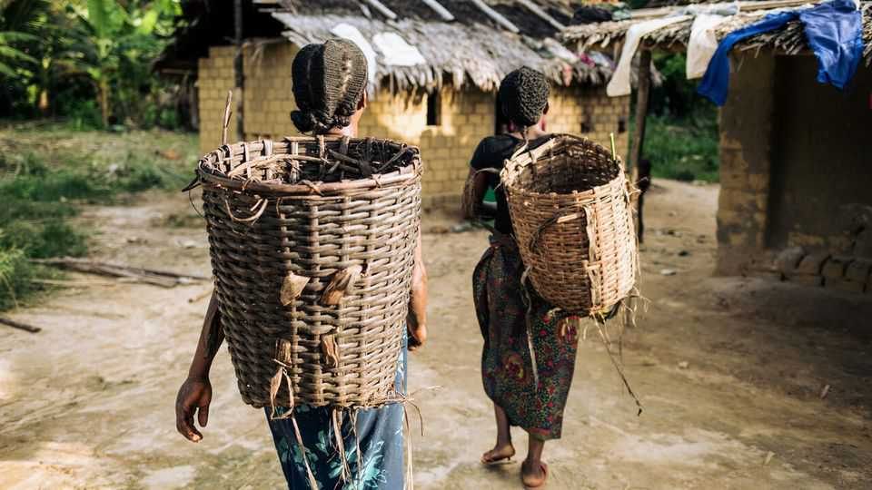

中东与非洲 | 拯救一棵树，赚一笔钱
如何为每个人保护非洲的自然财富
环保主义者希望让世界为照顾其雨林和野生动物付费
2025年10月23日

摘要：要了解雨林未来的希望，去刚果民主共和国的英甘达。距离最近城镇九小时车程，这个位于刚果盆地深处的村庄是班图人和俾格米人的家园，他们住在尘土飞扬的小径旁的粘土小屋中。高耸的树木遮住了阳光。但短暂进入森林后，天空打开，闪闪发光的木薯田出现在空地上。最大的树木被保留，这对返回该地区的蛇和黑猩猩来说是福音。一位向导说，动物数量正在增加，因为村民不再为肉而猎杀它们。

要了解雨林未来的希望，去刚果民主共和国的英甘达。距离最近城镇九小时车程，这个位于刚果盆地深处的村庄是班图人和俾格米人的家园，他们住在尘土飞扬的小径旁的粘土小屋中。高耸的树木遮住了阳光。但短暂进入森林后，天空打开，闪闪发光的木薯田出现在空地上。最大的树木被保留，这对返回该地区的蛇和黑猩猩来说是福音。一位向导说，动物数量正在增加，因为村民不再为肉而猎杀它们。

这种田园诗般的景象得到了挪威支持的社区森林基金（CFF）的帮助，该基金向村民发放现金，以换取保护其部分土地免受开发的承诺。这个想法是，付款将减少对该地区常见的刀耕火种农业的依赖，并帮助保护森林免受伐木公司的侵占。类似的努力正在整个非洲进行，试图阻止该大陆的雨林走上亚马逊的道路，亚马逊自1970年代以来失去了约20%的树木覆盖。他们的倡导者希望这样的计划将保护非洲生物多样性，并帮助世界在不损害经济发展的情况下缓解气候变化。

他们能做到吗？非洲自然在11月巴西联合国气候峰会COP30之前成为焦点。该大陆拥有地球超过四分之一的完整生态系统和具有特殊生态意义的"标志性"物种。刚果盆地是地球上最大的碳汇，仅次于世界海洋（见地图）。为了阻止全球变暖，联合国成员国已承诺到2030年保护地球30%的陆地和海洋，并在本十年末停止并逆转森林砍伐。这些目标几乎没有取得进展。要接近实现这些目标，保护非洲巨大的自然财富至关重要。

过去的保护模式并不总是做得很好。国家公园，其中许多在殖民时代被围起来，为政府金库带来了携带美元的游客。但它们对当地人的好处远不那么明显。今年早些时候，代表非洲各国政府管理公园的慈善机构非洲公园承认，其护林员对刚果-布拉柴维尔的巴卡部落成员进行了虐待。即使国家公园管理良好，它们的存在也无助于保护半保护区，如保护区，野生动物、牲畜及其主人生活在一起，包含非洲最丰富的动植物群的大部分。

CFF是替代方法的一个例子。越来越多的研究表明，在正确的激励下，土著人口往往是最好的土地监护人。但这需要使保护非洲自然对他们和各国政府都具有财务可行性。在英甘达，现金注入、开发特许权和协助土著群体确保其土地法律保有权相结合，应该激励居民将农业和其他业务限制在政府批准的区域，同时保持大部分森林完整。类似的努力正在整个大陆进行。

调整激励至关重要。目前，英甘达的人们欢迎来自CFF的钱。但如果使用或出售应该被禁止的森林部分比基金现金更有利可图，几乎没有什么能阻止他们放弃它。在附近一个不属于该计划的村庄，居民已将土地出售给一家中国伐木公司，该公司修建了宽阔的道路将树木运送到首都金沙萨。即使人们不想出售，执行产权也很困难。刚果国家软弱腐败，被指控参与非法伐木。

在整个大陆，肯尼亚首都内罗毕附近的基滕格拉-基佩托草原地区面临相关问题。当地领导人尼克森·奥勒·帕米萨说，一个长期运行的由捐助者资助的付款计划，当地人因保护其土地免受开发而获得，是"完全不够的"。他说，价格"不等于土地的价值"。在土地所有者出售的地方，基滕格拉的野生开放牧场被采石场和农田条带打断。

为了解决这个问题，肯尼亚初创公司EarthAcre开发了一个付款平台，允许参与者获得多种收入流。这些将包括新的生物多样性信用，或"自然资产"。它们被设计为有一天出售给投资者和公司，希望通过向非洲土地所有者付款以保护其地块免受退化来抵消其对环境的影响。另一层融资预计来自碳信用，肯尼亚总统威廉·鲁托将其描述为其国家的"下一个重要出口"。该集团联合创始人帕蒂塔·恩卡穆努解释说，关键是最大化土地所有者从保护其地块中获得的收入，从而阻止他们出售它。

67岁的马赛寡妇菲利斯·恩卡帕帕说，她的第一笔生物多样性付款18000肯尼亚先令（140美元）帮助支付了她孙子的学费。作为交换，她鼓励她的家人种植树木，维护草岸（以封存碳）并保持其土地无围栏，以便狮子和其他野生动物可以漫游。她还承诺不制作或燃烧木炭。为了确保这样的承诺得到遵守，底层生态系统保持健康和完整，EarthAcre使用各种技术，可以测量生物多样性到"每片叶子，每片草"，另一位联合创始人维拉吉·西坎德声称。这，它希望，将有助于

为保护自然定价，并说服热衷于提升其绿色信誉的投资者将资金投入这一努力。

要在大规模上工作，这样的计划最终必须吸引数十亿美元的资金。这看起来还很遥远。全球生物多样性信用市场在2024年估计价值不到1000万美元。联合国保护生物多样性和停止森林砍伐目标的资金承诺比估计的年度需求少约7000亿美元。就其而言，碳市场近年来受到了声誉打击。对信用计划的碳节约潜力，特别是与森林相关的计划，存在持续怀疑。"绿色洗白"的指控比比皆是。即使没有积极敌视气候缓解政策的富裕国家也在削减融资。这对新市场的创建来说不是一个好兆头。

这些问题能克服吗？李·怀特曾经这样认为。作为加蓬的环境部长直到2023年，他在倡导拥有大型雨林的国家通过保持其树木站立可以赚取数十亿美元的想法方面做得比大多数人都多。加蓬，由于可持续伐木实践，野生大象数量自1990年代以来反弹了约60%，是一个光辉的例子。推翻怀特政府的军政府基本上保持了其环境政策。然而，随着富裕国家在其绿色承诺上摇摆，自然资本市场努力起飞，他比过去更加悲观。"我们在加蓬试图做的是在不失去森林的情况下发展，"他说。整个非洲的环保主义者仍然决心证明这是可能的。■

【一｜英甘达的希望】刚果民主共和国英甘达村庄，班图人和俾格米人住在粘土小屋中，最大的树木被保留，动物数量正在增加，村民不再为肉而猎杀它们。

【二｜社区森林基金】挪威支持的CFF向村民发放现金，以换取保护其部分土地免受开发的承诺，减少刀耕火种农业，保护森林免受伐木公司侵占。

【三｜非洲自然财富】非洲拥有地球超过四分之一的完整生态系统，刚果盆地是地球上最大的碳汇，保护非洲巨大的自然财富对实现联合国目标至关重要。

【四｜过去保护模式问题】国家公园为政府带来游客美元，但对当地人好处不明显，非洲公园护林员对巴卡部落成员进行虐待，半保护区保护不足。

【五｜新方法挑战】EarthAcre开发付款平台，允许多种收入流，包括生物多样性信用和碳信用，但全球市场价值不到1000万美元，资金承诺比需求少7000亿美元。

总的来说，如何为每个人保护非洲的自然财富。英甘达村庄显示了希望，CFF向村民发放现金保护土地，非洲拥有巨大自然财富，但过去保护模式有问题，新方法面临挑战，需要数十亿美元资金，但市场价值很小，资金承诺不足。
