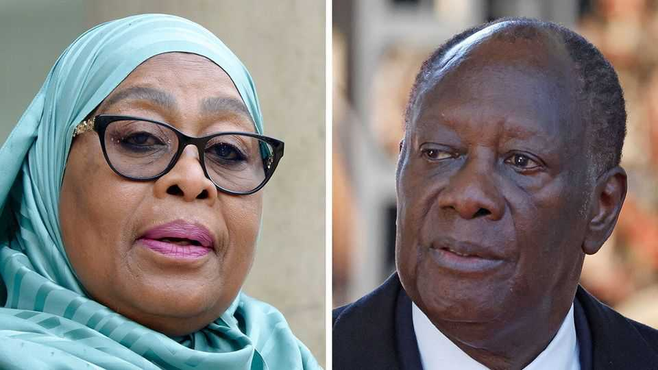

中东与非洲 | 可预测的结果
两次有缺陷的选举显示了一党统治的危险
坦桑尼亚和科特迪瓦的统治者可能高估了他们国家的稳定性
2025年10月23日

摘要：他们是各自邻里的新兴明星。在西非，科特迪瓦正在经历经济复兴。在东部，坦桑尼亚在过去二十年中实现了平均6%的年度GDP增长。两者都有相对较低的通货膨胀，与一些邻国相比，可管理的公共债务。随着两国选民本月前往投票，他们的统治者可以吹嘘一个优势：稳定性。对科特迪瓦总统阿拉萨内·瓦塔拉和坦桑尼亚总统萨米娅·苏卢胡·哈桑来说，稳定性是增长的灵丹妙药。

他们是各自邻里的新兴明星。在西非，科特迪瓦正在经历经济复兴。在东部，坦桑尼亚在过去二十年中实现了平均6%的年度GDP增长。两者都有相对较低的通货膨胀，与一些邻国相比，可管理的公共债务。随着两国选民本月前往投票，他们的统治者可以吹嘘一个优势：稳定性。对科特迪瓦总统阿拉萨内·瓦塔拉和坦桑尼亚总统萨米娅·苏卢胡·哈桑来说，稳定性是增长的灵丹妙药。这就是为什么83岁的瓦塔拉声称需要"经验"来应对其国家面临的经济和安全挑战，正在10月25日竞选违宪的第四个任期。坦桑尼亚的执政党CCM自1961年独立以来一直掌权，提出了类似的论点。萨米娅在2021年前任去世后上任，在10月29日准备首次面对选民时不留任何机会。虽然两次选举的结果都没有疑问，但消除竞争的努力可能证明是自我挫败的。

即将到来的投票有几个相似之处。坦桑尼亚和科特迪瓦都有总统制，巨大的权力集中在行政部门。这增加了政治风险，从而增加了暴力的可能性。但两国的执政党对关键机构如司法和选举委员会施加影响——或者，在CCM的情况下，完全控制。两位现任者都在与不知名的候选人竞选连任。

这种法律战在坦桑尼亚最为肆无忌惮，选举委员会（其成员由总统挑选）干脆禁止主要反对党Chadema参加。该党领袖通杜·利苏因叛国罪受审；判决方便地安排在选举后两周。"整个事情都是捏造的，"利苏的兄弟文森特·穆格瓦伊说。坦桑尼亚第二大反对党ACT-Wazalendo的领袖也因程序原因被取消资格。

类似的策略在科特迪瓦也很明显。多达55名总统候选人被禁止参加选举。这包括两个本会构成最严重挑战的人：前瑞士信贷老板蒂贾内·蒂亚姆和前总统洛朗·巴博，后者在2010年选举中拒绝向瓦塔拉让步，引发了一场短暂的内战。蒂亚姆的排除表面上是由于瓦塔拉控制之外的法律技术问题（法院认为蒂亚姆不符合资格，理由是他宣布候选资格时不是科特迪瓦公民）。然而，在科特迪瓦，这样的机构结果"往往有利于执政党"，咨询公司Control Risks的贝弗利·奥奇恩指出。

瓦塔拉很受欢迎，特别是在该国的北部和中部，他因在2000年代和2010年代初的内战后强劲的经济复苏而受到赞誉。即便如此，他的政府正在诉诸镇压。10月17日，它宣布禁止政治集会两个月。据检察官说，本月一周内约有700人被捕，他声称嫌疑人一直在计划对国家机构进行"恐怖主义行为"。据说已部署了约44000名警察和士兵以防止动乱。

但这与坦桑尼亚显示的州暴力相比算不了什么。流亡记者埃里克·卡本德拉说，也许因为它担心类似最近震撼马达加斯加和邻国肯尼亚的"Z世代"起义，政府释放了自1990年代多党政治回归以来该国从未见过的镇压。数十名年轻人和反对派人物在最近几个月消失了。10月6日，一位最近公开反对政权的前CCM大人物从家中被绑架。Chadema的副主席在10月22日到达法院参加其老板的审判时被捕。

坦桑尼亚备受赞誉的稳定性可能不会持续。尽管增长强劲，CCM对其数十年的无争议统治几乎没有展示。贫困仍然顽固地高，不平等正在上升。本月早些时候，商业首都达累斯萨拉姆爆发了骚乱。持不同政见者呼吁在选举日进行大规模抗议。坦桑尼亚远非该大陆的榜样，可能证明是一个警告。■

【一｜新兴明星】科特迪瓦正在经历经济复兴，坦桑尼亚在过去二十年中实现了平均6%的年度GDP增长，两者都有相对较低的通货膨胀和可管理的公共债务。

【二｜稳定性优势】瓦塔拉和萨米娅都吹嘘稳定性是增长的灵丹妙药，瓦塔拉竞选违宪的第四个任期，CCM自1961年独立以来一直掌权。

【三｜选举相似性】两国都有总统制，权力集中在行政部门，执政党对关键机构施加影响或完全控制，现任者与不知名候选人竞选连任。

【四｜法律战策略】坦桑尼亚选举委员会禁止主要反对党Chadema参加，利苏因叛国罪受审，科特迪瓦55名总统候选人被禁止，包括蒂亚姆和巴博。

【五｜镇压与暴力】瓦塔拉政府禁止政治集会两个月，700人被捕，坦桑尼亚政府释放镇压，数十名年轻人和反对派人物消失，前CCM大人物被绑架。

总的来说，两次有缺陷的选举显示了一党统治的危险。科特迪瓦和坦桑尼亚都是新兴明星，但统治者可能高估了稳定性。选举有相似性，执政党对关键机构施加影响，使用法律战策略和镇压手段，但稳定性可能不会持续，坦桑尼亚可能证明是一个警告。
