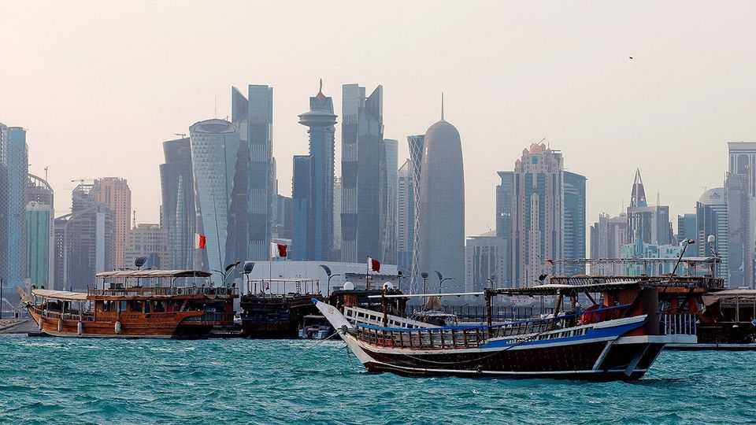

中东与非洲 | 重新定义多哈
卡塔尔是十字路口的十字路口
加沙之后，它需要保护自己免受攻击并重振过度建设的经济
2025年10月23日

摘要：卡塔尔可能感觉像一个由经过的人定义的地方。它通过为地区叛乱分子和政治家举办和平谈判开辟了地缘政治利基。它依靠美国空军基地获得安全。2010年后，当它被选为举办2022年足球世界杯时，其经济基于为比赛做准备。它最著名的公司是一家航空公司。过去几年，这种模式看起来摇摇欲坠。卡塔尔今年夏天被攻击了两次：伊朗在6月轰炸了美国空军基地；三个月后，以色列试图暗杀巴勒斯坦激进组织哈马斯的领导人，他们正在多哈讨论加沙停火。

卡塔尔可能感觉像一个由经过的人定义的地方。它通过为地区叛乱分子和政治家举办和平谈判开辟了地缘政治利基。它依靠美国空军基地获得安全。2010年后，当它被选为举办2022年足球世界杯时，其经济基于为比赛做准备。它最著名的公司是一家航空公司。过去几年，这种模式看起来摇摇欲坠。卡塔尔今年夏天被攻击了两次：伊朗在6月轰炸了美国空军基地；三个月后，以色列试图暗杀巴勒斯坦激进组织哈马斯的领导人，他们正在多哈讨论加沙停火。与此同时，经济仍在为世界杯结束而痛苦。有太多的企业和没有足够的游客来光顾它们。

随着加沙战争终于结束，这个小小的海湾酋长国正处于转折点。它需要调整其外交政策以保护自己免受未来攻击。它还需要将注意力转回经济——甚至一些官员承认，在中东两年的混乱中被忽视了。

卡塔尔说它仍然致力于调解地区争端。例如，9月，它帮助谈判释放了被伊拉克民兵扣押两年的以色列-俄罗斯研究员伊丽莎白·楚尔科夫。但其努力越来越多地集中在其他地方。它促成了卢旺达和刚果民主共和国之间的谈判，6月达成了和平协议。它还在哥伦比亚政府和毒品团伙Clan del Golfo之间进行调解。

多哈的官员说，他们将注意力转向更远的地方，因为中东值得尝试仲裁的冲突越来越少。这样做也承担更少的风险：毕竟，如果团伙证明顽固，哥伦比亚似乎不太可能轰炸多哈。哈马斯领导人应美国的要求在多哈，以便它可以与他们谈判。但卡塔尔长期以来一直是整个地区伊斯兰主义者的赞助者。以色列的打击不是其赞助第一次招致麻烦。当四个阿拉伯国家在2017年对卡塔尔实施禁运时，酋长国对穆斯林兄弟会的支持在他们的不满清单上名列前茅。

它现在会放松与伊斯兰主义者的联系吗？一些外交官谈到忠于前任埃米尔的顾问之间的长期权力斗争，后者在2013年退位，以及由其继任者任命的顾问。据说老卫队推动更具意识形态的外交政策。"他需要摆脱这些人，"一位来自海湾国家的外交官说，指的是现任埃米尔。说起来容易做起来难：他的前任也是他的父亲。

一个风向标将是国有卫星新闻频道半岛电视台的语调。其阿拉伯语服务在整个战争中采取了坚定的亲哈马斯路线。上个月，政府改组了其管理层。新老板是王室成员。

与此同时，卡塔尔正在寻找美国将保护它的更正式保证。9月29日，唐纳德·特朗普发布了一项行政命令，宣布对卡塔尔的攻击将被视为"对美国和平与安全的威胁"。这不是北约宪章的铁定安全保证，但官员们希望这将是一个有用的威慑。他们计划下个月最终确定更详细的防务协议。

这将有助于安抚被夏天攻击吓坏的商业社区。卡塔尔的经济由其巨大的天然气储备推动。世界杯引发了无与伦比的建筑热潮：政府投入了超过2000亿美元建设体育场、酒店、地铁和其他基础设施。比赛后的宿醉是不可避免的，尽管可能已经缓解。经济在2024年增长了2.8%，从2023年的1.2%上升。

然而，过剩的迹象无处不在。69%的酒店入住率比迪拜落后9个百分点，比阿布扎比落后10个百分点。房地产市场看起来也饱和了。别墅的租金价格在过去一年下降了7%。公寓下降了5%。多哈购物中心约20%的店面被认为是空的，租金处于十年来的低点。

西湾，高层外交区，或市中心集市周围仍然有很多生活。然而，举办世界杯决赛的多哈北部时尚新城市卢赛尔感觉像一个鬼城。餐厅和咖啡馆是空的。在其他地方，工人抱怨未付工资。

虽然沙特阿拉伯投入巨资使其经济多元化，阿联酋享受由富裕外籍人士推动的繁荣，但卡塔尔可能感觉像回到了海湾的早期模式：一个依赖碳氢化合物、国有企业和少量游客的模式。

也许这还没有关系。大多数海湾国家依赖石油出口，对黑色东西的需求可能很快达到峰值。卡塔尔的天然气将在未来几年享受不断增长的需求。它也仅有40万公民，远少于任何邻国。多元化不如拥有2000万公民的沙特阿拉伯紧迫。

目前，卡塔尔正在等待变化。从机场开车到城镇的游客经过一系列世界杯体育场的鲜红色标志，其中一个本应被拆除并捐赠给一个贫穷国家（它仍然完好无损）。它们感觉像一个更活跃时代的遗迹。但很快会有更多的人经过。12月，卡塔尔将举办阿拉伯杯，这是它连续第二次这样做。■

【一｜卡塔尔模式摇摇欲坠】卡塔尔通过为地区叛乱分子和政治家举办和平谈判开辟地缘政治利基，但过去几年这种模式看起来摇摇欲坠，今年夏天被攻击了两次。

【二｜转折点】随着加沙战争终于结束，卡塔尔正处于转折点，需要调整外交政策保护自己免受未来攻击，将注意力转回经济。

【三｜调解努力转向】卡塔尔仍然致力于调解地区争端，但努力越来越多地集中在其他地方，如卢旺达和刚果，哥伦比亚政府和毒品团伙。

【四｜与伊斯兰主义者关系】卡塔尔长期以来一直是整个地区伊斯兰主义者的赞助者，以色列打击不是第一次招致麻烦，需要放松与伊斯兰主义者的联系。

【五｜经济挑战】卡塔尔经济由巨大天然气储备推动，世界杯引发建筑热潮，但过剩迹象无处不在，酒店入住率低，房地产市场饱和，卢赛尔感觉像鬼城。

总的来说，卡塔尔是十字路口的十字路口。过去几年模式摇摇欲坠，今年夏天被攻击了两次，正处于转折点，需要调整外交政策保护自己，将注意力转回经济。调解努力转向其他地方，需要放松与伊斯兰主义者关系，经济面临挑战，过剩迹象无处不在，但很快会有更多的人经过。
