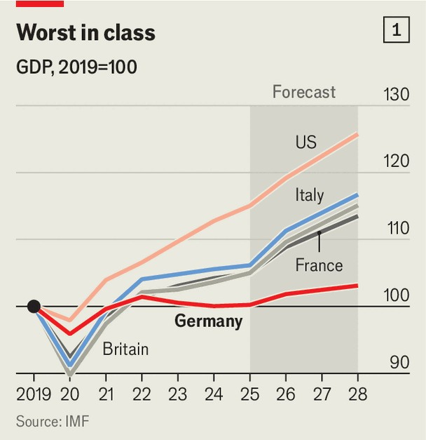

欧洲 | 联盟、委员会和妥协
德国大肆宣传的"改革之秋"是个哑炮
弗里德里希·默茨的政府在经济停滞中漂移
2025年10月23日

摘要：问问监督汉诺威就业中心的安娜·保拉·比塞，关于德国福利系统的复杂网络，你会得到一个混合了普鲁斯特式复杂性和卡夫卡式荒诞的回复。接受者的收入是否足够低以获得住房福利？如果是，他必须在一个地方申请。如果他有孩子，这些福利将从另一个地方支付；系统问类似的问题但应用不同的定义和收入门槛。获得一种福利的资格可能意味着另一种被撤回，尽管它们在不同时间评估。等等。慕尼黑Ifo研究所借助AI的帮助来计算德国福利的总数。在放弃之前达到了500多个。

问问监督汉诺威就业中心的安娜·保拉·比塞，关于德国福利系统的复杂网络，你会得到一个混合了普鲁斯特式复杂性和卡夫卡式荒诞的回复。接受者的收入是否足够低以获得住房福利？如果是，他必须在一个地方申请。如果他有孩子，这些福利将从另一个地方支付；系统问类似的问题但应用不同的定义和收入门槛。获得一种福利的资格可能意味着另一种被撤回，尽管它们在不同时间评估。等等。慕尼黑Ifo研究所借助AI的帮助来计算德国福利的总数。在放弃之前达到了500多个。

控制福利系统本应成为弗里德里希·默茨承诺的"改革之秋"的核心。德国必须"敢于尝试新事物"，保守党总理本月说。在专注于外交和安全的旋风式前几个月后，默茨发誓要将注意力转回该国的经济，现在处于第六年停滞（见图表1），以及其庞大的社会福利国家，吞噬了近三分之一的GDP。公司正在发出警报，资本正在逃离。但到目前为止，改革结果微薄。

见证对Bürgergeld（一个被550万人声称的收入支持计划）调整的激烈争论，该计划对保守党的重要性远远超过其代表的3.5%的福利支出。经过几周的影子拳击，本月默茨的基督教民主联盟（CDU）、其巴伐利亚盟友基督教社会联盟（CSU）和社会民主党（SPD）的联盟同意收紧对错过约会或拒绝工作机会的Bürgergeld接受者的制裁。"辩论有时相当民粹主义，"参与谈判的SPD议员达格玛·施密特说。柏林的单身母亲杰西卡说，她担心改革，因为她本来就很难找到工作。

默茨，一个习惯性过度承诺的人，说Bürgergeld改革通过推动人们工作可以产生50亿欧元（58亿美元）的年度储蓄，但政府自己的数字承诺只是其中的一小部分。官员们承认，变化的政治影响超过了财政影响。比塞，其就业中心管理Bürgergeld，更愿意更专注于数字化摇摇欲坠的福利系统，统一福利和削减繁文缛节。

该系统不仅造成官僚主义头痛，还造成反常的激励。在某些收入水平，边际税率可能超过100%，因为福利被撤回的速度比工资上涨更快；在OECD（富裕国家俱乐部）中工作时间最短的国家中，这几乎不是理想的。Ifo认为结合一些福利和改善激励可以增加相当于15万个全职工作的工作时间。政府委员会将在明年初提出修复方案。

更大的挑战在于德国笨拙的健康和老年护理保险系统，低效率导致公司和工人承担螺旋上升的成本（以及中等结果，根据预期寿命数字判断）。包括养老金，社会保障成本现在占工资总额的42%以上，缩小了工资包并阻碍了招聘。官员们说，解决这些成本是待办事项清单上的下一个。但现在还有两个委员会将考虑改革。

德国的养老金系统是最严峻的考验。由于2007年决定慢慢将退休年龄提高到67岁，它还没有跪下。（与法国相比，法国暂停了从62岁到64岁的增加。）但德国的人口结构意味着下一个十年将是艰难的，因为数百万婴儿潮一代退休（见图表2）。尽管有移民，到2035年，每个养老金领取者只有不到两个工作年龄的德国人，从2022年的三个下降。"这个问题是在德国制造的，必须在德国解决，"经济部长凯瑟琳娜·赖歇说。"我们失去了过去15年。"

默茨承诺在2029年下次选举前进行"重大"养老金改革。但与此同时，他的政府，用Ifo的安德烈亚斯·佩希的话说，"同意了一个六岁孩子在圣诞节写给圣诞老人的愿望清单"。联盟协议继续将养老金与工资增长联系起来，直到2031年，这在德国的现收现付制度下将进一步挤压工人和纳税人。政府拒绝将退休年龄与预期寿命联系起来的呼吁，就像瑞典和其他地方一样。鼓励工人更长时间工作的新税收激励与允许许多人在全额养老金上提前退休的规则冲突，这种福利经常累积给完全健康的人。在CSU的要求下，联盟批准了每年50亿欧元的养老金福利，给一些年长的母亲。对于更深入的改革，包括扩大私人养老金，工作已交给另一个委员会。它要到明年年底才会报告。

与官员交谈，你不会得到政府把头埋在沙子里的感觉。问题是在联盟内部找到妥协。默茨的保守党乐于抨击SPD，尽管相信他们在其联合领袖拉尔斯·克林贝尔（副总理和财政部长）中有一个盟友。他告诉他的党重新获得"2010议程"的精神，这是20多年前由SPD领导的政府通过的一套有争议的福利和劳工改革。克林贝尔希望支持那些担心过于坚持过时福利规则可能使他们获得失业党声誉的同事。自我认同的工人已经比SPD更多地投票给极右翼的德国选择党。

对默茨改革热情的陪审团仍然没有定论；他的政府还不到半年。三个执政党的领导人建立了乐观主义者认为可能以明年的大改革协议告终的融洽关系：也许对富人征收更高的税收以换取更深入的社会削减（无论如何必须找到储蓄来填补2027年的财政漏洞）。不乏想法，从有针对性的教育和劳动力市场政策到调整阻止女性全职工作的税收规则。赖歇坚持认为，如果政治家们清楚，德国人将接受他们需要更长时间工作的论点。

但这不会容易。经济复苏仍然难以捉摸，政府不受欢迎，默茨和克林贝尔都没有牢牢控制各自的党。联盟只有12个多数席位，甚至不能承受轻微的叛乱；18个年轻的CDU/CSU议员已经威胁要破坏新的养老金法，除非有更大的条款来遏制2031年后的成本。默茨喜欢说他的政府代表德国在屈服于极端之前"最后的机会"。他还没有表现得好像他相信它。■

【一｜德国福利系统复杂】德国福利系统有500多个项目，复杂如普鲁斯特式复杂性和卡夫卡式荒诞，接受者收入门槛不同，福利相互影响。

【二｜改革之秋哑炮】默茨承诺"改革之秋"，但改革结果微薄，Bürgergeld调整激烈争论，政治影响超过财政影响，系统造成反常激励。

【三｜健康护理系统挑战】德国健康和老年护理保险系统笨拙，低效率导致螺旋上升成本，社会保障成本占工资总额42%以上。

【四｜养老金系统严峻考验】德国养老金系统是最严峻考验，人口结构意味着下一个十年艰难，婴儿潮一代退休，工作年龄人口下降。

【五｜改革困难重重】默茨承诺重大养老金改革，但联盟协议继续将养老金与工资增长联系，政府拒绝将退休年龄与预期寿命联系。

总的来说，德国大肆宣传的"改革之秋"是个哑炮。福利系统复杂如普鲁斯特式复杂性和卡夫卡式荒诞，改革结果微薄，健康护理系统挑战严峻，养老金系统是最严峻考验，改革困难重重，政府还不到半年，经济复苏难以捉摸。
