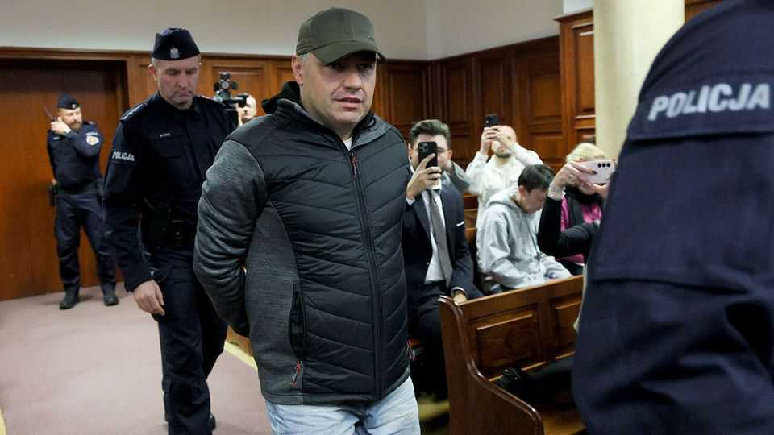
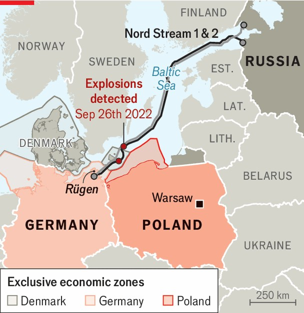

欧洲 | 危险水域
波兰拒绝引渡北溪嫌疑人
与德国的关系恶化
2025年10月23日

摘要：2022年9月26日，有人炸毁了北溪1号和2号管道，这些管道是为了将天然气从俄罗斯输送到德国而建造的。弗拉基米尔·朱拉夫列夫是否负责可能永远不会知道。朱拉夫列夫先生，一位乌克兰潜水教练，上个月在华沙的家中被德国检察官发出的逮捕令逮捕，德国检察官说他是一个七人团队的一部分，该团队实施了攻击。但10月17日，华沙法院拒绝引渡朱拉夫列夫先生，他否认指控。三天后，波兰检察官说他们不会上诉，让他成为自由人。

2022年9月26日，有人炸毁了北溪1号和2号管道，这些管道是为了将天然气从俄罗斯输送到德国而建造的。弗拉基米尔·朱拉夫列夫是否负责可能永远不会知道。朱拉夫列夫先生，一位乌克兰潜水教练，上个月在华沙的家中被德国检察官发出的逮捕令逮捕，德国检察官说他是一个七人团队的一部分，该团队实施了攻击。但10月17日，华沙法院拒绝引渡朱拉夫列夫先生，他否认指控。三天后，波兰检察官说他们不会上诉，让他成为自由人。

这一决定部分源于国际法的补丁。爆炸发生在任何国家的领海之外。根据海洋法，在国际水域的船上审判犯罪是悬挂其旗帜的国家的责任。但管道没有旗帜，对它们的管辖权令人惊讶地模糊。此外，北溪管道的主要所有者不是德国实体，而是俄罗斯国有天然气公司俄罗斯天然气工业股份公司。检方说，拆除团队在德国岛屿吕根租了他们的游艇。但法官说，这种联系不足以证明德国法院有管辖权。

在另一个层面，这一裁决强调了德国和波兰之间的困难关系。波兰领导人长期以来一直谴责德国关于北溪，这使欧洲更加依赖俄罗斯天然气。10月7日，波兰总理唐纳德·图斯克在消息平台X上写道，"北溪2号的问题不是它被炸毁了。问题是它被建造了。"这种胸脯拍打在 domestic politics中很有效，图斯克是一位中间派自由主义者，正在与极右翼总统卡罗尔·纳夫罗基就法律改革进行斗争。

然而，这破坏了改善与德国关系的努力，这种关系在波兰前任政府领导下崩溃了，该政府由民族主义法律与正义党领导。当弗里德里希·默茨5月成为德国总理时，对两个大国之间的新伙伴关系寄予厚望。但"这是一种从未发生的重置，"德国国际与安全事务研究所的凯-奥拉夫·朗说。德国很快实施了移民管制，包括在其波兰边界。波兰以自己的检查回应。

德国接受了波兰的决定，但历史为民族主义者提供了无尽的怨恨来源。纳夫罗基复活了对第二次世界大战赔偿的要求，德国坚持认为这个问题几十年前就解决了。一些波兰人担心德国可能回到其东方政策或安抚俄罗斯的习惯。华沙智库Polityka Insight的托马什·萨夫丘克说，为了平息这种怀疑，波兰人期望德国认识到"即使炸毁北溪不好，他们也不应该对此大惊小怪。"■

【一｜北溪管道被炸】2022年9月26日，有人炸毁了北溪1号和2号管道，乌克兰潜水教练朱拉夫列夫被德国检察官逮捕，但华沙法院拒绝引渡。

【二｜国际法补丁】爆炸发生在任何国家领海之外，管道没有旗帜，管辖权模糊，北溪管道主要所有者是俄罗斯天然气工业股份公司。

【三｜德波关系困难】波兰领导人长期谴责德国关于北溪，图斯克说问题不是被炸毁而是被建造，这种胸脯拍打在 domestic politics中很有效。

【四｜关系恶化】德国很快实施移民管制，波兰以自己的检查回应，纳夫罗基复活对二战赔偿要求，一些波兰人担心德国回到东方政策。

【五｜历史怨恨】历史为民族主义者提供无尽怨恨来源，波兰人期望德国认识到即使炸毁北溪不好，也不应该对此大惊小怪。

总的来说，波兰拒绝引渡北溪嫌疑人。2022年9月26日，有人炸毁了北溪管道，乌克兰潜水教练朱拉夫列夫被德国逮捕，但华沙法院拒绝引渡。国际法有补丁，德波关系困难，图斯克说问题不是被炸毁而是被建造，关系恶化，历史怨恨为民族主义者提供来源。
