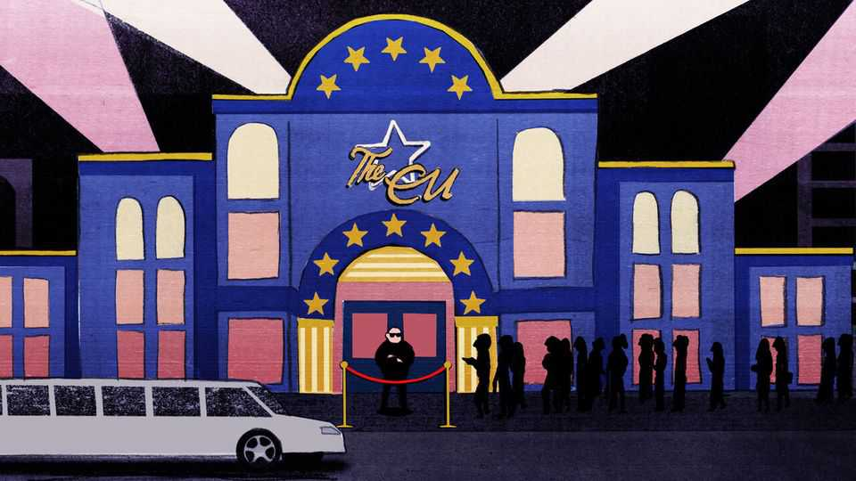

欧洲 | 查理曼
乌克兰能通过欧盟门口的保镖吗？
它的朋友已经在里面了，真的
2025年10月23日

摘要：很少有队伍比加入欧盟的队伍移动得更慢——那些希望被放进去的人很清楚。就像急切打扮的青少年在时尚夜总会门口徘徊，希望天鹅绒绳索最终被拉开，联盟的准成员坚持他们在队伍中的位置，相信坚持有一天会得到回报。乌克兰是那些仍在俱乐部边缘颤抖的最大国家，它能感受到温暖但还不能分享。它很快会被邀请进去吗？聚会看起来很有趣，乌克兰可以声称，就像几代狂欢者尝试的那样，"真的，我的伙伴已经在里面了！"许多在俱乐部欧洲内安顿的人确实渴望这个新成员通过加入过程。

很少有队伍比加入欧盟的队伍移动得更慢——那些希望被放进去的人很清楚。就像急切打扮的青少年在时尚夜总会门口徘徊，希望天鹅绒绳索最终被拉开，联盟的准成员坚持他们在队伍中的位置，相信坚持有一天会得到回报。乌克兰是那些仍在俱乐部边缘颤抖的最大国家，它能感受到温暖但还不能分享。它很快会被邀请进去吗？聚会看起来很有趣，乌克兰可以声称，就像几代狂欢者尝试的那样，"真的，我的伙伴已经在里面了！"许多在俱乐部欧洲内安顿的人确实渴望这个新成员通过加入过程。然而，现在厚脖子的保镖无动于衷，咕哝着关于司法改革和吸收能力的事情。如果等待时间太长，脾气可能开始磨损。"等等，这个队伍甚至还在移动吗？"

乌克兰对布鲁塞尔的渴望与其现代国家地位一样古老。该国刚刚恢复独立，就在1993年宣布它想加入欧盟，当时只是一个仅有十几个成员的俱乐部。多年来，加入的请求仅仅是表演性的：乌克兰太穷、太农业化、太寡头统治，不能成为欧盟的可信成员。无论如何，俱乐部的大门似乎被锁上了。一些更可信的申请者，包括西巴尔干地区的六个，在他们自己长达数十年的加入竞标中几乎没有取得进展；自2013年克罗地亚以来，没有人被放进去。俄罗斯在2022年2月对乌克兰的全面入侵重启了扩大的理由。让国家靠近欧盟但在其外部使它们成为地缘政治竞争对手（无论是中国还是俄罗斯）准备追求（如果不是实际入侵）的目标。给乌克兰一个加入的机会暗示了一个值得为之奋斗的更光明、更西方的未来。

乌克兰仍然贫穷、农业化且容易寡头过度——而且还在战争中。尽管如此，它通过欧盟要求严格的加入过程取得了令人惊讶的稳定进展，与巴尔干地区的一些国家以及摩尔多瓦一起。在俄罗斯入侵四天后提交申请，几个月后被授予候选国地位。2024年6月，基辅当局正式开启加入谈判，这个过程要求任何有抱负的成员采用数十年的欧盟法律——即使是和平国家也难以轻易管理的官僚主义打击。欧盟委员会（该集团评估乌克兰进展的执行机构）的公务员赞扬了他们在基辅发现的改革热情。他们对它如何快速跳过障碍、改革其弯曲的司法或遏制广泛的腐败感到兴奋。2030年的假设截止日期似乎雄心勃勃，但并非完全荒谬。

唉，加入的动力最近已经减弱。乌克兰和欧盟都有责任。在乌克兰方面，曾经让欧洲官员眼花缭乱的改革热情似乎已经减弱，甚至基辅的政府官员也承认。转型继续，但速度不那么令人印象深刻。既得利益——弱法院和可疑公共采购的受益者，比如说——正在抵制改革。总统弗拉基米尔·泽连斯基在7月试图削弱两个反腐败机构的笨拙尝试在欧盟圈子中引起了恐怖（以及在乌克兰，随后发生了罕见的战时抗议）。虽然损害已被控制，但这一事件突出了进展如何容易被逆转，特别是当改革开始咬人时。

但欧盟也陷入困境。任何通过加入过程推进的国家都需要目前俱乐部中每个国家政府的重复同意。匈牙利正在否决乌克兰进入谈判的下一阶段。其总理维克托·欧尔班，最像不合作门卫的欧盟领导人，面临明年4月的选举，认为抨击乌克兰将有助于他的事业。乌克兰人被要求表现出"战略耐心"，因为正在制定修复方案。至少加入的道路似乎对一些人开放：阿尔巴尼亚和黑山等国家正在取得稳定进展，可能能够在2030年前加入。

欧盟的创始原则之一对联盟和那些希望加入的人构成了一个棘手的问题。与夜总会吵闹的狂欢者不同，被允许进入欧盟的人不能被踢出去。该集团许多最重要的决定，如外交政策和制裁，必须一致通过。所以让一个派对破坏者（比如欧尔班先生）进入可能会破坏俱乐部的氛围。这使得许多人甚至超越布达佩斯，急于确保乌克兰对法治的坚持是持久的。如果乌克兰或摩尔多瓦被允许进入，有一天"错误"的政党上台，在欧盟最高桌留下一个克里姆林宫的奴才怎么办？

因此，布鲁塞尔的谈话是关于"创造性解决方案"来帮助超越日益加厚的僵局。一个提议是老套的：让乌克兰和其他国家与欧盟密切关联，从其单一市场和公民自由流动中受益，但仍然留在俱乐部本身之外。然而，这样的二级地位将被乌克兰视为背叛。更有希望的是，有关于乌克兰正式加入俱乐部的窃窃私语，但有警告。在2004年的大规模扩大中，波兰和其他国家必须接受他们的公民只有在七年成员资格后才能获得大多数更富裕欧洲国家劳动力市场的准入。这批最新的加入者可能必须同意过渡期，在此期间他们可能没有与现有成员相同的否决权，例如。一些人甚至提出过渡期的想法，在此期间不符合欧盟标准的新成员国可能被完全踢出去。这将以许多人认为严厉的方式扭曲俱乐部的法律。但这能说服保镖最终举起绳索吗？■

【一｜加入欧盟队伍缓慢】很少有队伍比加入欧盟的队伍移动得更慢，乌克兰是仍在俱乐部边缘颤抖的最大国家，能感受到温暖但还不能分享。

【二｜乌克兰渴望加入】乌克兰对布鲁塞尔的渴望与其现代国家地位一样古老，1993年宣布想加入欧盟，当时只是一个仅有十几个成员的俱乐部。

【三｜俄罗斯入侵重启扩大理由】俄罗斯2022年2月全面入侵重启了扩大理由，让国家靠近欧盟但在其外部使它们成为地缘政治竞争对手准备追求的目标。

【四｜加入过程稳定进展】乌克兰通过欧盟要求严格的加入过程取得稳定进展，2024年6月正式开启加入谈判，2030年假设截止日期似乎雄心勃勃。

【五｜加入动力减弱】加入的动力最近已经减弱，乌克兰和欧盟都有责任，既得利益抵制改革，匈牙利否决乌克兰进入下一阶段。

总的来说，乌克兰能通过欧盟门口的保镖吗？加入欧盟的队伍移动缓慢，乌克兰渴望加入，俄罗斯入侵重启了扩大理由，乌克兰在加入过程中取得稳定进展，但动力最近减弱，匈牙利否决，需要创造性解决方案来超越僵局。
