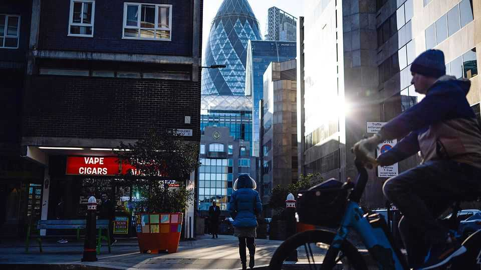
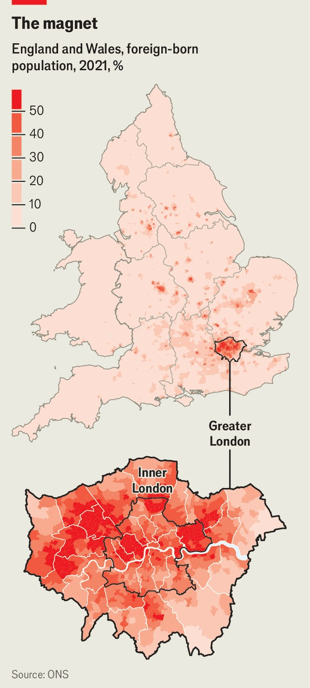

英国 | 英国的首都
工党对伦敦很吝啬
伦敦人部分要负责
2025年10月23日

摘要："一个来自北伦敦的品德信号律师。"前英国首相里希·苏纳克这样描述那个在2024年大选中将他赶下台的人。抨击伦敦和伦敦人是古老的政治运动。但试图将基尔·斯塔默爵士描绘成首都的产物既误导又愤世嫉俗。首相确实出生在伦敦（财政大臣雷切尔·里夫斯也是）。他代表（北）伦敦的一个选区。他不是一个为伦敦服务的首相。2024年7月赢得权力的工党政府追求的政策对首都的利益不利。这更多是粗心而不是恶意的结果。

"一个来自北伦敦的品德信号律师。"前英国首相里希·苏纳克这样描述那个在2024年大选中将他赶下台的人。抨击伦敦和伦敦人是古老的政治运动。但试图将基尔·斯塔默爵士描绘成首都的产物既误导又愤世嫉俗。首相确实出生在伦敦（财政大臣雷切尔·里夫斯也是）。他代表（北）伦敦的一个选区。他不是一个为伦敦服务的首相。2024年7月赢得权力的工党政府追求的政策对首都的利益不利。这更多是粗心而不是恶意的结果。政府着手做合理的事情，如关闭税收漏洞、合理化地方政府财政和削减移民。然而，在这样做时，它不成比例地伤害了英国最有生产力的部分。更糟糕的是，其政策的一些责任必须落在普通伦敦人身上。

以前的政权在对待首都方面确实是恶意的。鲍里斯·约翰逊曾担任伦敦市长，当他成为首相时抨击这座城市。他与他的工党继任者萨迪克·汗爵士争吵，并在covid-19大流行最严重时迫使他乞求交通资金。在保守党领导下，市长和伦敦议会离开了为他们在大都市中心建造的臃肿建筑，因为他们努力支付租金。英国国家歌剧院公司被从伦敦推到曼彻斯特，面临失去资金的痛苦。

对首都最吵闹的攻击已经停止，特别是因为萨迪克爵士属于与首相相同的政党。地方政治家欣赏这种变化的心情。"不被伦敦不断攻击是很好的，"威斯敏斯特委员会领导人亚当·哈格说。尽管如此，他们有很多抱怨。

最让哈格先生和其他伦敦政治家担心的是对地方政府财政的拟议改变。伦敦的许多服务由33个地方当局提供。它们的大部分收入来自三个来源：对房屋征收的市政税；地方企业支付的费率的一部分；以及中央政府的拨款。这些来源中的最后一个即将被削减。

政府正在修订用于计算地方需要程度和应该收到多少现金的公式。其提议对伦敦不利。该公式不仅在没有充分考虑住房成本的情况下衡量贫困，住房成本在首都很高。它还包含一个新的"偏远调整"，有利于农村地区。智库财政研究所计算，如果新公式立即应用，内伦敦的行政区将看到19%的资金削减。

伦敦地方当局做的许多事情，如照顾老人和从无家可归中拯救人们，是法律义务。所以他们可能会通过提高税收来填补财政漏洞。考虑到他们房屋的巨额价值，伦敦人多年来支付的市政税相当低。首都的标准"d级"房屋今年将支付平均1982英镑（2660美元）的税收，而整个英格兰为2280英镑。这种差异不太可能持续。

企业也可以预期税收的急剧增加。对商业地产征收的商业费率正在修订以反映租金价值的变化——这每三年发生一次。政府还计划对价值超过50万英镑的商业地产引入更高的税率。目标是打击电子商务公司使用的巨大仓库，否则很难征税。不幸的副作用将是占据伦敦市中心办公室的企业费率更高。商业地产代理Colliers International估计，新伊丽莎白铁路线服务的地区Farringdon的费率将从每平方英尺316英镑跃升至437英镑。

另一项税收将强加给大学。5月，基尔爵士的政府建议将对国际学生支付的学费增加6%的征税。很少有细节被发布，但该计划肯定会颁布，因为政府已经宣布了它将如何花费收益。该政策将打击许多大学，但特别是伦敦的大学。在整个英国，39%的学费由外国学生支付。在首都，58%是。

外国学生征税是政府旨在削减英国移民的许多政策之一。毕业生签证将变得更短，工作签证将更难获得，公司必须为雇用外国人的特权支付更多，一些移民必须等待十年才能获得永久居留权，而不是现在的五年。

对一个移民城市（见地图）的后果可能是深远的。伦敦是向英国其他地区输出人口的净出口国：在截至2024年6月的一年中，国内移民离开的比到达的多128000人。如果没有国际移民，这使首都人口增加了163000人，它就会萎缩。

伦敦的外国出生居民非常有成就。在英格兰和威尔士的十个地方当局中，移民最有可能拥有高等教育资格的地方，九个在首都。在2022-23纳税年度，伦敦还包含英国58%的"非居民"，这是一个富裕的人群，他们为了税收目的在另一个国家居住。他们被轻税，但在今年4月，政府废除了非居民制度，并用一个不那么友好的制度取代，至少吓跑了一些人。

结合英国脱欧，这结束了英国和欧洲其他地区之间的自由流动，移民改革和新的非居民规定已经玷污了伦敦。投资管理公司Man Group的首席财务官安托万·福泰尔说，当他在20年前这样做时，在巴黎开始建立金融职业生涯是不寻常的（他最终搬到了伦敦）。今天这将是不寻常的。福泰尔先生说，伦敦仍然是一个极具吸引力的城市，作为一个非英国人很容易感到宾至如归。但那些决心最小化税收的人被吸引到意大利或中东。

伦敦人确实从他们支付的税收中得到一些好东西，特别是优秀的公共交通系统。但他们将来可能得不到那么多。财政部改变了其评估项目的指导，称为绿皮书，以可能比首都更适合英国其他地区的方式。"我爱伦敦，我来自伦敦，"里夫斯女士在9月30日的工党会议上说。但是，她补充说，利兹市缺乏大众交通系统。她想在看到伦敦得到另一条地铁或铁路线之前看到一条被建造。

使用奇怪公式避免给首都钱的旧保守党做法继续。9月，政府启动了一个名为"地方自豪感"的计划，将在169个贫困社区各撒2000万英镑。为了识别值得的地方，它使用社区需求指数等指标。该指数计算志愿服务和酒吧夜总会密度等事情。也许不足为奇，英国最需要的地方中只有两个在伦敦。伯明翰有八个。

工党政治家可能没有做伦敦选民想要的，但他们正在做伦敦选民应得的。伦敦经济学院的托尼·特拉弗斯指出，在1990年代末之前，该市的居民投票很像整个英国人。1987年，玛格丽特·撒切尔（北伦敦芬奇利的议员）领导下的保守党在首都比其他地方做得更好。这些天伦敦坚定地支持工党（见图表）。去年，保守党在首都75个席位中只赢得了9个。

自2016年英国脱欧公投以来，英国部分地区的人们从一个政党摇摆到另一个政党。约克郡和亨伯的人们在2017年投了最多的工党票，2019年投了保守党，2024年又投了工党；他们现在支持改革英国，一个民粹主义右翼政党。这样善变的选民吸引政治关注，而首都的居民很容易被忽视。寻求为忽视他们的城市而责备某人的伦敦人可能会照镜子。■

【一｜工党对伦敦吝啬】工党政府追求的政策对首都利益不利，更多是粗心而不是恶意，政府做合理事情但不成比例地伤害英国最有生产力的部分。

【二｜以前政权恶意】约翰逊曾担任伦敦市长，成为首相时抨击城市，与萨迪克·汗争吵，迫使他乞求交通资金，英国国家歌剧院被推到曼彻斯特。

【三｜地方政府财政改变】政府修订计算地方需要程度的公式，对伦敦不利，没有充分考虑住房成本，包含偏远调整有利于农村地区，内伦敦将看到19%资金削减。

【四｜税收急剧增加】企业可以预期税收急剧增加，商业费率修订反映租金价值变化，对价值超过50万英镑的商业地产引入更高税率，大学将面临外国学生征税。

【五｜移民政策影响】外国学生征税是削减移民政策之一，毕业生签证变短，工作签证更难获得，对移民城市的后果可能是深远的，伦敦是人口净出口国。

总的来说，工党对伦敦很吝啬。工党政府追求的政策对首都利益不利，更多是粗心而不是恶意，地方政府财政改变对伦敦不利，税收急剧增加，移民政策影响深远，伦敦人部分要负责，因为他们坚定支持工党。
