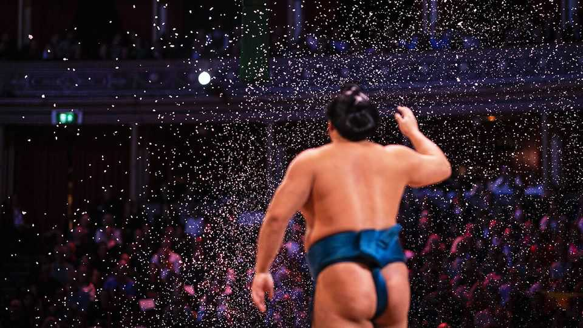
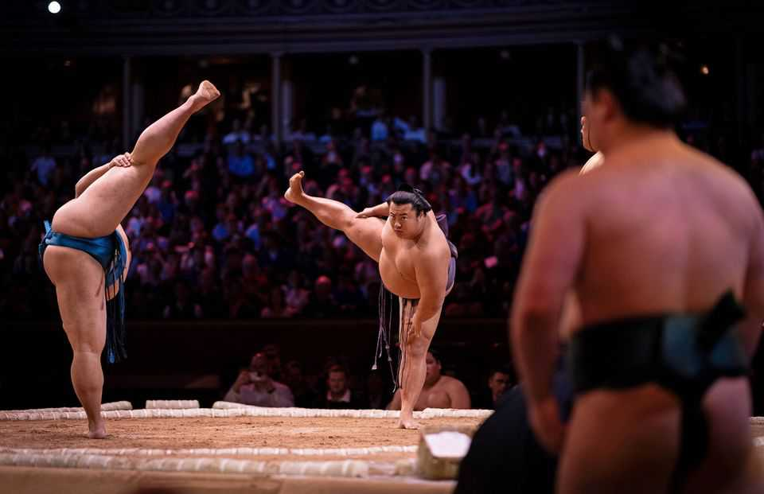
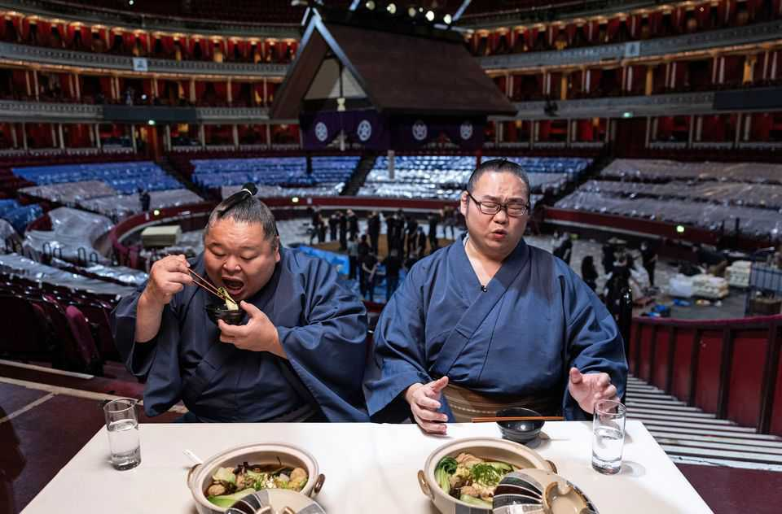
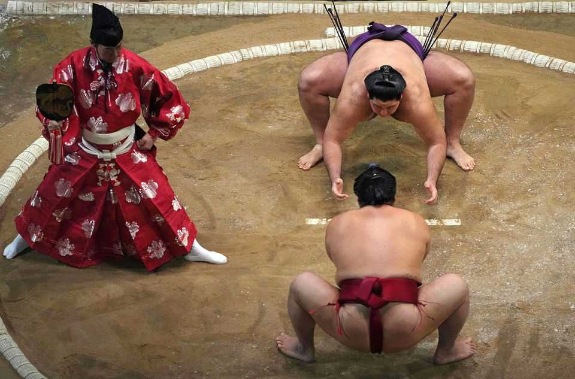

英国 | 重量级外交
相扑摔跤如何在英国成为热门
古老的日本运动找到了一些不太可能的粉丝
2025年10月23日

摘要：通常，皇家阿尔伯特音乐厅的游客来品尝逍遥音乐会或其他音乐会。10月中旬的五天，伦敦西南部的宏伟维多利亚场地举办了一种相当不同的奇观。在一个抬高的粘土环中，大个子男人拍手召唤神道教神灵，撒下优雅的净化盐弧。当他们跺脚粉碎邪恶灵魂时，他们用芭蕾舞者的姿态将巨大的肚子平衡在一条腿上。相扑摔跤来到了伦敦——那只是热身。相扑已经练习了1500多年，很少离开日本。然而，当它这样做时，英国具有特殊的吸引力。

通常，皇家阿尔伯特音乐厅的游客来品尝逍遥音乐会或其他音乐会。10月中旬的五天，伦敦西南部的宏伟维多利亚场地举办了一种相当不同的奇观。在一个抬高的粘土环中，大个子男人拍手召唤神道教神灵，撒下优雅的净化盐弧。当他们跺脚粉碎邪恶灵魂时，他们用芭蕾舞者的姿态将巨大的肚子平衡在一条腿上。相扑摔跤来到了伦敦——那只是热身。相扑已经练习了1500多年，很少离开日本。然而，当它这样做时，英国具有特殊的吸引力。这只是第二次在国外举行的五天相扑锦标赛；第一次，1991年，也在伦敦举行。英国不是因为其繁荣的相扑场景而被选择的。英国相扑联合会（BSF）只知道少数几个俱乐部，这项运动不再在英国电视上播出。相反，它的回归很大程度上归功于怀旧。1991年活动的获胜者白鹤信义现在是日本相扑协会的主席，并游说将其带回来。

他的热情得到了回报。活动在几分钟内售罄。三名摔跤手穿着和服在伦敦骑Lime自行车的照片迅速传播。英国媒体高兴地报道，为了保持40名参赛者吃饱，皇家阿尔伯特音乐厅订购了700公斤大米、1000包速溶味噌汤和750包面条。几天来，摔跤手，许多人第一次出国旅行，成为该国最独特的游客：在大本钟旁咧嘴笑，在巨石阵旁摆姿势，在红色双层巴士旁摆姿势。

一些粉丝知道会发生什么。尼尔在1990年代第一次在电视上观看相扑，与他的女儿艾米丽一起来，艾米丽在日本学习时发现了它。其他人对这项运动及其仪式是新手。在大厅里，一个活泼的评论员解释了为什么穿着原始白手套的助手们正在为横纲（最高级别的摔跤手）穿上白色绳索的扭曲（象征神道教神社的神圣绳索），以及为什么裁判携带匕首（象征如果他犯错他愿意自杀）。在裁判做出可疑决定后，四名穿长袍的法官跳进环中推翻它，而不是服从VAR，这让人群高兴。

真正的奇观是战斗。大多数比赛在几秒钟内结束，当一个大个子试图将另一个从环中扭出时，拍打手掌和蛮力的模糊。乌克兰战士青锦新是人群的最爱。"他用内大腿抓取技术完成了一个世界级的技术，"BSF副主席理查德·里格斯滔滔不绝地说，他是观众中罕见的相扑专家。坐在前排垫子上的人有最好的视野，但也有被摔倒摔跤手压扁的最高风险。整个过程中，朝日啤酒流淌。

相扑和皇家阿尔伯特音乐厅都在试图扩大它们的吸引力。曾经强烈封闭的相扑现在有国际气息：锦标赛由蒙古横纲获胜，他与奖品合影——一瓶巨大的酱油和Hello Kitty毛绒玩具（根据她的背景故事，Kitty是英国人）。皇家阿尔伯特音乐厅，就其而言，扩大了其剧目。最近的预订范围从Westlife（曾经是男孩乐队，现在是怀旧四重奏唱民谣），到迪士尼电影"如何训练你的龙"的管弦乐表演。相扑吸引了最大的关注。

对日本来说，这一周不仅仅是一次性表演。该国大使铃木博已经在社交媒体上通过与小熊帕丁顿摆姿势、唱威尔士国歌和喝一品脱苦啤酒赢得了英国人的喜爱。他说他很高兴看到英国人蜂拥到首都观看相扑和抹茶。在锦标赛期间，他在社交媒体上发布了热情的评论；日本大使馆的游客享受了相扑展览。背后是精明的外交。"如果英国人开始热爱日本文化，"他微笑着说，"那么日本将是你一生的伙伴。"■

【一｜相扑来到伦敦】皇家阿尔伯特音乐厅举办相扑摔跤奇观，大个子男人拍手召唤神道教神灵，撒下净化盐弧，用芭蕾舞者姿态平衡巨大肚子。

【二｜第二次在国外举行】这只是第二次在国外举行的五天相扑锦标赛，第一次1991年也在伦敦，英国不是因为繁荣相扑场景而被选择，而是因为怀旧。

【三｜活动售罄】活动在几分钟内售罄，三名摔跤手穿和服骑自行车的照片传播，皇家阿尔伯特音乐厅订购700公斤大米、1000包味噌汤和750包面条。

【四｜真正的奇观】真正的奇观是战斗，大多数比赛几秒钟内结束，乌克兰战士青锦新是人群最爱，用内大腿抓取技术完成世界级技术。

【五｜精明的外交】相扑和皇家阿尔伯特音乐厅都试图扩大吸引力，相扑现在有国际气息，蒙古横纲获胜，日本大使铃木博通过社交媒体赢得英国人喜爱，背后是精明的外交。

总的来说，相扑摔跤如何在英国成为热门。相扑来到伦敦皇家阿尔伯特音乐厅，这是第二次在国外举行的五天锦标赛，活动售罄，真正的奇观是战斗，乌克兰战士是人群最爱，背后是精明的外交，日本大使希望英国人热爱日本文化。
