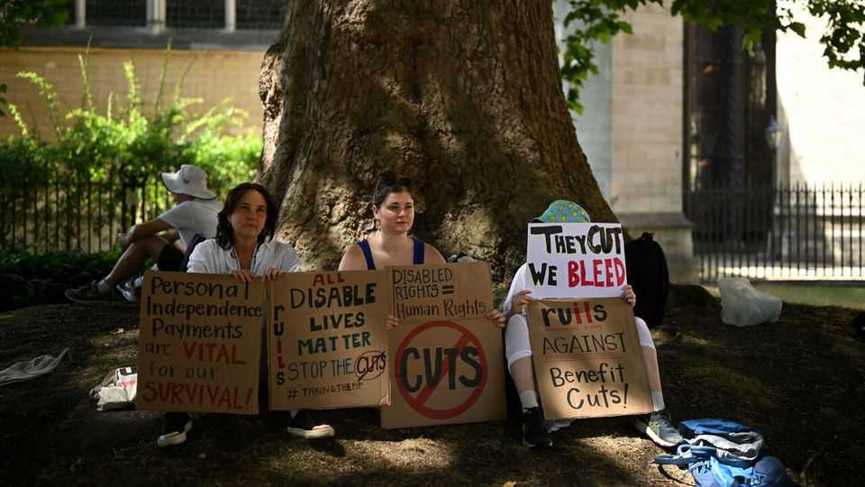

英国 | 同情的代价
英国的福利系统变得更病态
有些事情必须放弃
2025年10月23日

摘要："当我试图做饭时，我会感到焦虑和困惑。我以前把东西留在炉子上。我需要附近有人来保持安全。"这些不是虚弱养老金领取者的话，而是TikTok影响者告诉观众在残疾福利表格上写什么的建议。这个内容创作者是越来越多的"病态影响者"的一部分，他们指导人们如何从英国福利系统中榨取金钱。许多追随者有真正的疾病使生活更困难。问题是，在心理健康态度变化的帮助下，与健康相关的福利申请激增。

"当我试图做饭时，我会感到焦虑和困惑。我以前把东西留在炉子上。我需要附近有人来保持安全。"这些不是虚弱养老金领取者的话，而是TikTok影响者告诉观众在残疾福利表格上写什么的建议。这个内容创作者是越来越多的"病态影响者"的一部分，他们指导人们如何从英国福利系统中榨取金钱。许多追随者有真正的疾病使生活更困难。问题是，在心理健康态度变化的帮助下，与健康相关的福利申请激增。英格兰和威尔士十分之一的工作年龄成年人声称至少一种与残疾相关的福利。这是400万人，比2019年的280万人上升。这对工党政府来说是棘手的，其议员进入政治是为了保护弱势群体，而不是削减他们的支持。

一些政治家认为整个福利系统失控。保守党反对派领袖凯米·巴德诺克说，英国有成为"福利国家，附带经济"的风险。这些说法被夸大了。根据《经济学人》的计算，英国今年非养老金领取者福利账单占GDP的4.8%（1450亿英镑，或1950亿美元）。这与30年平均水平大致一致。支出预计在整个十年中保持在类似水平（见图表1）。

在那个平静的表面下，有两个相反的趋势。第一个是与健康无关的支出削减，如失业和住房。这种支出从2005-06年GDP的3.5%下降到2025-26年的2.7%。历届政府削减了系统的慷慨。福利水平被冻结，住房津贴减少，对儿童支付引入两孩限制。

这些削减被残疾和无能力福利支出的急剧上升所抵消。残疾福利，如个人独立支付（PIP），是现金支付，用于支付残疾的额外成本：例如更高的取暖或旅行费用。它们对工人和非工人都可用，不进行经济状况调查。无能力福利是为那些病得太重无法工作的人提供的。

自2019年以来，两者的申请都激增（见图表2）。英国是一个异常值；类似的欧洲国家自2019年以来看到案件数量停滞或下降。大量生病的英国人今年将残疾和无能力支出推高到GDP的2.1%（640亿英镑）——几乎是二十年前份额的两倍。残疾福利占大部分上升。

激增的案件数量反映了残疾定义的扩大，加上扭曲激励的福利系统。约七分之一的工作年龄英国人现在报告有长期精神或行为障碍，在过去十年中上升了50%。在残疾福利系统中，44%的申请引用此类疾病作为其主要状况，从2002年的25%上升。最急剧的上升是在女性、40岁以下和儿童中（见图表3）。

政府对福利资格的评估努力跟上步伐。这些测试一个人的状况如何影响日常任务，如做饭或洗衣服——对身体疾病来说是直接的，但对精神疾病来说要难得多。成功往往取决于呈现正确的叙述。关于如何最好地做到这一点的整个建议生态系统已经出现，包括来自慈善机构、TikTok和越来越多的AI。Mr PIP Hero Chat Bot特别受欢迎：输入你的状况，它会写你的申请。更精明的申请者从这个系统中获胜，而表达力较差、更脆弱的申请者失败。

有缺陷的评估被其他地方的小气所恶化。英国的失业福利是富裕世界中最吝啬的之一：单身人士得到的不到平均工资的13%。然而，那些获得最大健康相关福利的人可以使他们的收入翻四倍（见图表4）。这种要么盛宴要么饥荒的选择驱使人们走向疾病申请并阻碍工作。

3月，政府公布了改革。它将把主要失业福利率每周提高7英镑，同时将新申请者的无能力补贴减半到50英镑。它将废除要求人们证明他们无法工作的评估，并保证尝试就业不会导致福利削减。总的来说，这些变化应该加强工作激励。

然而，改革没有触及残疾福利，那里是支出激增的大部分所在。7月，在工党议员的强烈抗议后，一个笨拙的收紧资格和每年节省50亿英镑的尝试被放弃。部长们现在将希望寄托在由残疾部长斯蒂芬·蒂姆斯爵士领导的PIP评估过程审查上，该审查将在2026年秋季报告。但很少有人期望它识别重大节省。

巴德诺克女士提议削减残疾福利以避免11月预算中的税收增加。这是痴心妄想。咨询公司Capital Economics估计，政府需要在2029-30年找到多达270亿英镑的节省或税收增加来满足其财政规则。鉴于50亿英镑的残疾福利削减在夏天已经太多无法承受，更深的削减不太可能——债券市场不会信任匆忙的提议。

尽管如此，有些事情必须放弃。非养老金领取者残疾福利支出预计在未来五年内增长速度约为健康支出的两倍。债券市场正在密切关注，将政府对残疾福利的处理视为财政可信度测试。

政府的第一步应该是使成本削减成为蒂姆斯审查的明确目标，专注于在保护最弱势群体的同时节省资金。这需要处理困难的问题：工党是否应该遵循保守党计划，为一些精神健康申请者削减现金支付，提供额外治疗？残疾福利是否应该进行经济状况调查？确切的答案可以等到预算之后。但如果政府想要表明严肃性，它不能等太久。■

【一｜病态影响者指导】TikTok影响者告诉观众在残疾福利表格上写什么，"病态影响者"指导人们如何从英国福利系统中榨取金钱，与健康相关的福利申请激增。

【二｜福利系统失控？】一些政治家认为整个福利系统失控，巴德诺克说英国有成为"福利国家，附带经济"的风险，但这些说法被夸大了。

【三｜支出削减被抵消】与健康无关的支出削减被残疾和无能力福利支出的急剧上升所抵消，残疾福利占大部分上升，英国是异常值。

【四｜残疾定义扩大】激增的案件数量反映了残疾定义的扩大，约七分之一工作年龄英国人报告有长期精神或行为障碍，过去十年上升50%。

【五｜改革困难】政府改革没有触及残疾福利，7月收紧资格的尝试被放弃，巴德诺克提议削减残疾福利但这是痴心妄想，有些事情必须放弃。

总的来说，英国的福利系统变得更病态。"病态影响者"指导人们如何从福利系统中榨取金钱，与健康相关的福利申请激增，支出削减被残疾福利支出急剧上升所抵消，残疾定义扩大，改革困难，有些事情必须放弃。
